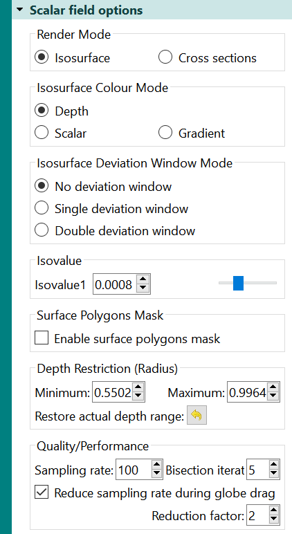
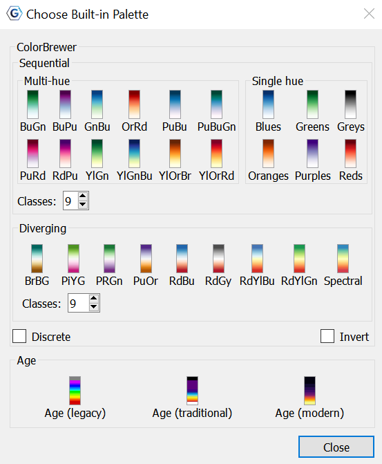
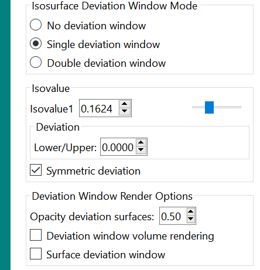
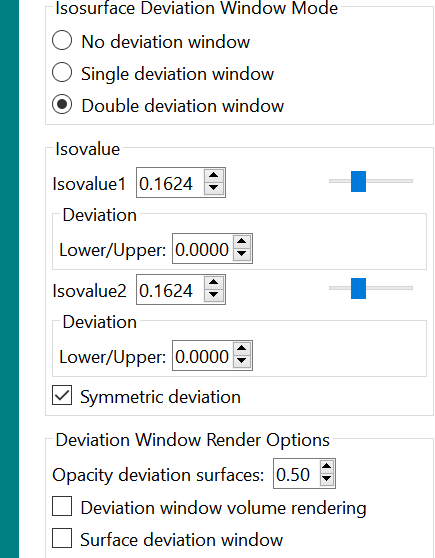
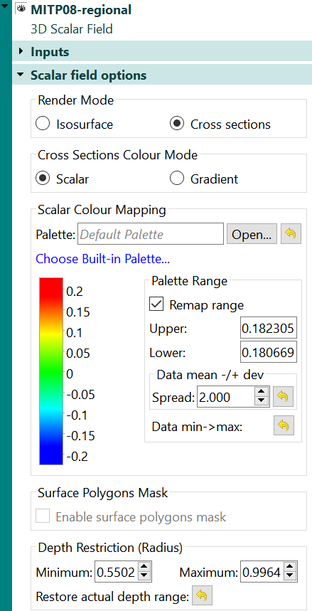

1 Introduction
============

3D Volume Visualisation in GPlates involves the rendering of **sub-surface 3D scalar fields**, containing any scalar quantity, such as *mantle temperature* or *seismic tomography wave speed*, to name a few. GPlates has the ability to render a scalar field as **Isosurfaces** (surfaces of constant scalar value), or **Cross sections** (2D vertical slices).

The 3D volumes are represented as a sequence of 2D depth layers when imported. The scalar fields can be imported as a sequence of 2D rasters combined to form a single 3D scalar field. They can also be imported as a time-sequence of 3D scalar fields, where you import a sequence of 2D rasters, where each raster represents a specific depth and time. 

2 3D Scalar Field
================

Once a Scalar Field has been imported, via a *.gmpl* file, a 3D Scalar Field layer is constructed. In this layer, various parameters can be set to determine the properties of the projected volume. 

# 2.1 Isosurfaces

The user can choose to visualise scalar fields as either **Isosurfaces** or **Cross sections**. When they select Isosurfaces they are presented with the options seen in the image below.

The isosurface uses a specific **scalar value** (*isovalue*) to represent a surface through the scalar field. It is rendered via a ray-tracing process through the scalar field at each screen pixel location, recognising when an isosurface is found. Each pixel excecutes an independent shader program on the graphics hardware. The scalar field gradient is used in the *Lambert diffuse reflectence lighting model*. A *white sphere* is rendered at the lowest depth of the imported scalar field. 

## 2.1.1 Isosurface Colour Mode

If the user selects Isosurface as their 3D Volume Visualisation **Render Mode**, they are presented with a selection of **Isosurface colour mode** options.

### -   Depth

Colour varies with depth in this mode, using hard-coded colouring. The colours range from blue at the bottom/deepest layer, and cyan at the top/shallowest layer for the lower isosurface, and from red (at inner sphere) to yellow (at out sphere) for the upper isosurface. It uses shades of blue and red on the front and back of an isosurface, indicative of mantle temperature scalar fields, where downgoing slabs are shades of blue (cooler than surroundings), and the mantle upwellings are shades of red (hotter than surroundings). It does **not** use a colour palette (CPT file). *It is also an **isosurface-only colour mode**, therefore non-applicable under the cross-section render mode.* 

### -   Scalar

The **scalar colour mode** uses isosurface scalar value to look up the colour palette that is either chosen from the Built-in Palette selection below, or a colour palette loaded from a *GMT* regular *CPT* file. For an isosurface, the scalar colour mode covers the entire surface in the same colour, as it represents a single isovalue. To change the colour, you **must** modify the isovalue. 

### -   Gradient

The **gradient colour mode** uses isosurface gradient magnitude to look up the colour palette. This allows users to visualise how rapidly the scalar values are increasing or decreasing in the direction perpendicular to the isosurface. An isosurface divides the space containing the scalar field into two regions, one containing higher scalar values, and the other lower scalar values. The front side of the isosurface, facing the region with higher scalar values, maps the negative of the gradient magnitude to colour, while the back side, facing the region with lower scalar values, maps the positive gradient magnitude to colour. Given that only one side of the isosurface is visible at any given stage, this difference helps distinguish whether the scalar field is increasing (viewing back side) or decreasing (viewing front side) along the view direction. 

<table class ="note">
   <tbody>
      <tr>
         <td class="icon">
            
         </td>
         <td class="content" >The user can choose a <i>GMT</i> color palette file (<i>CPT</i> file) to map isovalues, or gradients, to colour.</td>
      </tr>
   </tbody>
</table>

## 2.1.2 Scalar Colour Mapping

This dialog demonstrates the broad range of **Built-in Palette** options, from *Sequential* (multi-hue and single hue) to *Diverging*, to *Age* based palettes. All colour palettes under **ColorBrewer** have the ability to become discrete or inverted and have the number of classes defined. The Built-in colour palettes are accessible via the Gradient or Scalar colour modes. 

## 2.1.3 Isosurface Deviation Window Mode

An **Isosurface Deviation window** involves the main isosurface, in addition to an offset deviaiton window either side of it. The level in which these deviation windows are offset can be adjusted in the *Isovalue* section seen in the dialog boxes below. 

The main isosurface remains opaque and white, while the two offset deviation windows are semi-transparent (so the main isosurface is visible) and coloured dependent on the user's colour mode selection.

The deviation window provides an alternative visualisation of gradients along the main isosurface since locations with higher gradients will result in larger distances between the main and deviation isosurfaces. 

### Single deviation window

A single deviation window is possible, where you have one isosurface at value V and its two semi-transparent deviation isosurfaces at 'V+dev1' and 'V-dev2'.

### Double deviation window

A double deviation window is also possible, consisting of two single nonoverlapping deviaiton windows, that can each be separately configured by isovalue and deviation offset. 

### No Deviation window

The option to choose **No Deviation Window** is also there if the user wishes not to have one. 

## 2.1.4 Isovalue

This is where the user can adjust the *isovalue* to investigate different isosurfaces.

## 2.1.5 Surface Polygons Mask and Depth Restriction (Radius)

A **surface polygon mask** is an optional constraint for the visualisation of isosurfaces and cross-sections, in addition to a restricted depth range. A surface mask is the concave interior of one or more surface polygon geometries, and the **depth range** is defined by a minimum and maximum radius. Only isosurface regions directly beneath the surface mask and within the depth range are rendered. The user can define these parameters in the 3D Scalar Field layer, and choose to **restore actual depth range** at any time. 

<table class ="important">
   <tbody>
      <tr>
         <td class="icon">
            
         </td>
         <td class="content" >To Enable the surface polygons mask, you must have the latest graphics hardware driver installed. Also try switching to the dedicated GPU if using a dual-GPU system.</td>
      </tr>
   </tbody>
</table>

## 2.1.6 Quality/Performance

Display quality can be enhanced by increasing the **sampling rate** in addition to the **bisection iteral**. There is also an option to **reduce the sampling rate during global drag** to improve movement around the globe. The amount in which the sampling rate is reduced can be defined by the **reduction factor**. 

# 2.2 Cross sections

The users can also choose to visualise their 3D volume through a **Cross section**. A Cross section is a 2D vertical slice through the scalar field. Any existing surface geometries (*polylines* or *polygons*) can be used as the source of these cross sections. These polylines/polygons are extruded down inside the Earth and map the 3D scalar field values (that intersect these extruded surfaces) to colours. The user can implement a variety of the canvas tools to interactively manipulate the cross section by moving, inserting, or deleting surface geometry vertices. Cross sections can even be 1D vertical lines extruded from surface points or multi-points. 

When the user selects Cross sections as their **Render mode** in their 3D Scalar Field layer, they are presented with these options.

## 2.2.1 Cross Sections Colour Mode

Similar to isosurfaces, cross-sections can be coloured through either the **Scalar** or **Gradient** colour modes. Unlike isosurfaces however, when mapping a cross section with the gradient colour mode, only the *positive range of values to colours* are mapped, due to the fact that a magnitude is positive by deifinition. *See above (2.1.1) for further insight into these options*.

## 2.2.2 Scalar Colour Mapping

Colour mapping for cross sections is identical to isosurfaces. *See above (2.1.2) for further insight into these options*. 

## 2.2.3 Surface Polygons Mask and Depth Restriction (Radius)

Again, the user can create a surface polygon mask for their cross-sections and restrict it via a depth (radius). *See above (2.1.5) for further insight into these options.*

3 Exporting 3D Scalar Fields
=======================

SVG export includes 3D scalar fields (and rasters).