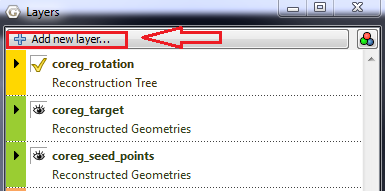
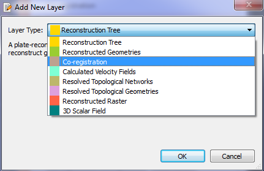
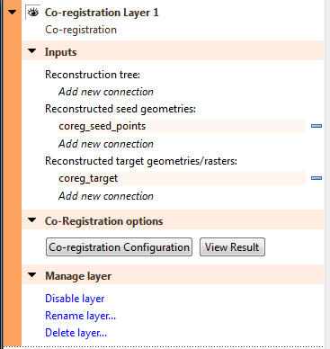
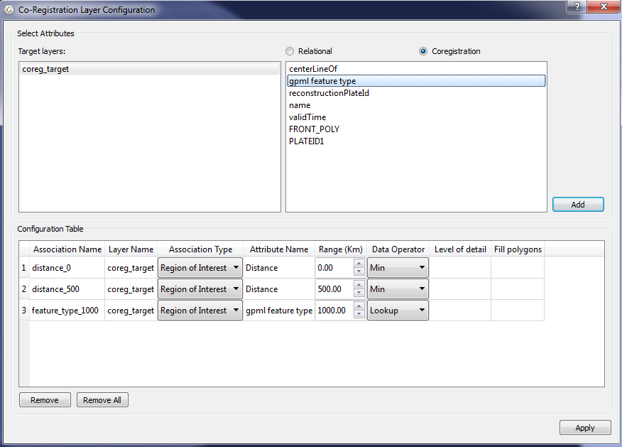
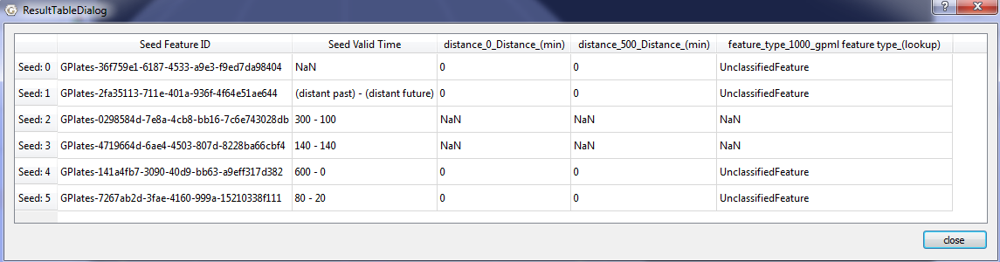
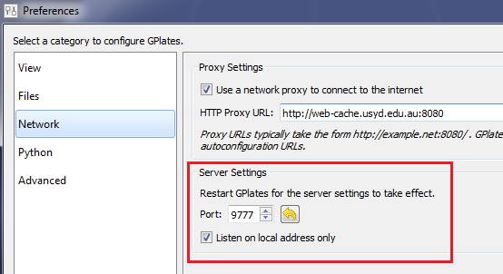

1 Introduction
============

The GPlates' co-registration layer allows users to combine two time-dependent datasets based on a set of user-defined associations. To put it simply, co-registration is the collection of data at certain points in a file such as a raster (can be another dataset type), and transporting this data to another file. The points are decided in reference to a base file.

2 Co-registration Layer
=====================

2.1 Open Co-registration Layer
--------------------------

In "Layers" widget, click "Add new layer…" button. The "Add New Layer" dialog will pop up. Click the "Layer Type" combobox and select "Co-registration" to add a new co-registration layer.

2.2 Configurate Co-registration Layer
---------------------------------

In "Layers" widget, expand co-registraion layer and add appropriate connections.

Click the "Co-registration Configuration" button to bring up "Co-registration Configuration" dialog.

2.3 Result Table
------------

Click the "View Result" to bring up the "Result Table" dialog.

3 Network Interface
=================

The co-registration layer data can be accessed through a network interface. When GPlates starts up, an internal tcp/ip server is initialized. Users can configurate the server setting in "Preference" dialog.

3.1 gplates.py
----------

The gplates.py module is a wrapper around the network interfaces. Users can retrieve data from GPlates by calling Python methods defined in gplates.py. The class CoregistrationLayer is a delegate of coregistration layer in GPlates.

-   get\_coreg\_seeds(self)

Return the feature ids of seeds as a list.

-   get\_begin\_time(self, feature\_id)

Given the feature id, return the begin time of the seed.

-   get\_coreg\_associations(self)

Return users defined associations as a list.

-   get\_time\_setting(self)

Return the time setting in GPlates as a tuple.

-   get\_coreg\_data(self, time)

Given a time, return coregistration data as a table.

