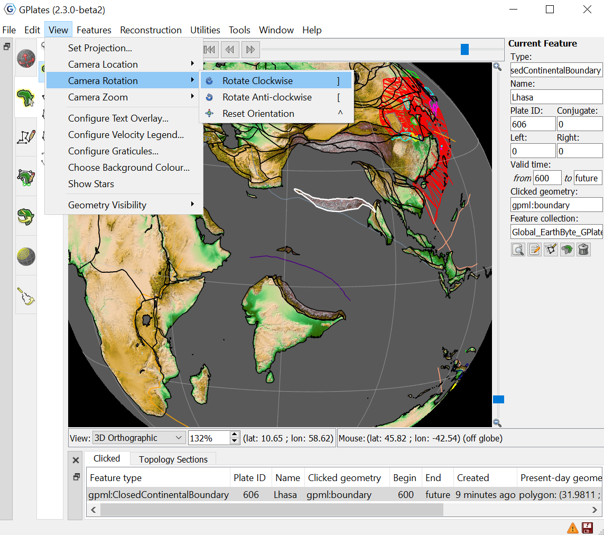

This chapter provides an overview of how to manipulate the view of the globe, and any displayed data or features.

1 Reconstruction View
===================

The **Reconstruction View** is the region of the GPlates interface which deals with plate reconstructions back through time and is displayed below.

<table>
   <colgroup>
      <col style="width: 29%" />
      <col style="width: 70%" />
   </colgroup>
   <thead>
      <tr class="header">
         <th style="text-align: left;">Name</th>
         <th style="text-align: left;">Description</th>
      </tr>
   </thead>
   <tbody>
      <tr class="odd">
         <td style="text-align: left;">Time Controls</td>
         <td style="text-align: left;">A collection of user-interface controls for precise control of the reconstruction time and animations.</td>
      </tr>
      <tr class="even">
         <td style="text-align: left;">Zoom Slider</td>
         <td style="text-align: left;">A mouse-controlled slider which controls the zoom level of the Globe View camera.</td>
      </tr>
      <tr class="odd">
         <td style="text-align: left;">View Controls</td>
         <td style="text-align: left;">A drop-down control for selecting the projection to be used for the view, and a precise percentage control for the camera zoom level</td>
      </tr>
      <tr class="even">
         <td style="text-align: left;">Camera Coordinate</td>
         <td style="text-align: left;">An information field which indicates the current globe position of the Globe View camera</td>
      </tr>
      <tr class="odd">
         <td style="text-align: left;">Mouse Coordinate</td>
         <td style="text-align: left;">An information field which indicates the current globe position of the mouse cursor</td>
      </tr>
   </tbody>
</table>

2 Tool Palette
============

The first two tools in the **Tool Palette** control your view of the GPlates globe or map. The **Tool Palette** includes camera positioning tools, feature selection tools and drawing tools. A tool is activated by clicking on it; only one tool can be active at any time. The **Task Panel** on the right will change to reflect the current tool that is activated.

<table>
   <colgroup>
      <col style="width: 11%" />
      <col style="width: 22%" />
      <col style="width: 11%" />
      <col style="width: 55%" />
   </colgroup>
   <tbody>
      <tr class="odd">
         <td>
            
Icon

         </td>
         <td>
            
Tool

         </td>
         <td>
            
Shortcut

         </td>
         <td>
            
Operation

         </td>
      </tr>
      <tr class="even">
         <td>
            

         </td>
         <td>
            
Drag Globe

         </td>
         <td>
            
D

         </td>
         <td>
            
Drag to re-orient the globe. <code>Shift+drag</code> to rotate the globe

         </td>
      </tr>
      <tr class="odd">
         <td>
            

         </td>
         <td>
            
Zoom In

         </td>
         <td>
            
Z

         </td>
         <td>
            
Click to zoom in. <code>Shift+click</code> to zoom out. <code>Ctrl+drag</code> to re-orient the globe

         </td>
      </tr>
   </tbody>
</table>

3 View Menu
=========

The **View Menu** enables the user to manipulate the globe, and includes the following options:

**Set Projection.**

Clicking this menu item will open a dialog allowing you to select what projection GPlates should use to display data (and for 2D map views, also what central meridian to use). Alternatively, a list box of projections to set can be found on the bottom of the **Reconstruction View**.

**Camera Location / Rotation / Zoom.**

These menu items permit control of the camera in order to view the globe.

3.1 Configure Text Overlay
----------------------

GPlates can display the current reconstruction time within the globe area. Selecting this menu item opens the **Configure Text Overlay** dialog.

You can choose what text should be displayed, using `%f` as a placeholder for the reconstruction time. The text can be displayed in any of the four corners of the view.

3.2 Configure Velocity Legend
-------------------------

Once you have created a Velocity Layer, you can configure a **Velocity Legend Overlay** using this menu option. First you assign the desired velocity layer using the dropdown menu, then select an appropriate colour for the text, arrows, and background (given you choose to show it) that can be seen, alongside font. Next you can apply a **horizontal and vertical offset** to arrange the placement of the legend on the screen. **Vertical offset** comprises of two options, either a maximum arrow legth (pixels) or a fixed scale (cm/yr).

   -   **Maximum arrow length**: should you choose this option, the arrow length on the screen (in pixels) will not exceed the value provided by you. The scale used (cm/yr) will be the largest multiple of 1,2,5,10 etc which satisfies the user-provided maximum arrow length.

       -   The scale will change as appropriate in response to changes in zoom, or changes in the Arrow Scale in the Layers dialog.

   -   **Fixed Scale**: should you choose this option, the scale (cm/yr) of the arrow is fixed, but the legend's arrow length will change as appropriate in response to changes in zoom, or changes in the Arrow Scale in the Layers dialog.

You can also adjust the orientation of the arrow in the legend

3.3 Configure Graticules
--------------------

With this menu item, the graticule spacing can be configured to use a different grid spacing than the default 30 degrees. The colour can also be changed if better contrast with a background raster is needed. The Line width hint can also be adjusted.

3.4 Choose Background Colour
------------------------

This option can be used to select the background colour of the globe (or map in the map view).

<table class ="note">
   <tbody>
      <tr>
         <td class="icon">
            
         </td>
         <td class="content" >If the value entered in the `Alpha channel` option is less than 255 then the globe will be semi-transparent and you will be able to see the rear of the globe (and geometries/rasters on the rear) through the front of the globe. This has no effect in the 2D map views.</td>
      </tr>
   </tbody>
</table>

3.5 Geometry Visibility
-------------------

Use this panel to control which types of geometry are visible on the globe. By choosing to display or hide certain geometries, you can improve the visual representation you are after, without painstakingly loading and unloading files. 

Selecting "**Show Static Points/Lines/Polygons/Multipoints**" will prevent feature geometries of those types from being drawn on the globe. When creating Velocity Domain Points, the points themselves can impede on the visual asthetics of the globe, and can therefore be hidden by unselecting **Show Static Multipoints**.

By selecting or unselecting the "**Show Topological Sections/Lines/Polygons/Networks**", you can display or hide geometries such as active margins, deforming meshes and networks, basins, or subduction zones.

In particular, unselecting "**Show Topological Sections**" will hide all geometries that were used to build any topologies. For example, if a topological polygon is made up of four intersecting lines, then those four lines will be hidden. Note that those lines could be a mixture of static lines and topological lines and they would all be hidden (regardless of the settings of **Show Static Lines** and **Show Topological Lines**).

Selecting "**Show Velocity Arrows**" can be used to control the display of the velocity arrows (in Velocity layers).

Selecting "**Show Rasters**" gives you the ability to display or hide any rasters loaded on the globe.

Selecting "**Show 3D Scalar Fields**" allows you to turn on or off the 3D Scalar Fields loaded onto the globe. Unticking this option will remove the 3D Scalar Field from view, alongside the white core created with it. This can improve visualising surface features without distraction from underneath.

Selecting "**Show Scalar Coverages**" will allow you to turn on or off the scalar coverage layers, however will leave the Deforming Mesh Points visible. To turn off the Deforming Mesh Points, unselect **Show Static Multipoints**. 

4 Window Menu
===========

The **Window Menu** enables the user to control the windows GPlates opens to display aspects of your data, and includes the following options:

**Open New Window.** `[Ctrl + N]`

Creates a new instance of GPlates. Currently each instance created this way is completely separate with its own main window and dialogs. Any program state such as files loaded prior to selecting **New Window** is not transferred across to the new instance. This feature is useful mainly for macOS where it is not possible to run multiple instances of the same application from the *Finder*.

**Show Layers.** `[Ctrl + L]`

This option shows and hides the Layers window.

**Show Bottom Panel.**

This option allows you to show or hide the **Clicked** Features and **Topology Sections** tables.

**Log.**

This option opens a dialog that:

-   Displays low-level debug, warning and error messages in a dialog window.

-   Supports filtering of log messages with a text string entered by the user.

-   Supports copy and pasting log messages in order to, for example, email bug reports to the GPlates developers.

-   Removes duplicate messages - shows message once along with a count of the number of identical messages.

**Full Screen.** `[F11]`

Makes the GPlates **Main Window** fill the entire screen, and hides most of the user interface elements such as the **Tool Palette** and **Task Panel**. A shortcut for this mode is the `F11` key. This mode is ideal for doing presentations.

Tools can still be accessed via their keyboard shortcuts. While in full screen mode, a new GPlates logo button will appear in the top left hand corner. If you need to access the **Main Menu**, click this button.

To leave **Full Screen** mode, you can:

-   Press `F11` again.

-   Press `Esc`.

-   Click the **Leave Full Screen** button in the top right corner.

5 Manage Colouring
================

Colouring is managed using the **Draw Style Dialog**. It allows the user to customise how feature geometries are coloured. 

There are three ways to open the **Draw Style Dialog**:

-   Select the **Manage Colouring** menu item in the **Features** menu:

-   Click the Draw Style Icon   in the top right of the layers dialog:

-   Click the **Set Draw style** link in options of a `Reconstructed Geometries` layer, `Resolved Topological Geometries` layer or `Resolved Topological Network` layer.

To change the default colouring scheme for all feature collections, select **(All)** from the drop-down box at the top. Alternatively, to change the colouring scheme for only a single layer, select the desired layer from the drop-down box. In either case you can then choose a colouring scheme from one of the following categories:

1.  **Colour by plate ID.**

    Currently with two options, being default or by region.

2.  **Colouring all features with a single user-specified colour.**

    Currently with single colours of white, blue, black, silver, gold, pink, green, and orange. Any other colour can be created by selecting **Add** and then **Choose**.

3.  **Colour by feature age.**

    This colour is specified by the time of the feature's creation relative to the current view time. It currently has two options of Default or Monochrome. You can create your own option coloured by a CPT file by clicking **Add**, then **Open**.

4.  **Colour by feature type.**

    Currently this only has one default option, however you can create your own option and colour using an uploaded CPT by clicking **Add** and **Open**.

5.  **Arbitrary colours.**

    There is currently a variety of Hues, Saturations and Values to choose from. You can create your own colouring option by clicking **Add** and specifying the Hue, Saturation, Value, Variance Minimum and Maximum.

6.  **Arbitrary colouring by feature property.**

    You can select to colour the feature collection by gml:name, gpml:subcategory, gpml:polarityChronId, or better yet, create your own colour by clicking **Add**, the specifying the Hue, Property Name, Saturation, Value, Variance Minimum and Maximum.

7.  **Arbitrary colouring by chrons.** 

    You can colour based on a polarity chron Id using the default, or you can create your own colouring by specifying the Normal and Reverse Hue once you **Add** a new option, in addition to specifying its fallback and identity property names.

8.  **Colour by feature property.**

    By choosing this option, you can choose to load in your own CPT file, specifying the `property_name` in which you wish to colour by. GPlates then colours each feature by querying the value of its feature property (using the specified property name) and using that value to lookup the `CPT` palette (mapping values to colours).

<table>
   <tbody>
      <tr>
         <td class="icon" style="width:5rem; display:inline-table;">
            
         </td>
         <td class="content">The <b>Python</b> chapter covers how to create your own colouring scheme by registering your own <b>Draw Style</b> plugin.</td>
      </tr>
   </tbody>
</table>

* Visit the Python Chapter [here](/docs/user-manual/Python/).

For the options that support the inclusion of user-specified **Colour Palette Files** (`.CPT`), a few sample `CPT` files are included with the sample data to choose from, given you do not wish to create your own.

6 Symbol File
=============

The Symbols functionality of GPlates allows users to customise the appearance of point features (i.e. features - such as **HotSpots** or **Volcanoes** - which are represented by point geometries). Such point features are by default rendered in GPlates as filled circles, but the Symbols functionality lets the user override this behaviour and represent features on the globe and map with one of several symbols (circle, triangle, square, or cross). The user can control the size and fill-state of these symbols, and can map different symbol types to different features.

Preparing a symbol (\*.sym) file
--------------------------------

To use symbols in GPlates, the user should prepare a symbol (`*.sym`) file. An example symbol file (`symbol_file.sym`) is contained in the sample data package, under `GeoData\SymbolFiles\`.

Comment lines in the file begin with a `#` and are ignored by GPlates. Each (non-comment) line should be of the form:

     feature-type symbol-type symbol-size fill-state

for example:

    MagneticAnomalyIdentification CROSS 2
    Volcano TRIANGLE 4 FILLED
    HotSpot SQUARE 3 FILLED
    Seamount CIRCLE 2 UNFILLED

**feature-type** should be the name of a gpml feature type, such as Volcano, HotSpot etc., but without any gpml: prefix.

**symbol-type** must be one of:

     CIRCLE
     CROSS
     SQUARE
     TRIANGLE

**symbol-size** should be a positive integer.

**fill-state** is optional and should be one of:

     FILLED
     UNFILLED

The default fill-state is FILLED. Not all symbol-types will respect the fill-state (e.g. CROSS).

Using a symbol file
-------------------

To use a symbol file in GPlates, load it into GPlates through **Features→Load Symbol file…** Loading a new file will overwrite any previously loaded file. The loaded symbol file can be unloaded through **Features→Unload Symbol file**

Restrictions
------------

Some restrictions on current symbol file usage:

-   Only one file at a time can be loaded.

-   Symbol rules in the file will apply to all loaded collections.

-   Only point features will be drawn with symbols.

-   Symbol mapping is only by feature type.
