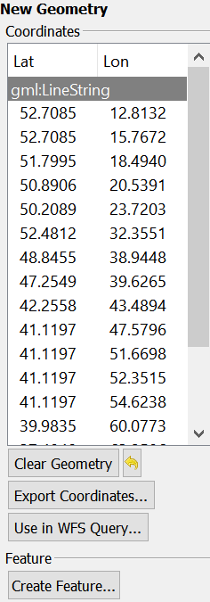
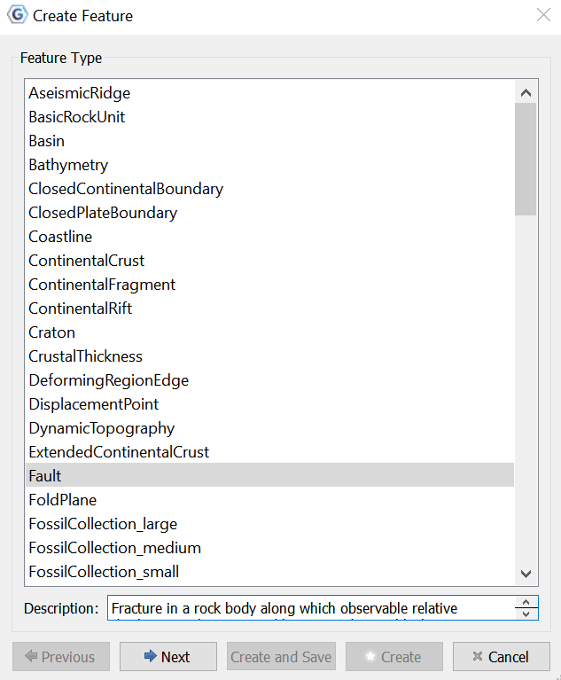
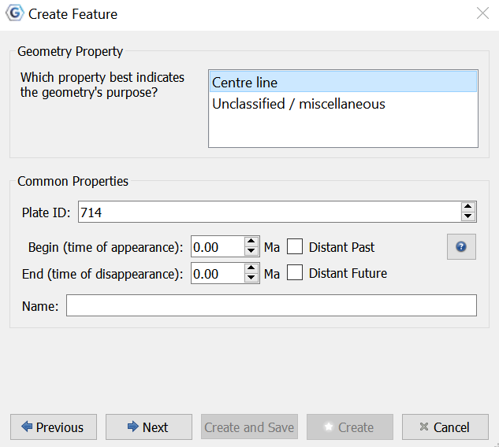
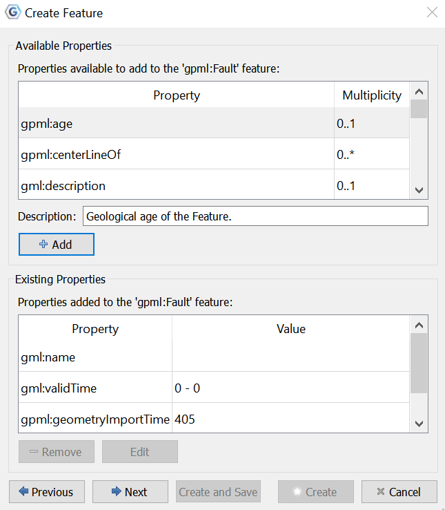
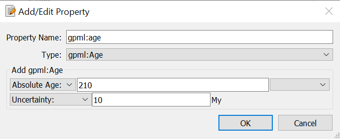
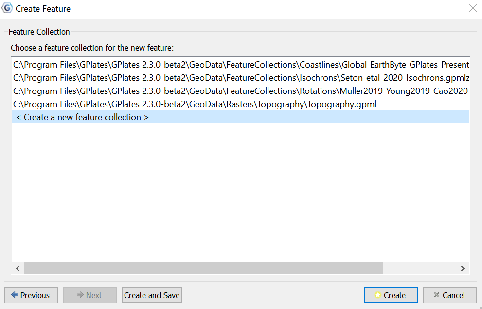

This chapter aims to provide the reader with information and instructions for digitising new features in GPlates.

1 Digitisation
============

GPlates allows the user to create features on the globe: from aseismic ridges to volcanoes. To create a new feature, a user first "digitises" a new geometry, then specifies the additional properties for that feature. The geometries which GPlates handles are point, polyline (a series of lines drawn end-to-end, forming an open polygon) and polygon. Certain types of features require certain geometries, for example: a volcano uses a point to represent its position; an isochron uses a polyline to represent its center-line; and a basin uses a polygon to represent its outline.

1.1 Digitisation Tools
------------------

GPlates offers three digitisation tools in the **Tool Palette**:

  Polyline Geometry

  Multi-point Geometries

  Polygon Geometry

Each tool can be used to create any of the GPlates GPML features, however it is the user’s responsibility to ensure that the correct geometry is digitised for the intended feature type.

After choosing a geometry tool, you can begin adding control points to the globe by clicking on an area; these points define the geometry (feature) you want to create. (You can still rotate the globe by holding down the `Ctrl` key.) After you have plotted the feature, the latitude and longitude can be verified in the digitisation panel.

Once you are satisfied with the new feature location, click **Create Feature** button to select the type of feature you would like to create. E.g Isochron, Fault, Mid Ocean Ridge etc.

The next step is to assign a **geometry property** to the feature as well as:

-   Plate ID

-   A begin time for the feature

-   An end time

-   A name (To help you distinguish/classify your feature)

Next you can choose to **add properties** to your new feature, or **edit existing properties**.

To Add available properties, you must select the property from the table (*e.g. gpml:age*), then click the **+ Add** button, where you are directed to the **Add/Edit Property** dialog, in which you can specify the features details.

In the final step of feature creation, the feature is assigned to a feature collection. All data files that are currently loaded in GPlates will be listed here, as well as the **&lt; New Feature Collection &gt;** option. Choosing any one of the existing feature collections and clicking **Create** will add the newly digitised feature to that collection and return the user to the GPlates main window.

If the **&lt; New Feature Collection &gt;** option is selected, a new feature collection will be created to hold the new feature. This feature collection will not yet have a name, and is not associated with a file on disk. Like all other feature collections, the new one will be found in the **Manage Feature Collections** dialog.

