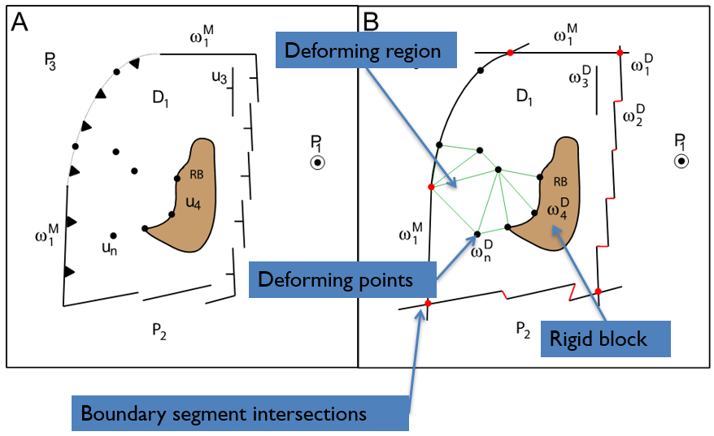
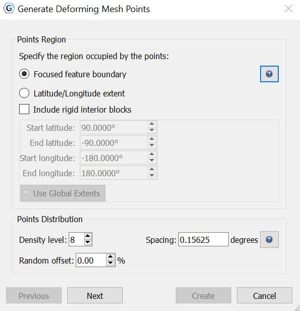
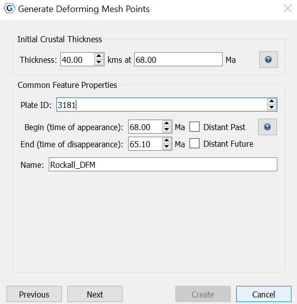
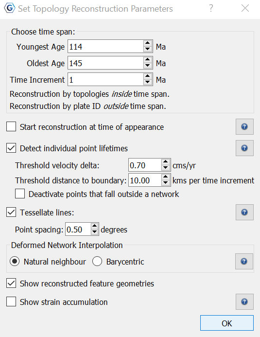
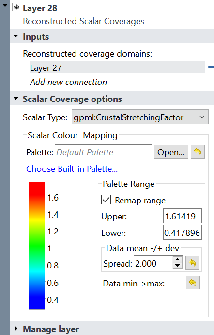
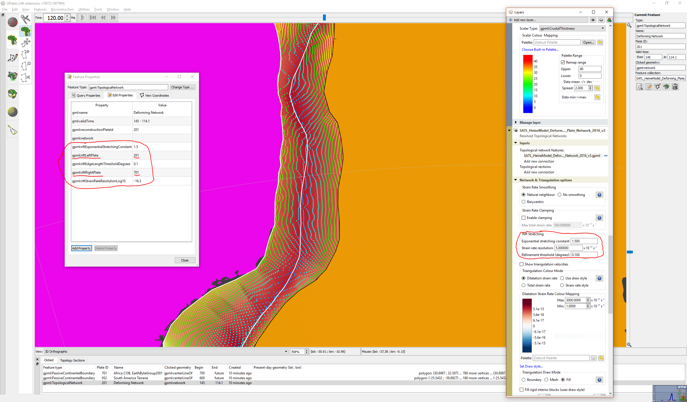

1 Introduction
============

Through GPlates, users can model the deformation of regions through time by defining the spatial and temporal extent of diffuse plate boundaries. These regions extend, compress and shear, contributing to the relative motion of rigid blocks in the traditional concept of plate tectonics. 

To model the deformation, users must first create a **Deforming Network**. A Deforming Network consists of a **boundary polygon** (resolved by *intersecting boundary line segments*, similar to topological closed plate polygons), optional interior **rigid blocks**, individual **deforming points**, and a **deforming region** (triangulation with vertices from boundary, rigid blocks and deforming points). Once the deforming network has been created, the user can then map the temporal crustal thickness evolution, the crustal stretching or thinning factor, strain rate variation, or degree of tectonic subsidence. The geometries of the regions change over time in regard to the kinematics defined by the user, producing results quantifiable by the stretching/thinning factors.

2 Create a Deforming Network
==========================

A deforming network can be created from existing polylines such as plate boundaries or faults or can be uploaded from a *.gpmlz* file.

To create a deforming network using existing polylines, navigate to the  . This tool has inbuilt feature selection, so all you need to do is select a polyline you wish to contribute to the boundary, and then select **"Add to Boundary"** under the **Topology Tools** dialog. Continue clockwise, adding each polyline you wish to the boundary untill you have a Closed Topological Feature. Then click **"Create Feature"** and follow through the dialogs to create the final Deforming Network, specifying the purpose, time span, adding new properties, or altering existing properties.

3 Generate Deforming Mesh Points
===========================

To begin with this feature, you must reconstruct to a desired point in time using their prefered method. Then, you should select a Deforming Network on the globe using the Choose Feature Tool  . You **must** then reconstruct the globe to the time in which the Network begins (visible in the Current Feature Panel). 

<table class ="note">
   <tbody>
      <tr>
         <td class="icon">
            
         </td>
         <td class="content" >It is <i>imperative</i> that the <b>Deforming Network</b> is selected at the beginning of its time span to ensure the relative changes are calculated in respect to the particular domains existence, or else the results <b>will be incorrect</b>.</td>
      </tr>
   </tbody>
</table>

Next, you navigate to **Features**, then **Generate Deforming Mesh Points**. 

The distribution of points fill a region defined either by a polygon boundary or a latitude/longitude extent. The initial crustal point positions are uniformly distributed within the points regions. A **random offset** can be applied to each position, varying between 0 and 100%. At 100%, each point is randomly offset within a circle of radius half the spacing between points. The **density level** can also be altered, with points spaced roughly 20 degrees apart at level zero. The spacing between the points halves with each increment of density level.

<table class ="note">
   <tbody>
      <tr>
         <td class="icon">
            
         </td>
         <td class="content" >The initial crustal thickness is set at a default depth of 40kms, however can be altered based on personal or supported preference to achieve a different result.</td>
      </tr>
   </tbody>
</table>

The **Common Feature Properties** dialog allows users to:

-   *Specify a time period* in the unit of millions of years ago (Ma).

    -   Present day = **0 Ma**

    -   **Begin** time: 

        -   Indicates the time (in Ma) at which the feature appeared or was formed.

        -   Should be earlier than, or same as the **End** time.

    -   **End** time:

        -   Indicates the time (in Ma) at which the feature disappeared or was destroyed.

-   Assign a **Plate ID**.

-   Assign a **Name**.

<table class ="note">
   <tbody>
      <tr>
         <td class="icon">
            
         </td>
         <td class="content" >If the time of appearance is <i>not known</i>, select <b>Distant Past</b>. Similarily, if the time of destruction is <i>not known</i>, select <b>Distant Future</b>.</td>
      </tr>
   </tbody>
</table>

## 3.1 Setting Topology Reconstruction Parameters

This dialog allows you to set the particular parameters for your topology reconstruction.

### 3.1.1 Choose time span

Here you specify the **time span** (in Ma) in which you wish for the reconstruction to occur, in addition to the **time increment** (in Ma). Reconstruction by topologies occurs *inside* the time span specified, while reconstruction by Plate ID occurs *outside* the time span. 

### 3.1.2 Starting reconstruction at time of appearance

Reconstruction using topologies starts at an initial geological time which could be present day or a past geological time. 

There is the option to *start the reconstruction* at the feature's time of appearance. If this check box is *ticked*, then the feature's initial time of appearance is used as the initial time for that feature. Otherwise, the feature's *geometry import time* is used (if the feature has one). If the feature does not have a *geometry import time*, present day (0 Ma) is used.

<table class ="note">
   <tbody>
      <tr>
         <td class="icon">
            
         </td>
         <td class="content" >Note that features digitised using GPlates 2.0 or above record the <i>geometry import time property</i> (gpml:geometryImportTime) as the geological time the feature was digitised at. This includes generated crustal thickness points.</td>
      </tr>
   </tbody>
</table>

### 3.1.3 Detect individual point lifetimes

If you choose to have the **lifetimes of individual points detected**, then they can disappear when they are:

-   *subducted* (going forward in time), or

-   *consumed* by a mid-ocean ridge (going backward in time).

Otherwise the points never disappear and are just *propagated* from one plate/network to another over time.

-   When detecting lifetimes, two parameters can be tweaked to affect the detection algorithm:

    - **threshold velocity delta**: A point that transitions from one plate/network to another can disappear if the change in velocity exceeds this threshold (in cms/yr).

    - **threshold distance to boundary**: Only those transitioning points exceeding the *threshold velocity delta* and that are close enough to a plate/network boundary can disappear. The distance is proportional to the *relative velocity* (change in velocity), plus a constant offset based on the **threshold distance to boundary** (in kms/myr) to account for plate boundaries that change shape significantly from one time step to the next (*note that some boundaries are meant to do this and others are a result of digitisation*). The actual distance threshold used is **(threshold_distance_to_boundary + relative_velocity) * time_increment**.

Furthermore, there is the option to have points inside a deforming network disappear as soon as they fall outside all deforming networks. This option is enabled by checking the **Deactivate points that fall outside a network** check box.

<table class ="tip">
   <tbody>
      <tr>
         <td class="icon">
            
         </td>
         <td class="content" >This ability is useful for initial crustal thickness points that have been generated inside a deforming network and where subsequently deformed points should be <i>limited</i> to the deformed network regions. In this case sudden large changes to the deforming network boundary can progressively exclude points over time. However, in the case where the topologies (deforming networks and rigid plates) have global coverage, this option should generally be <i>left disabled</i> so that points falling outside deforming networks can then be reconstructed using rigid plates. And these rigidly reconstructed points may even re-enter a subsequent deforming network. </td>
      </tr>
   </tbody>
</table>

### 3.1.4 Tessellate lines

Polyline and polygon geometries are uniformly sampled into points (rather than retaining the line segments) with a sample spacing that can be controlled, when the option to **Tessellate lines** is checked.

<table class ="note">
   <tbody>
      <tr>
         <td class="icon">
            
         </td>
         <td class="content" >The individual points of the polyline or polygon can deform (to change the shape of the geometry) and subduct (if inside an oceanic plate) just as with multipoint geometries. In the future the line segments will return.</td>
      </tr>
   </tbody>
</table>

### 3.1.5 Deformed Network Interpolation

Points falling inside topological networks deform according to their location within the network's triangulation.

-   For **Barycentric** interpolation, only the triangle containing the point will deform it.

-   For **Natural Neighbour** interpolation, nearby triangles also contribute to a point's deformation. This tends to reduce the faceted effect of the triangulation on deformed point positions.

### 3.1.6 Strain accumulation

Total strain is accumulated for each point from oldest age of the time span/range of topology reconstruction to the current reconstruction time. If you choose to **Show strain accumulation** then each point will render the principal components of its strain oriented in the principal directions, with outwards-facing red arrows for *extension* and inward-facing blue arrows for *compression*. 

4 Reconstructed Scalar Coverages Layer
====================================

Once the Deforming Mesh Points have been created, a new *Reconstructed Scalar Coverages* layer is produced. The Deforming Networks temporal and spatial evolution can then be modelled through a variety of **Scalar Types**. 

## 4.1 Crustal Thickness

Crustal thickness represents the actual crustal thickness in kms.

## 4.2 Crustal Stretching Factor

The Crustal stretching (beta) factor represents changing crustal thickness **'T'** according to **'beta = Ti/T'**, where **'Ti'** is initial thickness. Values greater than 1 represent extensional regions and values between 0 and 1 represent compressional regions. This factor starts with an initial value of 1.0 and has no units.

## 4.3 Crustal Thinning Factor

The crustal thinning (gamma) factor represents changing crustal thickness **'T'** according to **'gamma = (1 - T/Ti)'** (also written as 1 - 1/**beta**) where **'Ti'** is initial thickness. This factor is used because syn-rift subsidence is linearly related to 1 - 1/beta, while beta is not. Values between 0 and 1 represent extensional regions and negative values represent compressional regions. This factor starts with an initial value of 0.0 and has no units. 

## 4.4 Tectonic Subsidence

Thermal tectonic subsidence can occur during stretching/rifting (opposed to McKenzie instantaneous stretching). Numerically solving the 1D (lithosphere depth) temperature advection-diffusion equation corroborates this claim. The Advection term (based on strain rate) transports hot asthenosphere upward, thus reducing subsidence, while the Diffusion cools over time, increasing subsidence consequentially. The initial condition is a linear temperature gradient over lithosphere depth (equilibrium state). Initial tectonic subsidence commences at zero (km) and is positive moving down. Non-zero initial subsidence can be specified in pyGPlates, as well as a non-flat region. 

<table class ="note">
   <tbody>
      <tr>
         <td class="icon">
            
         </td>
         <td class="content" >Each Scalar Type (e.g. crustal stretching factor, tectonic subsidence etc.) can be assigned an individual palette, that is saved by the project file (or recent session). The ranges of these palettes are adjustable in the Reconstructed Scalar Coverages Layer also.</td>
      </tr>
   </tbody>
</table>

5 Exponential Rift Stretching Profile
===============================

To avoid the problem of *constant* stretching across a rifting profile, the user can make it exponential. This is achieved by adding more points to the interior of a deforming network and distributing the velocities at these points such that the strain rate varies exponentially (along the stretching direction) from the un-stretched side of the rift towards the rift centre. 

This feature works reasonably well for regular rifts (like AFR-SAM). However, for oblique rifts (like AUS-ANT), more work needs to be completed.

To achieve this all you need to do is load in a deforming model and add a 'rift' left and right plate ID to any deforming network (e.g. in the South Atlantic). It doesn't matter which plate is left and which is right (ie, you can swap them). The presence of these two plate IDs is what triggers the rift stretching algorithm in GPlates (on a per-network basis).

There are also three other parameters (noted below), in addition to the two plate IDs mentioned above, that can either be set on a deforming network feature or just set in the layer. If they are set in both places, then the feature properties override the layer parameters. These parameters can be directly modified to see what effect they have on crustal thicknesses. 

### Parameters:

   -   *riftLeftPlate/riftRightPlate*: Two conjugate rigid plates bounding a rift topological network. The presence of riftLeftPlate and riftRightPlate triggers the generation of an exponential strain rate rift profile in GPlates.
   
<table class ="note">
   <tbody>
      <tr>
         <td class="icon">
            
         </td>
         <td class="content" >These should only be defined <b>when a topological network is a rift</b>.</td>
      </tr>
   </tbody>
</table>   

   -   *riftExponentialStretchinConstant*: Controls exponential variation of stretchin across a rift profile in network triangulation. The strain rate in the rift stretching direction varies exponentially from un-stretched side of rift towards the rift axis. The spatial variation in strain rate is SR(x) = SR_constant * exp(C*x) * [C * / (exp(C) - 1)] where SR_constant is un-subdivided strain rate, C is stretching constant and x=0 at un-stretched side and x=1 at stretched point. Therefore SR(0) < SR_constant < SR(1). For example, when C=1.0 then SR(0) = 0.58 * SR_constant and SR(1) = 1.58 * SR_constant.

   -   *riftStrainRateResolutionLog10*: Rift edges in network triangulation are sub-divided until strain rate matches exponential curve within this tolerance (10^resolution, in units of 1/second). To set *riftStrainRateResolutionLog10*, take your strain rate threshold (in units of 1/second) and then take log10 of that. For example, a strain rate resolution of 2e-17 gets converted to -16.7.  (However, note that in the layer parameters you don’t need to take log10). Sub-division is also limited by *riftEdgeLengthThresholdDegrees*.

   -   *riftEdgeLengthThresholdDegrees*: Rift edges in network triangulation shorter than this length, in degrees, will not be further sub-divided. Rifts edges in network triangulation are sub-divided to fit an exponential strain rate profile in the rift stretching direction. Sub-division is also limited by *riftStrainRateResolutionLog10*.