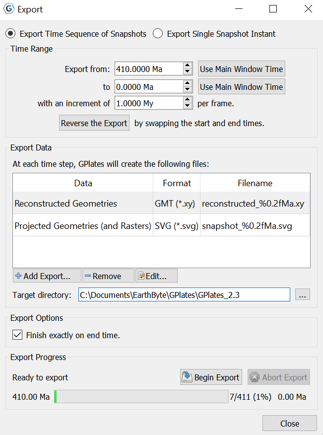
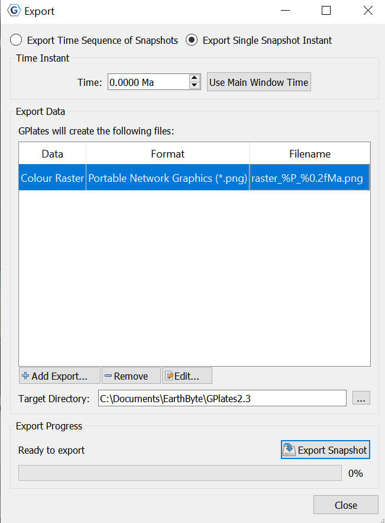
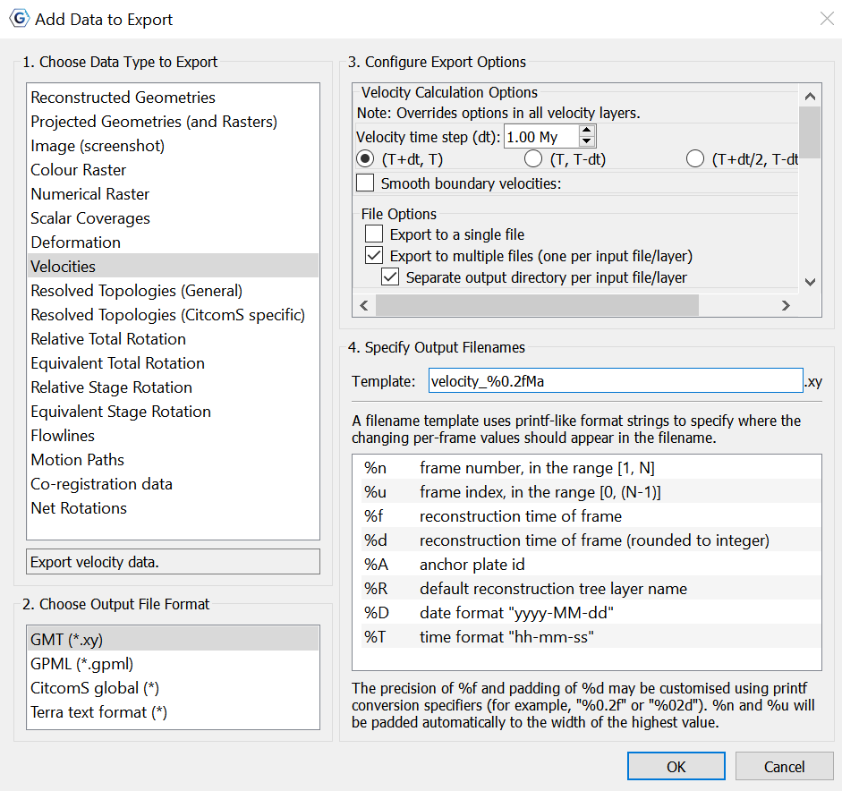

Introduction
============

The *export* functionality allows users to save scientific data or images to files.

Export dialog
=============

The **Export** dialog can be accessed via the **Reconstruction** menu, by choosing the **Export…** item (shortcut **Ctrl+Shift+E**). It is used to configure what aspects of the data you want export, what time range you want to export over, and the file names and formats you want to use.

The Export process can work in two different modes: Exporting a **Time Sequence** of snapshots, or just exporting a **Single Snapshot** of data.

The controls are divided into three groups. **Range** (or **Time** for a single snapshot), **Options**, and **Export**.

Export Time Sequence of Snapshots
---------------------------------

Given a time range, export a series of files. Each file contains data at a particular time point. To activate the controls for exporting a time sequence, choose the **Export Time Sequences of Snapshots** option at the top of the dialog.



Export single Snapshot
----------------------

Export data or image at a single specific time. To activate the controls for a one-off snapshot, click the **Export Single Snapshot** option at the top of the dialog.



Time Range
-----

When using **Export Time Sequence of Snapshots**, the **Time Range** group of controls specifies the time range that the **Export** will cover. For convenience, these controls are linked to the **Animation** system, and affect the same time range that you see with the **Time Slider** and **Configure Animation** dialog - this way you can see a preview of what will be exported.

The **Use Main Window Time** buttons are a convenient way of quickly entering the time that the main window is currently viewing. The **Reverse the Export** button can swap the start and end time for the export.

Time Instant
----

The **Time Instant** group is used with **Export Single Snapshot** to specify a time point.

Export Data
-------

The **Export Data** group specifies the items that users want to export and the directory to store output files.

A table shows what files will be created at each time, along with the substitution pattern that will be used to create each unique file name. Users can use **Add Export…** to add a new export to the table, **Remove** to remove an existing export, or **Edit** to modify an existing export in the table.

The **Target directory** specifies which directory all the files will be created in. Users can use the button on the right to select directory.

Export Options
------

The **Export Options** group is for Exporting Time Sequence of Snapshots, and allows you to check whether you wish for the Export to **finish exactly on end time**, or not.

<table class ="important">
   <tbody>
      <tr>
         <td class="icon">
            
         </td>
         <td class="content" >The <b>Finish exactly on end time</b> checkbox is important if you are creating an animation with a time increment that is not an exact multiple of the range of your animation. For example, creating an animation between 18 Ma and 0 Ma, in increments of 5 My. This range leaves a 3 million year gap at the end which does not fit neatly into the supplied 18-0 range. Checking the <b>Finish exactly on end time</b> option ensures that GPlates will still write this final, shorter, frame.</td>
      </tr>
   </tbody>
</table>

Export Progress
------

The **Export Progress** group is used to start and stop the export, and provide progress information during the export process. Click **Begin Export** to commence the export and begin creating files. If you have specified a large range, this may take some time.

The **Abort Export** button is provided in the event that users wishes to terminate the export sequence early. In **Export single Snapshot** mode, users can not abort.

Add Export dialog
===================

When choosing the **Add Export** button to add a new export item to the table, the **Add Data to Export** dialog is shown to allow the selection of export type, format, and filename.



Next, follow steps 1-4 below and then choose **OK** to add your chosen export.

1 Choose Data Type to Export
---------------------

This is a list of export data types to choose from (see [Export Data Types](#export-data-types)).

2 Choose Output File Format
------

When an export data type is selected, its available output file formats will be listed in this group.

3 Configure Export Options
---------------

Each export data type usually has a different set of export options. In this group you can configure these options.

Note that sometimes the available options can change slightly when selecting a different output file format. For example, when exporting *Reconstructed Geometries* to *Shapefile* format a *Dateline Wrapping* option appears that is not available with the *GMT* format.

4 Specify Output Filenames
------------------

Specify the file name template which will be used to generate output file names.

The filename **Template** field is used by GPlates to generate exported filenames and ensure that each export snapshot gets assigned a unique name. Special **Placeholder** tokens (listed below) can be used in this text entry box that GPlates will substitute for different values according to what is being exported and at what time.

<table>
   <colgroup>
      <col style="width: 6%" />
      <col style="width: 93%" />
   </colgroup>
   <thead>
      <tr class="header">
         <th>Placeholder</th>
         <th>Description</th>
      </tr>
   </thead>
   <tbody>
      <tr class="odd">
         <td>
            <p>%n</p>
         </td>
         <td>
            <p>the &quot;number&quot; (index + 1) of the frame — will lie in the inclusive range [1, N], and will be padded to the width of the decimal integer representation of N.</p>
         </td>
      </tr>
      <tr class="even">
         <td>
            <p>%u</p>
         </td>
         <td>
            <p>the index of the frame — will lie in the inclusive range [0, (N - 1)], and will be padded to the width of the decimal integer representation of (N - 1).</p>
         </td>
      </tr>
      <tr class="odd">
         <td>
            <p>%f</p>
         </td>
         <td>
            <p>the reconstruction-time instant of the frame, in printf-style %f format.</p>
         </td>
      </tr>
      <tr class="even">
         <td>
            <p>%d</p>
         </td>
         <td>
            <p>the reconstruction-time instant of the frame, rounded to the closest integer, in printf-style %d format.</p>
         </td>
      </tr>
      <tr class="odd">
         <td>
            <p>%A</p>
         </td>
         <td>
            <p>anchor plate ID</p>
         </td>
      </tr>
      <tr class="even">
         <td>
            <p>%R</p>
         </td>
         <td>
            <p> default reconstruction tree layer name.</p>
         </td>
      </tr>
      <tr class="odd">
         <td>
            <p>%D</p>
         </td>
         <td>
            <p> date format &quot;yyyy-MM-dd&quot;.</p>
         </td>
      </tr>
      <tr class="even">
         <td>
            <p>%T</p>
         </td>
         <td>
            <p> time format &quot;hh-mm-ss&quot;.</p>
         </td>
      </tr>
   </tbody>
</table>

Export Data Types
============

Below is a table of available export data types.

<table>
   <colgroup>
      <col style="width: 28%" />
      <col style="width: 35%" />
      <col style="width: 35%" />
   </colgroup>
   <thead>
      <tr class="header">
         <th>Data Type</th>
         <th>Format</th>
         <th>Description</th>
      </tr>
   </thead>
   <tbody>
      <tr class="odd">
         <td>
            <p>Reconstructed Geometries</p>
         </td>
         <td>
            <p>GMT, Shapefiles, OGR-GMT, GeoJSON</p>
         </td>
         <td>
            <p>Export the reconstructed geometries in their paleo-coordinates.</p>
         </td>
      </tr>
      <tr class="even">
         <td>
            <p>Projected Geometries (and Rasters, 3D Scalar Fields)</p>
         </td>
         <td>
            <p>SVG</p>
         </td>
         <td>
            <p>Export projected geometries (and projected raster, 3D scalar field) data according to the current View settings.</p>
         </td>
      </tr>
      <tr class="odd">
         <td>
            <p>Image (screenshot)</p>
         </td>
         <td>
            <p>bmp,jpg,jpeg,png,ppm,tiff,xbm,xpm</p>
         </td>
         <td>
            <p>Export image (screenshot) of current view (globe or map).</p>
         </td>
      </tr>
      <tr class="even">
         <td>
            <p>Colour raster</p>
         </td>
         <td>
            <p>bmp,jpg,jpeg,png,tiff,img</p>
         </td>
         <td>
            <p>Export 8-bit (per channel) RGBA (or RGB) coloured raster data. Exports each visible raster layer to a single file (per time step). RGBA (and RGB) raster layers contain colour pixels. Numerical raster layers converted to colour using layer's palette. Geo-referenced region stored in raster formats that support it.</p>
         </td>
      </tr>
      <tr class="odd">
         <td>
            <p>Numerical raster</p>
         </td>
         <td>
            <p>nc,grd,tif,img</p>
         </td>
         <td>
            <p>Export 32-bit floating-point numerical (non-coloured) raster data. Exports each visible (numerical) raster to a single file (per time step). RGBA (and RGB) raster layers are not exported. Numerical raster layers contain floating-point pixels. NaN no-data value stored in pixels not covered by raster data. Geo-referenced region stored in raster</p>
         </td>
      </tr>
      <tr class="even">
         <td>
            <p>Scalar Coverages</p>
         </td>
         <td>
            <p>GMT,GPML</p>
         </td>
         <td>
            <p>Export reconstructed scalar coverages geometries with per-point scalar values. Exports visible reconstructed scalar coverage layers. Each geometry point exports a position and a scalar value. Scalar values for the currently selected scalar type are exported.</p>
         </td>
      </tr>
      <tr class="odd">
         <td>
            <p>Deformation</p>
         </td>
         <td>
            <p>GMT, GPML</p>
         </td>
         <td>
            <p>Export Deformation information. Exports visible reconstructed geometry layers connected to topology layers. Each geometry point exports a position, strain and strain rate.</p>
         </td>
      </tr>
      <tr class="even">
         <td>
            <p>Velocities</p>
         </td>
         <td>
            <p>xy,gpml,CitcomS,Terra</p>
         </td>
         <td>
            <p>Export Plate velocity data.</p>
         </td>
      </tr>
      <tr class="odd">
         <td>
            <p>Resolved Topologies</p>
         </td>
         <td>
            <p>GMT, Shapefiles, OGR-GMT, GeoJSON</p>
         </td>
         <td>
            <p>Export resolved topological lines and polygons (but not networks) for any feature type.</p>
         </td>
      </tr>
      <tr class="even">
         <td>
            <p>Resolved Topologies (CitcomS specific)</p>
         </td>
         <td>
            <p>GMT, Shapefiles, OGR-GMT, GeoJSON</p>
         </td>
         <td>
            <p>Export resolved topologies for use by CitcomS software. Exports boundaries of resovled topological close plate polygons/networks. Optionally exports the subsegment geometries of polygon/network boundaries.</p>
         </td>
      </tr>
      <tr class="odd">
         <td>
            <p>Relative Total Rotation</p>
         </td>
         <td>
            <p>CSV (either comma, semicolon, or tab delimited)</p>
         </td>
         <td>
            <p>Export relative total rotation data (between a moving/fixed plate pair from the export reconstruction time to present day).</p>
         </td>
      </tr>
      <tr class="even">
         <td>
            <p>Equivalent Total Rotation</p>
         </td>
         <td>
            <p>CSV (either comma, semicolon, or tab delimited)</p>
         </td>
         <td>
            <p>Export equivalent total rotation data (from an exported plate id to the anchor plate, from the export reconstruction time to present day).</p>
         </td>
      </tr>
      <tr class="odd">
         <td>
            <p>Relative Stage Rotation</p>
         </td>
         <td>
            <p>CSV (either comma, semicolon, or tab delimited)</p>
         </td>
         <td>
            <p>Export relative stage rotation data (between a moving/fixed plate pair, from <i>t+interval</i> Ma to <i>t</i> Ma where <i>t</i> is the export reconstruction time).</p>
         </td>
      </tr>
      <tr class="odd">
         <td>
            <p>Equivalent Stage Rotation</p>
         </td>
         <td>
            <p>CSV (either comma, semicolon, or tab delimited)</p>
         </td>
         <td>
            <p>Export equivalent stage rotation data (from an exported plate id to the anchor plate, from <i>t+interval</i> Ma to <i>t</i> Ma where <i>t</i> is the export reconstruction time).</p>
         </td>
      </tr>
      <tr class="even">
         <td>
            <p>Flowlines</p>
         </td>
         <td>
            <p>GMT, Shapefiles, OGR-GMT, GeoJSON</p>
         </td>
         <td>
            <p>Export flowlines.</p>
         </td>
      </tr>
      <tr class="odd">
         <td>
            <p>Motion Paths</p>
         </td>
         <td>
            <p>GMT, Shapefiles, OGR-GMT, GeoJSON</p>
         </td>
         <td>
            <p>Export motion tracks.</p>
         </td>
      </tr>
      <tr class="even">
         <td>
            <p>Co-registration data</p>
         </td>
         <td>
            <p>CSV (comma delimited)</p>
         </td>
         <td>
            <p>Co-registration data for data-mining.</p>
         </td>
      </tr>
      <tr class="odd">
         <td>
            <p>Net Rotations</p>
         </td>
         <td>
            <p>CSV (either comma, semicolon,  or tab delimited)</p>
         </td>
         <td>
            <p>Export net-rotation data based on a set of dynamic polygons.</p>
         </td>
      </tr>
   </tbody>
</table>


Exporting Reconstructed Geometries
------------------------

This option allows the user to export reconstructed geometries. 

To export a reconstructed geometry, you have the following output file format options:

-   GMT (`*.xy`)

-   Shapefiles (`*.shp`)

    -   Dateline wrapping option *automatically* ticked

-   OGR-GMT (`*.gmt`)

    -   Dateline wrapping option

-   GeoJSON (`*.geojson`)

    -   Dateline wrapping option

#### Dateline wrapping option

If you choose to enable/disable dateline wrapping, then polyline and polgon geometries will be clipped ot the dateline (if they intersect it) and wrapped to the other side as needed. Note that this can break a polyline into multiple polylines or a polygon into multiple polygons - and once saved this process is irreversible - in other words reloading the saved file will not undo the wrapping. *This option is provided to support ArcGIS users* - it prevents horizontal lines across the display when viewing geometries.


Exporting Projected Geometries (and Rasters, 3D Scalar Fields)
----------------------------------------------------

This export option allows the user to export projected geometries (and projected raster) data.

To export Projected Geometries, the user is given the following output file option:

-   Scalable Vector Graphic (`*.svg`)

This is similar to the **Image (screenshot)** export, in the sense that both capture the (projected) viewport as it appears in GPlates, except to Scalable Vector Graphics (SVG) format instead of an image. Reconstructed geometries are represented as SVG vector geometries (points/polylines/polygons). Whereas both rasters and 3D scalar fields are represented as SVG images. For example, a 3D scalar field is rendered as a flat 2D image (as it appears in the viewport).

The user can configure the image resolution of the projected geometries they wish to export, by adjusting the width and height of the export. They can also select to constrain the aspect ratio, which locks the height, and ensures the correct ratio is applied when the width is changed manually. At any time they can revert to the window dimensions.


Exporting an Image (screenshot)
----------------

This export option allows users to export an image (screenshot) of the current view (globe or map).

To export an Image (screenshot), the user is given the following output file formats to choose from:

-   Window's Bitmap (`*.bmp`)

-   Joint Photographic Experts Group (`*.jpg`)

-   Joint Photographic Experts Group (`*.jpeg`)

-   Portable Network Graphics (`*.png`)

-   Portable PIxmap (`*.ppm`)

-   Tagged Image File Format (`*.tiff`)

-   X11 Bitmap (`*.xbm`)

-   X11 Pixmap (`*.xpm`)

The user can configure the image resolution of the Image (screenshot) they wish to export, for any of the file output options, by adjusting the width and height of the export. They can also select to constrain the aspect ratio, which locks the height, and ensures the correct ratio is applied when the width is changed manually. At any time they can revert to the window dimensions.


Exporting a Colour Raster
-------------

This export option allows the user to export 8-bit (per channel) RGBA (or RGB) coloured raster data:

-   Exports each visible raster layer to a single file (per time step).

-   RGBA (and RGB) raster layers contain colour pixels.

-   Numerical raster layers converted to colour using layer's palette.

-   Geo-referenced region stored in raster formats that support it.

To export a Colour Raster, the user is given the following output file formats to choose from:

-   Windows Bitmap (`*.bmp`)

-   Joint Photgraphic Experts Group (`*.jpg`)

-   Joint Photographic Experts Group (`*.jpeg`)

-   Portable Network Graphics (`*.png`)

-   GeoTIFF (`*.tif`)

-   Erdas Imagine (`*.img`)

#### Colour Raster Configure Export Options

Each of these file output formats give the following options to configure the export:

-   Resolution

    -   Adjust pixel spacing. *Automatically* set at 0.100000 degrees.

-   Exported Regions

    -   The option to choose **Grid line registration**
 
        -   Grid line registration involves placing the pixel **centres** of border pixels on the boundary  of  the exported region. The default is pixel registration which places the pixel **area** boxes of   border pixels within the boundary, and hence the centres of border pixels are inside the exported   region by half a pixel.
        
        -   The top latitude and left longitude refer to the top-left pixel *centre* for *grid line*   registration and top-left corner of top-left pixel for *pixel* registration. Additionally the  bottom  latitude and right longitude refer to the bottom-right pixel centre for *grid line*  registration and  bottom-right corner of bottom-right pixel for *pixel* registration.
        
        -   Also note that the top latitude can be less than the bottom latitude (raster is flipped   vertically), and the right longitude can be less than the left longitude (raster is flipped   horizontally).
  
        -   You can revert to use Global Extents at any point in time.
        
        -   This lat-lon georeferencing information is also saved to those formats supporting it. Note that   some software reports the lat-lon extents of the exported raster in *pixel* registration (such as   GDAL) while other software reports it in *grid line* registration (such as GMT). For example, a   1-degree global raster exported by GPlates with grid line registration is reported by GDAL as  having  pixel-registered lat-lon extents [-90.5, 90.5] and [-180.5, 180.5], and reported by GMT as  having  grid-line-registered lat-lon extents [-90, 90] and [-180, 180]. Both are correct since both  place  border pixel *centres* along the lat-lon extents [-90, 90] and [-180, 180]. 

-   Exported Pixel Dimensions

    -   These dimensions can be changed when the **Pixel spacing** is edited (in resolution section).

**GeoTIFF and Erdas Imagine Output File Formats also have the following option in addition to all above options for colour rasters**:

-   Compression

    -   Choose to 'Enable compression' or not.

When these rasters are exported, their layer name will replace '%P' in the file name. 


Exporting a Numerical Raster
----------------

This export options allows users to export 32-bit floating-point numerical (non-coloured) raster data:

-   Exports each visible (numerical) raster layer to a single file (per time step).

-   RGBA (and RGB) raster layers are not exported.

-   Numerical raster layers contain floating-point pixels.

-   NaN no-data value stored in pixels not covered by raster data.

-   Geo-referenced region stored in raster.

To export a Numerical Raster, the user is given the following output file formats to choose from:

-   NetCDF/GMT (`*.nc`)

-   NetCDF/GMT (`*.grd`)

-   GeoTiff (`*.tif`)

-   Erdas Imagine (`*.img`)

For **all** of these file output options, the user is then given the following options to cofigure the export:

-   Resolution

    -   Adjust pixel spacing. *Automatically* set at 0.100000 degrees.

-   Compression

    -   Choose to 'Enable compression' or not.

-   Exported Region

    -   The option to choose grid line registration. See [Colour Raster](#colour-raster-configure-export-options) for more information on grid line registration. 

-   Exported Pixel Dimensions

    -   These dimensions can be changed when the **Pixel spacing** is edited (in resolution section).


Exporting Scalar Coverages
----------------

This export option allows you to export reconstructed scalar coverages (geometries with per-point scalar values):

-   Exports visible reconstructed scalar coverage layers.

-   Each geometry point exports a position and a scalar value.

-   Scalar values for the currently selected scalar type are exported.

-   Per-point deformation strain and strain rate can also be exported.

#### Scalar Coverages Output file format options

To export Scalar Coverages, the user is given the following output file formats to choose from:

-   GMT (`*.xy`)

-   GMPL (`*.gmpl`)

The output file formats both have the following options to configure the export:

-   Export to a single file

-   Export to multiple files (one per input file/layer). *Automatically* ticked.

    -   Separate output directory per input file/layer

-   Include Strain Options

    -   The option to include dilatation strain.

-   Include Strain Rate Options

    -   The option to include dilatation strain rate (1/sec)

    -   The option to include total strain rate (1/sec)


Scalar values in the **GMT (`*.xy`) export** will be exported as:
   
   -   longitude     latitude     scalar

Scalar values in the **GMPL (`*.gmpl`) export** will be exported as:

   -   Scalar coverages containing visible scalar values.


A **GMT (`*.xy`) export** also has the export configure option of:

-   Domain Point Format Options

    -   Longitude / Latitude (GMT default)

    -   Latitude / Longitude


Exporting Deformation
-----------

This export options allows user to export Deformation information:

-   Exports visible reconstructed geometry layers connected to topology layers.

-   Each geometry point exports a positon, strain and strain rate.

This export option has the same Output File Format Options as the [Scalar Coverages](#scalar-coverages-output-file-format-options) export option. It also has the same export configure options. 

The Deformation information will be exported as scalar coverages containing:

-   `DilatationStrainRate`


Exporting Velocities
----------

This export option allows users to export velocity data. 

To export Velocities, the user is given the following output file formats to choose from:

-   GMT (`*.xy`)

-   GPML (`*.gpml`)

-   CitcomS global (*)

-   Terra text format (*)

The export output file formats for this export type all have different export configure options.

#### GMT export options

-   Velocity Calculation Options (Note: This overrides options in all velocity layers)

    -   Velocity time step(dt)
 
        -   *Automatically* set to 1.00 My
  
        -   Given the option of:
  
            -   (T+dt,T)
   
            -   (T, T-dt)
   
            -   (T+dt/2, T-dt/2)
 
    -   Smooth boundary velocities option:
 
       -   Change degrees. *Automatically set at 1.00 degrees*.
 
       -   Option to Exclude deforming regions
 
    -   File Options:
 
       -   Export to a single file
 
       -   Export to multiple files (one per input file/layer). *Automatically* ticked.
 
           -   Separate output directory per input file/layer.
 
    -   Velocity Vector Format Options:
 
        -   Cartesian 3D vector (vel_x / vel_y / vel_z)
  
        -   Colatitude / Longitude (South/East local tangent plane)
  
        -   Angle (-180 to +180 degrees anti-clockwise from West; 0 is East) / Magnitude
  
        -   Azimuth (0 to 360 degrees clockwise from North; 0 is North) / Magnitude
 
    -   Velocity Scale and Stride
 
        -   Scale (velocity magnitude multiplier). *Automatically* set at 1.0000
  
        -   Stride (output every 'n'th velocity). *Automatically* set at 1.
 
    -   Domain Point Format Options
 
        -   Longitude / Latitude (GMT default)
  
        -   Latitude / Longitude
 
    -   Include Options
 
        -   Include Plate ID
  
        -   Include domain point
  
        -   Include domain metadata

The velocity data will export as:

-   `domain_point_lon    domain_point_lat   velocity_x   velocity_y   velocity_z   plate_id`

-   **Velocities are given in cm/year**.

#### GPML export options

This export option is [identical to GMT](#gmt-export-options), however **does not include** the configure options of:

-   Velocity Vector format options

-   Velocity Scale and Stride

-   Domain Point Format Options

-   Include Options

The velocities in this file format will be exported in (`Colatitude, Longitude`) format. 

#### CitcomS global export options

This export option has the [Velocity Time Step (dt)](#gmt-export-options) in addition to the [Smooth boundary velocities option](#gmt-export-options) like that of the GMT export option. In addition, it also has the following export configure options:

-   CitcomS Grid Files

    -   CitcomS grid file names: `%D.mesh.%C`
 
        -   This identifies input CitcomS grid parameters required for each exported velocity file.
  
        -   Use '%C' to locate the diamond cap number in the CitcomS grid file name.
  
        -   Use '%D' to locate the diamond density/resolution.
  
        -   Velocities are only exported if matching CitcomS grid files are already loaded. 

-   GMT Export Options

    -   Choose to include an additional export to GMT format (".xy")
 
        -   GMT velocity scale (velocity magnitude mulitplier). *Automatically* set to 1.0000. Can be adjusted.
  
        -   GMT velocity stride (output every 'n'th velocity). *Automatically* set to 1. Can be adjusted. 

##### CitcomS Export Description

The CitcomS file export option replaces '%P' with the diamond cap number in each exported file name. 

Each velocity line in a CitcomS file contains:

-    velocity_colat   velocity_lon

Each velocity line in a GMT ('.xy') file contains:

-   `domain_point_lat   domain_point_lon   velocity_azimuth   velocity_magnitude`

#### Terra text format export options

This export option has the [Velocity Time Step (dt)](#gmt-export-options) in addition to the [Smooth boundary velocities option](#gmt-export-options) like that of the GMT export option. In addition, it also has the following export configure options:

-   Terra Grid Files

    -   Terra grid file names: TerraMesh.%MT.%NT.%ND.%NP

        -   This identifies input Terra grid parameters required for each exported velocity file.

        -   Use '%NP' to locate the local processor number in the Terra grid file name.

        -   Use '%MT', '%NT', and '%ND' to locate the Terra parameters 'mt', 'nt' and 'nd'.

        -   Velocities are only exported is matching Terra grid files are already loaded.

##### Terra text format export description

The Terra text format export option will replace '%P' with the local processor number in each exported velocity file name. The header lines, beginning with '>' contain Terra grid parameters and age. Then each velocity line contains:

-   `velocity_x   velocity_y   velocity_z`

Exporting Resolved Topologies(General)
----------------------------

This export option allows users to export resolved topologies:

-   Exports resolved topological lines and polygons (but not networks) for any feature type.

To export Resolved Topologies, the user is given the following output file formats to choose from:

-   GMT (`*.xy`)

-   Shapefiles (`*.shp`)

-   OGR-GMT (`*.gmt`)

-   GeoJSON (`*.geojson`)

The following options are given when exporting the resolved topologiee:

-   Dateline Wrapping (`*.shp`, `*.gmt`, `*.geojson` files only)

    -   Wrap polyline and polygon geometries to the dateline. - See the description of [Dateline Wrapping](#dateline-wrapping-option) for further information into this option.

    -   *Automatically* ticked for `*.shp` file format.

-   File Options

    -   Export to a single file. *Automatically ticked for all*

    -   Export to multiple files (one per input file/layer)

-   Resolved Geometry Options

    -   Export resolved topological lines

    -   Export resolved topological polygons

    -   Export resolved topological networks (boundary polygons)

    -   Export boundary segments (of polygons/networks):

        -   Note: duplicaiton removed (each segment shared by its two adjacent areas)
   
        -   (%P=`'boundaries'`,`'_ridge_transform_boundaries'`,`'_subduction_boundaries'`,`'_subduction_boundaries_sL'`,`'_subduction_boundaries_sR'`)

-   Polygon Options

    -   For `*.xy`, `*.gmt`, and `*.geojson` files:

        -   The option to force polygon orientation Clockwise or Counter-clockwise

    -   For `*.shp` files:

        -   Polygon orientation is Clockwise.

Exporting Resolved Topologies(CitcomS specific)
------------------------------------

This export options allows users to export resolved topologies for use by CitcomS software:

-   Exports boundaries of resolved topological closed plate polygons/networks.

-   Optionally exports the subsegment geometries of polygon/network boundaries

To export resolved topologies for use by CitcomS software, the following output file formats are available:

-   GMT (`*.gmt`)

-   Shapefiles (`*.shp`)

-   OGR-GMT (`*.gmt`)

-   GeoJSON(`*.geojson`)

The following options are available to configure the export:

-   Dateline Wrapping (option for `*.shp` files only)

    -   Wrap polyline and polygon geometries to the dateline. - See [Dateline Wrapping option](#dateline-wrapping-option) for more information into this option.

-   Plates

    -   Export each plate polygon to a separate file (%P='plate_'+rotation id)

    -   Export all plate boundaries to a single file (%P='platepolygons')

    -   Export plate boundary segments to files based on feature type:

        -   (%P=`'plate_boundaries','plate_ridge_transform_boundaries','plate_subduction_boundaries',plate'_subduction_boundaries_sL', 'plate_subduction_boundaries_sR'`)

-   Networks

    -   Export each Network polygon to a separate file (%P='network_'+rotation id)

    -   Export all Network polygons to a single file (%P='network_polygons')

    -   Export Network boundary segments to files based on feature type:

        -   (%P=`'network_boundaries','network_ridge_transform_boundaries','network_subduction_boundaries','network_subduction_boundaries_sL','network_subduction_boundaries_sR'`)

-   Slabs

    -   Export each Slab polygon to a separate file (%P='slab_'+rotation id)

    -   Export all Slab polygons to a single file (%P='slab_polygons')

    -   Export Slab boundary segments to files based on feature type:

        -   (%P=`'slab_edges','slab_edges_leading','slab_edges_leading_sL','slab_edges_leading_sR','slab_edges_trench','slab_edges_side'`)

-   All Polygons

    -   Plate/network/slab polygons combined into a single file (%P='polgons')

        -   Include all Plate polygons

        -   Include all Network polygons

        -   Include all Slab polygons

-   All Boundary segments

    -   Plate/network/slab boundary segments combined into files based on feature type: (%P=`'boundaries','ridge_transform_boundaries','subduction_boundaries','subduction_boundaries_sL','subduction_boundaries_sR'`)

        -   Include all Plate boundary segments

        -   Include all Network boundary segments

        -   Inlcude all Slab boundary segments

Exporting Relative Total Rotation
-----------------------

This export option allows user to export relative total rotation data:

-   *relative* is between a moving/fixed plate pair.

-   *total* is from the export reconstruction time

-   Each line in latitude/longitude format will contain:

    -   `moving_plate_id   euler_pole_lat   euler_pole_lon   euler_pole_angle`

-   Each line in 3D cartesian format will contain:

    -   `moving_plate id   euler_pole_x   euler_pole_y   euler_pole_z   euler_pole_angle   fixed_plate_id`

To export Equivalent Total Rotation's the user must choose from the following output file formats:

-   CSV file (comma delimited) (`*.csv`)

-   CSV file (semicolon delimited) (`*.csv`)

-   CSV file (tab delimited) (`*.csv`)

The following options are available to configure the export:

-   Rotation options

    -   Write indeterminate rotations as:

        -   "Indeterminate"

        -   North Pole Euler Pole

    -   Euler pole format:

        -   Latitude/longitude

        -   3D Cartesion (x,y,z)

Exporting Equivalent Total Rotation
--------------------------

This export option allows the user to export equivalent total rotation data:

-   *equivalent* is from an exported plate id to the anchor plate.

-   *total* is from the export reconstruction time to present day.

-   Each line in latitude/longitude format will contain:

    -   `plate_id   euler_pole_lat   euler_pole_lon   euler_pole_angle`

-   Each line in 3D cartesian format will contain:

    -   `plate id   euler_pole_x   euler_pole_y   euler_pole_z   euler_pole_angle`

The output file format options and the configure export options are **indentical** to that of [Relative Total Rotation's](#exporting-relative-total-rotation).

Exporting Relative Stage Rotation
-----------------------

This export option allows the user to export relatie stage rotation data:

-   *relative* is between a moving/fixed plate pair.

-   *stage* is from `t+interval` Ma to `t` Ma, where `t` is the export reconstruction time.

-   Each line in latitude/longitude format will contain:

    -   `moving_plate_id   stage_pole_lat   stage_pole_lon   stage_pole_angle   fixed_plate_id`

-   Each line in 3D cartesian format will contain:

    -   `moving_plate_id   stage_pole_x   stage_pole_y   stage_pole_z   stage_pole_fixed   fixed_plate_id`

The output file format options and the configure export options are almost **indentical** to that of [Relative Total Rotation's](#exporting-relative-total-rotation). However there is one extra eport configure option *for all file formats*:

-   Stage rotation options

    -   Stage rotation time interval (My)

Exporting Equivalent Stage Rotation
-------------------------

This export option allows the user to export stage rotation data:

-   *equivalent* is from an exported plate ID to the anchor plate.

-   *stage* is from `t+interval` to Ma to `t` Ma, where `t` is the export reconstruction time.

-   Each line in latitude/longitude format will contain:

    -   `plate_id   stage_pole_lat   stage_pole_lon   stage_pole_angle`

-   Each line in 3D cartesian format will contain:

    -   `plate_id   stage_pole_x   stage_pole_y   stage_pole_z   stage_pole_angle`

The output file format options and the configure export options are almost **indentical** to that of [Relative Total Rotation's](#exporting-relative-total-rotation). However there is one extra eport configure option *for all file formats*:

-   Stage rotation options

    -   Stage rotation time interval (My)

Exporting Flowlines
--------------------

This export option allows the user to export flowlines.

To export flowlines, the following output file format options are available:

-   GMT (`*.xy)`

-   Shapefiles (`*.shp`)

-   OGR-GMT (`*.gmt`)

-   GeoJSON (`*.geojson`)

Exporting motion paths have the following export options:

-   File Options (*for all file format options*):

    -   Export to a single file

    -   Export to multiple files (one per input file/layer)

        -   Separate output directory per input file/layer

-   Dateline Wrapping (*for all file format options **except** GMT*)

    -   Wrap polyline and polygon geometries to the dateline. - See [Dateline Wrapping](#dateline-wrapping-option) for more information into this option.

Exporting Motion Paths
------------

This export option allows the user to export motion tracks.

The file format options and options to configure the export are identical to that for the [Flowlines](#exporting-flowlines) export options.

Exporting Co-registration data
--------------------

This export option allows the user to export Co-registration data for data-mining.

To export Co-registration data, the following output file format option is available:

-   CSV file (comma delimited) (`*.csv`)

There are no options to configure this export. 


Exporting Net Rotations
-------------

Net lithosphere rotations can be exported over time. The net lithosophere rotation is a useful concept in geodynamics and can be used to check global rotation models. Models where plate motions are driven by mantle convection should have zero net lithosphere rotation.

For a given time reconstruction time, GPlates calculates the net lithosphere rotation based on the method described in Torsvik et al. 2010 *Plate tectonics and net lithosphere rotation over the last 150 My*. Earth and Planetary Science Letters 291, pp 106-112.

In addition to a rotation model, this export needs a closed plate polygon dataset, such as the dynamic polygon dataset provided in the geodata folder. Such a dataset, if constructed correctly, provides dynamic closed polygons covering the whole of the lithosphere for all reconstruction times of interest.

For each specified time step GPlates will create a csv-formatted output file containing the reconstruction time, a breakdown of the contribution from each plate (in the form of stage-pole, angular velocity, and plate area), and the net lithosphere rotation for that time.

**Example of net rotation output file:**

```
190  
PlateId,Lat (°),Lon (°),Angular velocity (°/Ma),Area (km2)  
101,-5.66643,194.502,0.859129,3.47035e+07  
280,6.16577,195.403,0.517291,2.17859e+06  
301,-5.47275,193.582,0.862577,3.77175e+07  
380,12.7946,173.121,0.844439,2.82862e+07  
449,6.16577,195.403,0.517291,6.19785e+07  
497,6.16577,195.403,0.517291,5.55872e+07  
498,43.6454,185.782,0.299004,5.34413e+06  
530,53.9416,174.266,0.409926,3.07373e+07  
607,6.16577,195.403,0.517291,1.81432e+07  
707,5.84829,195.276,0.515454,604999  
902,44.8427,162.369,0.69957,5.36242e+07  
919,4.76113,-26.252,0.599968,8.71006e+07  
926,-41.7798,143.754,0.649741,9.53976e+07  

Net rotation: (lat,lon,degrees/Ma): ",-1.00128,-166.95,0.349531
```

In addition the net rotations for each time step are collated in one file with name "total-net-rotations.csv":

**Example of total net rotation output file:**

```
Time (Ma),Lat (°),Lon (°),Angular velocity (°/Ma)  
170,-32.6324,82.837,0.142964  
160,-0.303429,75.4867,0.126344  
150,20.3478,130.5,0.197437  
140,-25.1647,-31.618,0.444411  
130,-43.0921,-30.1352,0.397041  
120,-19.9593,120.71,0.35672  
110,-66.0726,-100.477,0.318935  
100,-38.8836,165.001,0.216189  
90,-43.4639,129.239,0.438149  
80,-38.843,125.599,0.494966  
70,-43.4446,100.371,0.289385 
```

Note that GPlates uses dynamic closed polygons from any active layers in its net lithosphere calculations. If several such layers are loaded which have overlapping polygons, the user should ensure that only one such layer is activated.

