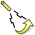
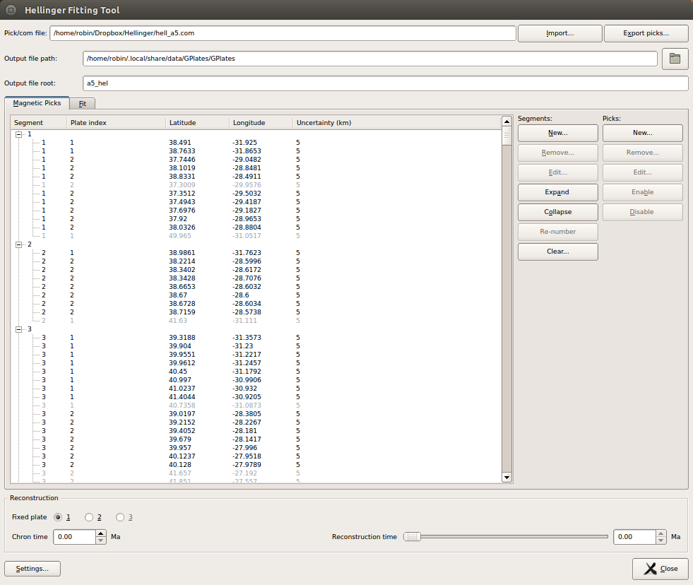
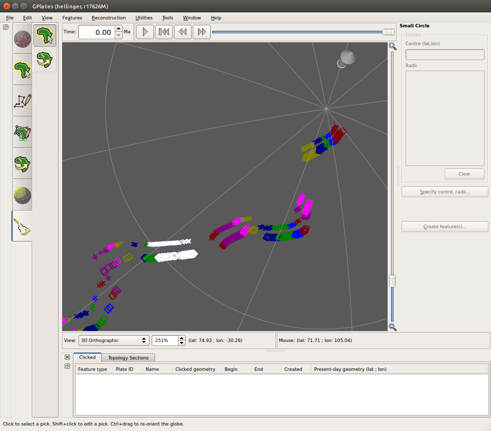
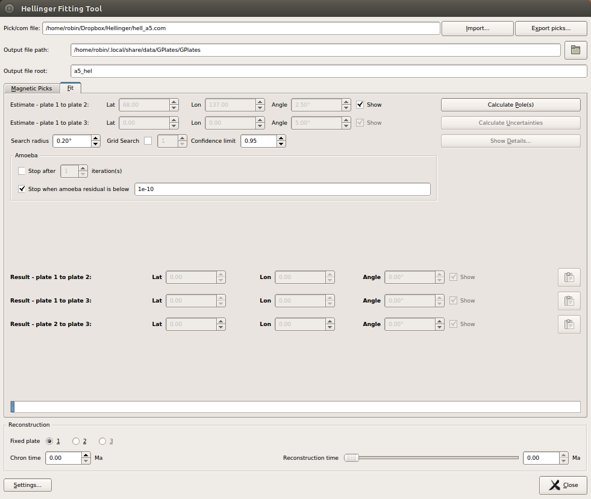

1 Introduction
============

The GPlates Hellinger tool lets the user generate a best-fit rotation pole to a series of segmented magnetic picks. The fitting, and determination of uncertainties, is performed using algorithms based on those in the FORTRAN program **hellinger1** and related programs, which are based on the work of Hellinger (1981) and of Chang, Royer and co-workers (1988, 1991). GPlates uses a python implementation of the original FORTRAN programs. Input and output file formats are consistent with those for the **hellinger1** program.

<table class ="note">
   <tbody>
      <tr>
         <td class="icon">
            
         </td>
         <td class="content" >Three-plate fitting capabalities (based on the <b>hellinger3</b> FORTRAN code) are under development; the additional widgets for this feature (e.g. an extra pole estimate, and extra resulting poles) are visible in the Hellinger dialog but are currently disabled.</td>
      </tr>
   </tbody>
</table>

2 Starting the tool
=================

The Hellinger tool is one of the Workflows visible at the left hand side of the main window, and can be started by selecting the Hellinger icon:   or using the shortcut **7**. On starting the tool, the Hellinger dialog window will open.

3 Closing the tool
================

In addition to closing the dialog with the **Close** button or the **Escape** key, the dialog will also close when another Workflow is selected. If the dialog has been closed, re-open it by switching to another Workflow and then switching back to the Hellinger tool. While the tool is active, a user can - as with other canvas tools - drag the canvas (i.e. the globe or map view) by using **Ctrl left click**, and can zoom the canvas using the mouse wheel or the zoom slider.

4 The tab interface
=================

The dialog includes a 2-tab interface, with **Magnetic picks** and **Fit** tabs. The **Magnetic picks** tab contains controls related to viewing and editing the picks; the **Fit** tab contains controls related to the fit parameters and fit results.

5 Importing magnetic picks
========================

Magnetic picks can be imported to the tool from \*.pick and \*.com file formats with the **Import** button. See below for details of these formats. After selecting a \*.pick or \*.com file, the magnetic picks in these files will be displayed in the **Picks table**. If a \*.com file was used, then pole-estimate and search-related information will also be displayed in the dialog. The pole estimate(s) will be also be displayed on the canvas with a light blue arrow symbol. (Colours can be changed using the **Settings** dialog, discussed later).

**The Picks tab after loading data from a pick file.**

6 Exporting magnetic picks
========================

Magnetic picks can be exported to \*.pick files using the **Export picks…** button.

7 Viewing, editing, and creating picks and segments
=================================================

7.1 Viewing picks
-------------

### 7.1.1 Picks in the table

Any imported picks will be displayed in the **Picks table** and on the canvas (i.e. the globe or map view) . The **Picks table** displays the picks in a tree structure, with each segment occupying a node of the tree. Individual segments can be collapsed and expanded by clicking the **plus** or **minus** symbols at segment nodes. The entire collection can be expanded or collapsed by using the **Expand** and **Collapse** buttons to the right of the table. Each pick is displayed in the form

    <segment> <plate index> <latitude>      <longitude>     <uncertainty>

where &lt;plate index&gt; is 1 or 2, and where the uncertainty is in kilometres. Each pick is either enabled or disabled: disabled picks are displayed in grey text. The enabled/disabled status of each pick can be changed by selecting the pick in the table and clicking the **Enable** or **Disable** buttons.

<table class ="note">
   <tbody>
      <tr>
         <td class="icon">
            
         </td>
         <td class="content" >In the hellinger1 FORTRAN code, plate index 1 was also referred to as the <b>moving</b> plate, and 2 as the <b>fixed</b> plate.</td>
      </tr>
   </tbody>
</table>

### 7.1.2 Picks on the canvas

Picks which are visible in the **Picks table** are also displayed on the canvas (i.e. the globe or map view) and will be visible there as long as the Hellinger dialog is open. Picks are displayed with the following symbols  
1.  plate index 1: cross

2.  plate index 2: square

When a pick is hovered over on the canvas, it will turn light grey, and its corresponding line in the **Picks table** will be highlighted in yellow. When a pick is selected on the canvas (by left clicking the pick symbol), it is displayed with a white symbol on the canvas, and the corresponding line in the **Picks table** is displayed in inverted colours.

<table class ="note">
   <tbody>
      <tr>
         <td class="icon">
            
         </td>
         <td class="content" >Disabled picks are not normally shown on the canvas, but if a disabled pick is selected in the <b>Picks table</b> it will be shown in grey on the canvas.</td>
      </tr>
   </tbody>
</table>

**Picks displayed on the canvas. One of the segments in the table has been selected, and its picks are shown in white..**

7.2 Editing picks
-------------

To edit a pick, select the pick either in the **Picks table** or on the canvas (left click), and press the **Edit** button in the Picks column. (Alternatively go directly to editing mode from the canvas by using **Shift-left-click**). This will open the **Edit pick** dialog, and the canvas symbol of the selected pick will turn yellow. Pick data can then be adjusted in the dialog. The pick location an be adjusted in 2 ways:

1.  by adjusting the lat lon spinboxes in the dialog, or

2.  by left-clicking and dragging the pick on the canvas.

Press **Apply** to accept the changes and to close the **Edit pick** dialog.

7.3 Creating picks
--------------

To create a new pick, select the **New** button in the Picks column. The **New Pick** dialog will open, where pick details can be entered. The current location of the new pick is also displayed by a yellow square symbol on the canvas. The location of the new pick can be aadjusted by three methods:

1.  the location is entered directly in the **Latitude** and **Longitude** spinboxes in the dialog.

2.  the location is specified by left-clicking on the canvas.

3.  the location is taken from an existing point or multi-point feature on the canvas. To do this, hover over the desired feature vertex, so that the point symbol increases in size, and **Shift-left-click** the point symbol.

To create the pick, press **Add pick**. The **New pick** dialog will remain open to allow further picks to be added. Close the dialog with the **Done** button.

7.4 Editing segments
----------------

To edit segments, select a segment node in the **Picks table**, and press the **Edit** button in the Segments column. The **Edit segment** dialog will open, where the user can adjust picks belonging to this segment, and add and remove picks. Double click on table cells to edit them. Revert the segment to its original state with the **Reset** button. Press **Apply** to apply the changes and close the **Edit segment** dialog. Editing segments is not currently possible via the canvas.

7.5 Creating segments
-----------------

To create a new segment, press the **New** button in the Segments column. Double click on table cells to edit them. Revert the segment to its original state with the **Reset** button. Press **Add Segment** to apply the changes and close the **New Segment** dialog. Creating new segments is not currently possible via the canvas.

8 Segment numbering
=================

Segment numbers should be contiguous beginning at 1 before attempting to generate a best-fit pole. If segment numbers are not suitable, GPlates will prompt the user before re-numbering the segments. Similarly if the user has attempted to add a new segment using an existing segment number, or change a segment number to an existing segment number, GPlates will prompt the user for one of several possible re-numbering actions. The user can re-number the segments at any time using the **Re-number** button in the Segments column.

9 Fitting
=======

9.1 Selecting output filenames and locations
----------------------------------------

Use the text boxes at the top of the Hellinger dialog to specify the location for output files from fitting, and the base filename for these files. By default the output directory will be:

-   for Windows: C:\\Users\\&lt;username&gt;\\AppData\\Local\\GPlates\\GPlates

-   for Mac osx: /Users/&lt;username&gt;/Library/Application Support/GPlates/GPlates

-   for Linux: ~/.local/share/data/GPlates/GPlates

The base filename will be derived from the last loaded pick file, or will be **hellinger\_output** if no pick file has been loaded. After two-plate fitting, the output directory should contain:

-   &lt;base-filename&gt;\_results.dat - the results of the fit

-   &lt;base-filename&gt;\_ellipse.dat - x y coords of the error ellipse

-   &lt;base-filename&gt;\_down.dat - data file for the lower surface, as per hellinger1

-   &lt;base-filename&gt;\_up.dat - data file for the upper surface, as per hellinger1

9.2 Providing fit settings, and performing the fit
----------------------------------------------

**The Fit tab.**

GPlates will perform a fit based on the algorithms in the hellinger1 FORTRAN code.

To perform a fit, first provide an estimate for the pole. The estimate can be entered in 3 ways:

1.  importing a \\\*.com file

2.  using the **Adjust Pole Estimate** canvas tool (the second of two canvas tools available in the Hellinger Workflow). When this tool is activated, the pole positions and opening angles are visible in blue. Adjust the pole locations by left-clicking and dragging the blue pole symbol (the large cylindrical arrow), and adjust the angle by left-clicking and dragging either of the end points of the arcs. Note that the arcs here are used purely to define a rotation angle - the direction of the arcs on the canvas are not used in any way.

3.  entering values in the **Lat**, **Lon** and **Angle** spinboxes (the **Adjust Pole Estimate** canvas tool needs to be selected to activate the spinboxes)

Provide a search radius (degrees), and press the **Calculate Pole** button. Performing the fit will most likely take several seconds, and the more data points that are used, the longer it will take. When a fit has been found, the pole(s) will be displayed in the **Result** fields in the dialog, and each will be indicated by a red arrow on the canvas.

By default a downhill simplex routine ("amoeba" routine, so-named because of the way in which the three sampling vertices move around the search space) is used to converge on a best-fitting pole. A grid search may also be performed before the amoeba routine. To perform a grid search, select the **Grid search** checkbox and provide the number of grid search iterations to perform. After performing a grid search, GPlates will use the downhill simplex routine to refine the result.

**Adjusting the pole estimate on the canvas. The user is dragging the pole estimate, and the new pole location and opening angle are highlighted in yellow..**

9.3 Adjusting fit parameters
------------------------

The criteria for determining a "good" fit can be adjusted in the **Amoeba** fields. At least one of the **amoeba** checkboxes should be selected in order to perform a downhill simplex-based fit. The downhill simplex will stop when either of the two provided criteria are met: the number of iterations, or the residual from the fit algorithm.

9.4 Estimating the fit uncertainty
------------------------------

After a best-fit pole has been determined, the uncertainty in the fit can be calculated using the **Calculate statistics** button. This will generate and display an uncertainty ellipse at the confidence level specified in the **Conf level** spinbox, and will generate output files containg representations of this ellipse, together with minimum and maximum rotation angles from each point of a lat-lon grid around the best fit pole. The resulting statistics can be viewed and exported to file through the **Show Details** button.

9.5 Testing the fit
---------------

The fit can be tested by using the **Reconstruction** slider at the bottom of the dialog. Enter the time corresponding to the chron of interest in the **Chron time** spinbox, and select which plate index you wish to remain fixed. A sample reconstruction can then be performed by using the reconstruction slider (or spinbox) to adjust the reconstruction time between present day and the chron time. This allows the user to check how well the individual picks fit together at the chron time.

10 Settings
========

The colours and sizes of some symbols can be adjusted in the **Settings** dialog. The colours of pole estimates, pole results, and error ellipses can be adjusted, along with the ellipse thickness. These settings are saved to disk and will be used in the next GPlates session.

11 File formats
============

To provide compatibility with legacy Fortran tools, the Hellinger tool supports import from two ascii text file formats - **Pick** files, which contain location and segmentation information about magnetic picks, and **Com** files, which contain input settings for the fitting routine. GPlates can also export pick files.

11.1 Pick files
----------

Pick files contain information about the position, uncertainty, and segmentation of magnetic picks. The files have file extension \*.pick, and each line of the text file corresponds to a segmented magnetic pick. The first five space-separated items in each line are parsed and interpreted by GPlates as follows:

    <plate-index>   <segment>       <latitude>      <longitude>     <uncertainty>

Any additional terms on each line are ignored by GPlates.

**&lt;plate-index&gt;** (integer) should normally have the value 1 or 2, where 1 represents the moving plate, and 2 represents the fixed plate. The number 3 immediately before the plate index (i.e. indices of the form 31 or 32) indicates that the pick is disabled. GPlates will still import disabled picks to the Hellinger tool, where they will be indicated as disabled in the Hellinger tool user interface. Users can enable and disable individual picks in the Hellinger tool.

**&lt;segment&gt;** (integer) indicates the segment number to which the pick belongs.

**&lt;latitude&gt;** (float) represents the latitude of the magnetic pick.

**&lt;longitude&gt;** (float) represents the longitude of the magnetic pick.

**&lt;uncertainty&gt;** (float) represents the uncertainty (in kilometres) of the magnetic pick position.

11.2 Com files
---------

Com files (normally used to provide input to the **hellinger1** FORTRAN program) contain parameters used in the fitting routine. These parameters can be entered manually in the Hellinger tool dialog, or can be imported from file. The file has at least 10 lines which are interpreted by GPlates as follows:

**&lt;pick file name&gt;** (string) - the name of a pick file to be used as input

**&lt;initial guess for pole&gt;** - (3 space-separated floats representing latitude, longitude and angle)

**&lt;search radius&gt;** (float) The radius (degrees) around the initial guess pole in which to search for the best-fitting pole

**&lt;grid search&gt;** (y or n) - whether or not to perform a full grid search. "y" means that a full grid search is performed, after which a downhill simplex algorithm is used to refine the search result. "n" means that only a downhill simplex algorithm is used.

The parameters of the grid search are currently hard-coded in that the search radius is divided into 10 steps in each of the x,y and z dimensions of h, where h is the perturbation rotation added to the initial guess rotation.

**&lt;confidence&gt;** (float in range \[0,1\]) - the confidence interval used when generating the error ellipse

<table class ="note">
   <tbody>
      <tr>
         <td class="icon">
            
         </td>
         <td class="content" >The following five lines are not used by GPlates.</td>
      </tr>
   </tbody>
</table>

**&lt;estimate kappa&gt;** (y or n) - whether or not kappa is estimated. This parameter is ignored by GPlates, which always calculates kappa.

**&lt;produce graphics output&gt;** (y or n) - whether or not to produce output files. This parameter is ignored by GPlates, which always generates output files.

**&lt;confidence region file&gt;** (string) - name of output file which will contain the coordinates of a confidence region ellipse. This parameter is ignored by GPlates, which instead uses filenames derived from the last-loaded pick file. (See [Selecting output filenames and locations](#91-selecting-output-filenames-and-locations) above). 

**&lt;upper bounds file&gt;** (string) - name of output file which will contain the maximun value of rotation angle on each point of a lat-lon grid around the best fit pole. This parameter is ignored by GPlates, which instead uses filenames derived from the last-loaded pick file. (See [Selecting output filenames and locations](#91-selecting-output-filenames-and-locations) above).

**&lt;lower bounds file&gt;** (string) - name of output file which will contain the minimum value of rotation angle on each point of a lat-lon grid around the best fit pole. This parameter is ignored by GPlates, which instead uses filenames derived from the last-loaded pick file. (See [Selecting output filenames and locations](#91-selecting-output-filenames-and-locations) above).

<table class ="note">
   <tbody>
      <tr>
         <td class="icon">
            
         </td>
         <td class="content" >The pole calculations are performed using a line-by-line python translation of the original FORTRAN code. The performance of this python code is currently considerably slower than that of the FORTRAN code.</td>
      </tr>
   </tbody>
</table>

