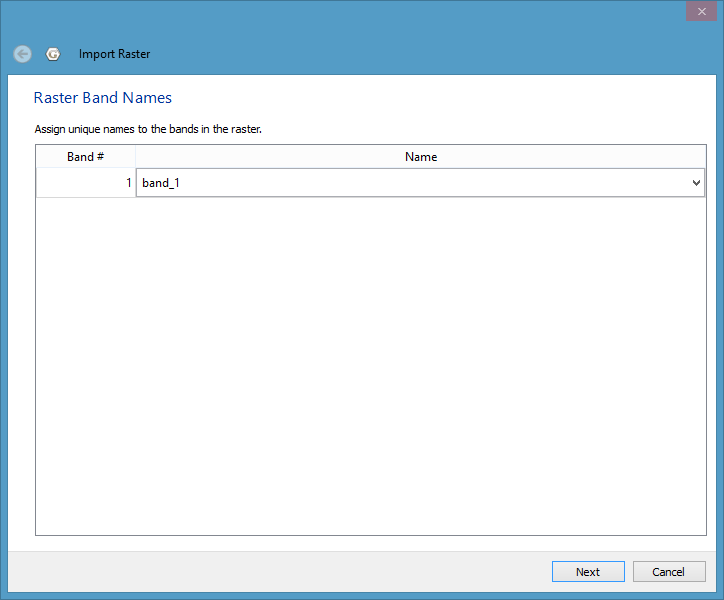

Introduction
============

Before a raster image or 3D scalar field data can be loaded into GPlates it must first be imported. This pre-processes the data into a form that is efficient for GPlates to load. It also associates the raster or scalar field with a GPML file. The import only needs to be done once for each raster or scalar field. After that you can simply load the GPML file (created during the import process) into GPlates like you would a regular feature collection (as covered in the [Loading and Saving](/docs/user-manual/LoadingAndSaving/) chapter).

Note that features containing vector geometries (points, polylines and polygons) do not require an import process. For example you can load a Shapefile directly into GPlates without first having to import it into GPML format.

Rasters
=======

GPlates has the facility to display raster images on the 3D globe (and the 2D map views).

GPlates can also reconstruct rasters back in geological time with the assistance of a set of static polygons (static meaning the shape of the polygons do not change in contrast to topological plate polygons which have dynamic shapes - see the **Topology Tools** chapter). For more information on reconstructing rasters please see the [Layers](/docs/user-manual/Layers/) chapter.

What are raster images?
-----------------------

A *raster image* is one formed by a 2-dimensional rectangular grid coloured by points. A single point of colour in the raster image is known as a *pixel*. Each pixel is positioned at one of the grid-points, and every grid-point has a pixel positioned on it.

The ability to display raster images on the globe enables the user to superimpose any kind of imagery or gridded data (such as satellite imagery, topography, bathymetry etc) on the surface of the globe, to be viewed at the same time as reconstructible features.

The ability to *reconstruct* raster images on the globe enables the user to visualise the movement of raster data as if it were "cutout" and "attached" to a set of polygons with the movement of the respective cutout raster pieces dictated by the movement of the individual polygons. For more information on reconstructing rasters please see the [Layers](/docs/user-manual/Layers/) chapter.

Which image formats does GPlates understand?
--------------------------------------------

GPlates reads images in a variety of formats which can be roughly categorised into two groups:

### RGBA images

These type of images have a Red, Green, Blue and optional Alpha value (usually 8-bits each) for each *pixel* in the image. Some of the supported file formats include JPEG (as known as JPG), PNG, TIFF, GIF. Formats like JPEG do not have transparency (the Alpha value) whereas other formats such as PNG support transparency. When raster images, containing transparent regions, are drawn on top of other rasters or vector geometries, the underlying rasters/geometries will be visible through the transparent regions. See the [Layers](/docs/user-manual/Layers/) chapter for more information on the visual ordering of rasters (or, more generally, layers). Some of these formats have inbuilt compression (such as JPEG) which result in smaller file sizes but can introduce compression artifacts depending on the compression quality. Other formats such as BMP do not have compression and can be quite large. Regardless of the file size the amount of memory used internally inside GPlates is the same for same-sized images.

### Floating-point images

There also exist integer formats but the floating-point formats are much more common and useful in general. These images have one (or more) raster *bands* where each *band* has a single *channel* (a single float-point value per pixel in the image). Most images have a single raster band. Supported file formats include NetCDF/GMT, GeoTIFF, ERMapper and Erdas Imagine. NetCDF files typically have the filename extension ".nc" or ".grd".

While RGB and RGBA images can be visualised directly since they already contain colour values (Red, Green and Blue), floating-point images require a mapping from a floating-point value to a colour value (RGB). This is done in the *Raster options* part of the raster layer. A new layer becomes visible in the *Layers* dialog for each raster loaded, or imported, into GPlates. For information on the *Raster options* please see the [Layers](/docs/user-manual/Layers/) chapter.

How do I import a raster image into GPlates?
--------------------------------------------

A global raster image is *imported* using the operation **Import Raster** in the sub-menu **Import** of the GPlates **File** menu. This will show a dialog requesting the user to choose the raster image file to be loaded.

If the selected raster image has been previously imported (and hence has an associated GPML file) then a message pops up giving you a choice to:

-   use the existing GPML (effectively cancelling the import process and instead loading the existing GPML file), or

-   continue with the import process (this means the existing GPML file will get overwritten if the you later decide to save the file), or

-   cancel the import process and not load anything.

Next you will be asked to enter the raster band name.

The default choice is *band\_1*. You can also type a new band name that describes the purpose or category of data contained in the raster. This is useful when you need to identify a specific raster band in the *Raster options* of the raster layer (for example to change the raster colour palette). Currently the import process does not support importing of multi-band rasters so there’s only one raster band per raster.

<table>
   <tbody>
      <tr>
         <td class="icon" style="width:5rem; display:inline-table;">
            
         </td>
         <td class="content">Previous versions of GPlates treated age-grid rasters (a floating-point raster where each pixel represents the age of the crust covered by the pixel) differently depending on whether you were planning to reconstruct another raster with the assistance of that age grid or whether you simply wanted to visualise the age grid as you would any other raster. This distinction, which required specifying <strong>age</strong> as the band name in the former case, is no longer required since the band name is no longer used to distinguish the two use cases. In other words, an age-grid raster can be visualised, or used to assist reconstruction of another raster, or both without any changes. See the <strong>Layers</strong> chapter for more information on using an age-grid raster for reconstruction.</td>
      </tr>
   </tbody>
</table>

If the imported raster file contains an embedded spatial reference system with georeferencing then it is imported, and hence GPlates will not ask you to specify the raster georeferencing. The georeferencing converts the raster’s pixel coordinates to its spatial reference system coordinates. The spatial reference system typically includes both a geographic coordinate system (datum) and an optional map projection. The following shows an imported raster containing an embedded Lambert Conformal Conic projection:

 

However if the imported raster file does **not** contain embedded georeferencing then you will be asked to confirm the global georeferencing information or enter new georeferencing information to control where on the globe your raster should be positioned. In this case the georeferencing determines the final latitude-longitude coordinates (of the image on the globe) which do not go through a further datum transformation or map projection.

GPlates is able to display global (covering the whole globe) and regional (covering a user-specified zone) raster images. GPlates assumes that a global image spans the longitude range of -180 degrees to +180 degrees and the latitude range of -90 to +90 degrees, and positions the image accordingly. For regional rasters a surface extent of any longitude and latitude range for the raster can be specified, enabling rasters of a smaller size to be correctly sized and positioned.

The default georeferencing covers the whole globe. You can edit the georeferencing directly using latitude-longitude aligned bounds or you can use the advanced option to specify an arbitrary affine transform.

The advanced option is enabled by ticking the `Show affine transform parameters (advanced)` check box. With these advanced options you can also rotate or skew your raster. The affine transform is defined as `x` and `y` components of pixel width and height and effectively determine the direction, in latitude-longitude space, that the horizontal and vertical axes of the raster image will map to when positioned on the globe. If the horizontal and vertical raster image directions are orthogonal (perpendicular) to each other, in latitude-longitude space, then you’ll have a rotation otherwise you’ll have a skew. The default latitude-longitude aligned bounds can be thought of as a non-rotated, non-skewed image. For a more detailed explanation of these parameters see the Wikipedia article on ESRI world files.

Next you will asked if you want to save the raster to an existing, or new, feature collection.

Time-Dependent Raster Sets
==========================

What is a time-dependent raster set?
------------------------------------

GPlates has the facility to display time-dependent raster images (that is, raster images whose pixels change according to the reconstruction time).

In reality, what GPlates is displaying is a time-sequence of raster images — each image in the sequence corresponding to a particular instant in geological time. The user can instruct GPlates to load a sequence of raster image files contained within a single folder, and GPlates will display the appropriate image for the reconstruction time. As the user changes the reconstruction time, the raster image displayed on the globe will update accordingly.

How do I import a time-dependent raster set into GPlates?
---------------------------------------------------------

A time-dependent raster set is imported using the operation **Import Time-dependent Raster** in the sub-menu **Import** of the GPlates **File** menu. This will show a dialog where the exact sequence of files can be assembled.

Click the **Add Directory** button to choose a folder containing time-dependent rasters.

This will fill the Import Raster file sequence dialog with those file names.

Alternatively you can click the **Add files** button to select each file in the raster set.

A time-dependent raster set is treated the same as a regular raster image by GPlates, in the sense that when a new raster image or time-dependent raster set is loaded, it will create a single layer.

The same georeferencing and raster band options apply to time-dependent rasters as they do to single rasters.

<table>
   <tbody>
      <tr>
         <td class="icon" style="width:5rem; display:inline-table;">
            
         </td>
         <td class="content">A time-dependent raster set can be reconstructed just as a single (non time-dependent) raster can. In this case the raster will be cutout into pieces according to static polygons which move independently across the globe (just like a single raster) but the image itself (that’s projected onto those pieces) will change over time as defined by the time-dependent sequence of images.</td>
      </tr>
   </tbody>
</table>

Links to existing time-dependent raster sets may be found on the "Downloads" page of the GPlates website: <https://www.gplates.org/download>

How can I create my own time-dependent raster set?
--------------------------------------------------

As already described, a time-dependent raster set is actually a sequence of raster image files contained within a single folder. The name of the folder is unimportant, but the raster image files must adhere to two rules:

1.  Each raster image file must be in a raster image format which GPlates is able to handle. Any format available to a single imported raster is also available to a time-dependent raster sequence.

1.  Either of the following two rules must apply:
    1.  Each raster image file has a file-name of the form `*-time.jpg` or `*_time.jpg`, where `time` is an integer (or floating-point) value representing a number of millions of years before the present day — this is the instant of geological time to which that raster image corresponds. You can also optionally have `Ma` after `time`. Note that `.jpg` is just an example - it could be any valid file format extension.

        For example, the files:
        
        -   topography-0.jpg
        
        -   topography-1.jpg
        
        -   topography-2.jpg

        ...together form a time-dependent raster set. In the above example the image lasts from 0-2Ma and has "time steps" of 1Ma.
    
        Note that since each `time` is at the end of the filename (and preceeded by `-` or `_`) the filename prefix does not need to be common across all the filenames. For example:
        
        -   b-topography-0.jpg
        
        -   a-topography-1.jpg
        
        -   c-topography-2.jpg
        
        will produce the same sequence ordered by time.

    1.  Alternatively each raster image can have a file-name of the form `<common_prefix>time<common_suffix>.jpg` where `<common_prefix>` and `<common_suffix>` represent the parts of each filename before and after the `time` that are common across all files, with the only varying part of the filename being `time`. Note that `.jpg` is just an example - it could be any valid file format extension.

        For example:
        
        -   topography0image.jpg
        
        -   topography1image.jpg
        
        -   topography2image.jpg

