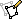
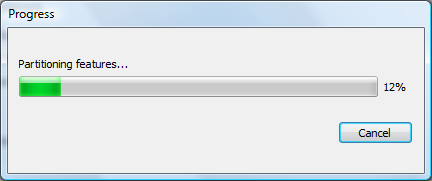

This chapter provides a guide to interacting with the geological features which you are creating or editing in GPlates.

1 Tools for Interacting with Features
===================================

To interact with features, the following tools can be used:

<table>
   <colgroup>
      <col style="width: 11%" />
      <col style="width: 22%" />
      <col style="width: 11%" />
      <col style="width: 55%" />
   </colgroup>
   <tbody>
      <tr class="odd">
         <td>
            
Icon

         </td>
         <td>
            
Tool

         </td>
         <td>
            
Shortcut

         </td>
         <td>
            
Operation

         </td>
      </tr>
      <tr class="even">
         <td>
            

         </td>
         <td>
            
Choose Feature

         </td>
         <td>
            
F

         </td>
         <td>
            
Click a geometry to choose a feature. <code>Shift+click</code> to query immediately. Ctrl+drag to re-orient globe

         </td>
      </tr>
      <tr class="odd">
         <td>
            

         </td>
         <td>
            
Move Vertex

         </td>
         <td>
            
V

         </td>
         <td>
            
Drag to move a vertex of the current feature. You can still drag the globe around

         </td>
      </tr>
      <tr class="even">
         <td>
            

         </td>
         <td>
            
Insert Vertex

         </td>
         <td>
            
I

         </td>
         <td>
            
Insert a new vertex into the feature geometry

         </td>
      </tr>
      <tr class="odd">
         <td>
            

         </td>
         <td>
            
Delete Vertex

         </td>
         <td>
            
X

         </td>
         <td>
            
Remove a vertex from a multi-point, polyline or polygon geometry

         </td>
      </tr>
      <tr class="even">
         <td>
            

         </td>
         <td>
            
Split Feature

         </td>
         <td>
            
T

         </td>
         <td>
            
Click to split the geometry of the selected feature at a point to create two features

         </td>
      </tr>
   </tbody>
</table>

<table class ="tip">
   <tbody>
      <tr>
         <td class="icon">
            
         </td>
         <td class="content" >To review information on all Tools please consult the <b>Introducing the Main Window</b> chapter.</td>
      </tr>
   </tbody>
</table>

2   Choose Feature Tool
==============================================================

2.1 Clicked Geometry Table
----------------------

You can query a feature, by first selecting   then click the mouse cursor on what you want to query. The information will be displayed in the **Clicked Geometry Table**.

<table class ="note">
   <tbody>
      <tr>
         <td class="icon">
            
         </td>
         <td class="content" >The table will list all features that have geometry in proximity to the point that was clicked. This is useful in situations where multiple geometries, from different features, happen to lie on top of each other. In this case the mouse click will populate the <b>Clicked Geometry Table</b> with one entry for each geometry. You can then use to the <b>Clicked Geometry Table</b> to select the desired geometry. As you select each entry in the <b>Clicked Geometry Table</b> its geometry (as displayed on the globe) will highlight to show you which geometry you are selecting.</td>
      </tr>
   </tbody>
</table>

<table class ="note">
   <tbody>
      <tr>
         <td class="icon">
            
         </td>
         <td class="content" >Most features have a single geometry but some do have multiple geometries. For these features all geometries are highlighted, however the geometry that was actually clicked on is displayed in white whereas the other geometries (belonging to that feature) are displayed in grey.</td>
      </tr>
   </tbody>
</table>

2.2 Current Feature Panel
---------------------

The Current Feature Panel summarises the pertinent properties of the current feature. This is the starting point for further interaction with the feature. It contains:

-   Type of feature

-   Name of the feature

-   Plate ID of the feature (used for reconstruction)

-   Conjugate plate ID of the feature, if it has one

-   Plate IDs for the left and right sides of the feature, if applicable

-   Life-time of the feature (the period for when it exists)

-   The purpose of the clicked geometry

-   Buttons to:

    -     Query Feature

    -     Edit Feature

    -     Copy Geometry to Digitise Tool

    -     Clone Feature

    -     Delete Feature

The **Edit** menu also provides access to:

-   Undo `[Ctrl+Z]`

-   Redo `[Ctrl+Y]`

-     Query Feature `[Ctrl+R]`

-     Edit Feature `[Ctrl+E]`

-     Copy Geometry to Digitise Tool

-     Clone Feature

-     Delete Feature `[Delete]`

-     Clear Selection `[Ctrl+K]`

<table class ="note">
   <tbody>
      <tr>
         <td class="icon">
            
         </td>
         <td class="content" >The valid life-time of the feature is a range of geological time, i.e from 65Ma to 0Ma (present day).</td>
      </tr>
   </tbody>
</table>

2.3 Querying Feature Properties
---------------------------

To query the properties of the current feature, either click , , at the bottom of the **Current Feature Panel**, or press `Ctrl+R` to invoke the corresponding operation in the **Edit Menu**. The **Feature Properties** dialog will appear, containing a complete listing of the properties of the current feature.

<table class ="tip">
   <tbody>
      <tr>
         <td class="icon">
            
         </td>
         <td class="content" >You can keep this dialog open and continue to use the Choose Feature Tool to click on new features - the Feature Properties dialog will be automatically updated.</td>
      </tr>
   </tbody>
</table>

### 2.3.1 Feature Type

This is the type of feature (e.g. fault, mid ocean ridge, subduction zone). The user can change the Feature Type by clicking **'Change Type...'**.

### 2.3.2 Query Properties Tab

This tab contains a complete listing of the properties of the current feature, presented in a concise, structured form which is easy to read, but does not allow editing of values.

### 2.3.3 Edit Properties Tab

This tab contains a table of properties, which enable editing of values. For more information on this tab, consult **Editing Feature Properties** below.

### 2.3.4 View Coordinates Tab

This tab contains a listing of the coordinates of the feature geometries, in both present-day and reconstructed-time position. For more information on this tab consult **Viewing Coordinates** below.

### 2.3.5 Feature ID

This is a unique label for this particular feature. It is a sequence of letters and numbers which is meaningful to GPlates. It is not yet of interest to users.

### 2.3.6 Revision ID

This is a unique label for this particular version of this feature. It is a sequence of letters and numbers which is meaningful to GPlates. It is not yet of interest to users.

2.4 Editing Feature Properties
--------------------------

This sequence of screenshots, first shows the initial window that will appear, and the following images display the options provided after selecting a property to edit. Each type of property has its own editing options.

The table in the centre lists all the properties belonging to the currently-chosen feature. The left hand column lists property names, and the right hand column lists property values.

The name of a property is a way to associate meaning with the feature data - for instance, this feature has a plate ID associated with it. That plate ID is 308. It is stored in the gpml:reconstructionPlateId property, indicating that GPlates should use that plate ID to reconstruct the feature.

Clicking a row of the table will expand the bottom half of the dialog with new controls specific to the property that was clicked.

2.5 Editing Geometry
----------------

<table class ="tip">
   <tbody>
      <tr>
         <td class="icon">
            
         </td>
         <td class="content" >For further information on editing feature geometries please read the <b>Editing Geometries</b> chapter.</td>
      </tr>
   </tbody>
</table>

The controls for directly editing the coordinates used by geometry appears as a table with **Lat**, **Lon**, and **Actions** columns. Click a row of the table to select it, and the following action buttons will appear:

  Insert a new row above

  Insert a new row below

  Delete row

-   Double-clicking an entry in the table lets you edit a coordinate directly.

    -   The **Valid Geometry** line will indicate if the coordinates in the table can be turned into correct geometry. It will indicate an error if there is something invalid about the coordinates, such as a lat/lon of 500 or similar.

-   The "Append Points" spin-boxes are designed to be a convenient means of data entry, if you need to enter some points from a hard copy source.

    -   Click in the **Lon** to start entering new coordinates. Type in a lon value, press **TAB**, type in a **lat** value, press **TAB** (to move to the "+" button), press **SPACE** to activate that button. The new coordinate line will be added to the table, and GPlates will prepare to receive the next line of input.

-   Selecting a property from the table and selecting **Delete** will delete the property from the feature.

2.6 Adding a Feature Property
-------------------------

By clicking on **Add Property** in the **Feature Properties** window, a new dialog will appear where you can select the **Name**, **Type** and **Value** of a property. In most cases, you will only need to select the name of the property you wish to add; the type of that property will be filled in automatically for you.

In the image above, the user has clicked on the down arrow of the combo box, and is selecting the "gpml:leftPlate" property. This property is used to annotate which regions are on either side of features such as a mid ocean ridge.

With the property name chosen, the lower section of the dialog presents the appropriate controls for entering the new value - in this case, a plate ID. Press Enter or the OK button to confirm the addition of the new property.

<table class ="note">
   <tbody>
      <tr>
         <td class="icon">
            
         </td>
         <td class="content" >If the property you are adding is not appropriate for the type of feature then a warning message is displayed at the bottom of the <b>Add Property</b> dialog.</td>
      </tr>
   </tbody>
</table>

2.7 Viewing Coordinates
-------------------

The View Coordinates dialog provides a tree view summarising the coordinates of every geometry in the feature.

The **Property Name** column lists the names and types of geometry, plus an enumeration of each coordinate. The **Present Day** column lists the coordinates of the geometry as it appears in the present, i.e. 0 Ma. The **Reconstructed** column lists the coordinates of the geometry as they appear on screen at the current view time, which for convenience is displayed at the bottom of the dialog.

2.8   Copy Geometry to Digitise Tool
---------------------------------------------------------------

Makes a *copy* of the **geometry** of the currently chosen feature (if any has been selected) and transfers the copied geometry to the appropriate digitisation tool:

-     Polyline Geometry tool for polyline geometry,

-     Point Geometries tool for point or multi-point geometry,

-     Polygon Geometry tool for polygon geometry.

You can then create a new feature from within the digitisation tool or, if you are not ready to create a new feature yet, you can further digitise the geometry to add lines (or points) or switch to a different geometry editing tool such as the **Move Vertex Tool** to make adjustments.

<table class ="tip">
   <tbody>
      <tr>
         <td class="icon">
            
         </td>
         <td class="content" >This ability is useful when you want to create a new feature that has the same geometry as another feature but you want the feature <b>type</b> to be different or you want a new feature that has different properties (but same geometry).</td>
      </tr>
   </tbody>
</table>

<table class ="note">
   <tbody>
      <tr>
         <td class="icon">
            
         </td>
         <td class="content" ><b>Copy Geometry to Digitise Tool</b> does <i><b>not</b></i> work on topological features such as Topological Closed Plate Polygon features. The geometry of these features changes dynamically as the reconstruction time changes.</td>
      </tr>
   </tbody>
</table>

2.9   Clone Feature
---------------------------------------------

Makes a *copy* of the entire **feature** (the currently chosen feature - if any has been selected). This differs from the **Copy Geometry to Digitise Tool** in that not only is the geometry of the feature copied but also all other properties of the feature are copied.

After this operation you will have two features which are identical except for their feature ID (the uniqueness identifier). The focused feature will now be the new cloned feature. Since both features have the same geometry(s) they will be indistinguishable except for the fact that they have different feature IDs, however the mouse click point will now reveal two features in the **Clicked Geometry Table** - the original feature and the cloned feature.

<table class ="note">
   <tbody>
      <tr>
         <td class="icon">
            
         </td>
         <td class="content" >Unlike <b>Copy Geometry to Digitise Tool</b>, <b>Clone Feature</b> <b><i>does</i></b> work on topological features such as Topological Closed Plate Polygon features. In this case the time-dependent list of topological sections referenced by a Topological Closed Plate Polygon feature is just another property of that feature that gets copied like any other property.</td>
      </tr>
   </tbody>
</table>

2.10   Delete Feature
--------------------------------------------------

Deletes the currently chosen feature and removes it from the feature collection that contained it.

<table class ="note">
   <tbody>
      <tr>
         <td class="icon">
            
         </td>
         <td class="content" >The feature collection is marked as modified but is not automatically saved to file (see the <b>Loading And Saving</b> chapter).</td>
      </tr>
   </tbody>
</table>

3 Features Menu
=============

The **Features Menu** contains a number of tools that are used to interact with features less directly. It has the following structure

3.0 Assign Plate IDs
=======

This feature assigns reconstruction plate IDs (and optionally time of appearance/disappearance) to a set of features. This is typically done to features that do not yet have plate IDs (or valid time ranges) but it can also override an existing plate ID, of a feature, with a new plate ID. To start the process, use the **Assign Plate IDs** item on the **Features** menu. - See the description of [Plate IDs](/docs/user-manual/Reconstructions/#plate-ids) in the Reconstructions chapter for more information as to what they are.

Two sets of features are required for this process:

-   A set of **partitioning** features.

    These are the features that the plate IDs (and optionally time ranges) are copied **from**. These features must have (or generate) polygon geometry and hence can be either static polygon features (where the polygon geometry does not change shape) or *Topological Closed Plate Polygons* features (where the polygon shape changes dynamically as the reconstruction time changes). These features remain unmodified by this process.

-   A set of features **to be** partitioned.

    These are the features that the plate IDs (and optionally time ranges) are copied **to**. And also, depending on the partitioning option chosen, the geometry(s) in these features can be partitioned (cookie cut) into several smaller geometries (still belonging to the one feature). Hence these features are modified by the addition, or modification, of plate ID (and optionally time range) properties and also their geometry property(s) depending on the partitioning options selected.

Here is an example of selecting *partitioning* features that are static polygons.

Here is an example of selecting coastline features *to be* partitioned (by the static polygons in the previous dialog page).

Here the user can specify some options.

3.0.1 Specifying the reconstruction time
----------------------------------

Select the reconstruction time representing the geometry in the feature collections. The three options for reconstruction time are:

-   **Present day**: the reconstruction time is 0Ma.

-   **Current reconstruction time**: the reconstruction time in the main window.

-   **Specify reconstruction time**: choose an arbitrary reconstruction time.

Note: Present day should be selected when assigning plate ids to VirtualGeomagneticPole features.

<table class ="note">
   <tbody>
      <tr>
         <td class="icon">
            
         </td>
         <td class="content" >The <b>partitioning</b> polygon features are reconstructed to the specified reconstruction time before testing for overlap/intersection with the features <b>to be</b> partitioned. The geometry in features <b>to be</b> partitioned effectively represents a snapshot of the geometry of those features at the specified reconstruction time. In other words the features <b>to be</b>partitioned effectively contain geometry at the reconstruction time regardless of whether they have a reconstruction plate id property or not. However, most features in GPlates contain present-day geometry so this distinction is not that important (typically "<b>Present day</b>" will be selected).</td>
      </tr>
   </tbody>
</table>

3.0.2 Reconstruction Options
-------------------------

Here you specify whether to only partition features that exist at the reconstruction time. 

If this option is checked then a feature is partitioned **only** is the specified reconstruction time falls between the feature's time of appearance and time of disappearance.

For example, you may want to leave this **unchecked** if you are partitioning at present day and the feature's time period does not include present day.

Note: *This option is ignored for VirtualGeomagneticPole features*.

3.0.3 Specifying how to partition features
------------------------------------

These three options determine how features are partitioned:

-   **Copy feature properties from the polygon that most overlaps a feature**:

    Assign, to each feature *to be* partitioned, the plate ID of the *partitioning* polygon feature that its geometry(s) overlaps the most.

-   **Partition (cookie cut) feature geometry into polygons and copy feature properties**:

    Partition all geometries of a feature *to be* partitioned into the *partitioning* polygons intersecting them. This can create extra features, for example if a feature *to be* partitioned has only one geometry but it overlaps both plate A and plate B then it is partitioned into one or more geometries fully contained by plate A (and likewise for plate B). These partitioned geometries will now be contained by *two* features since they have different plate IDs. If the polygons do not cover the entire surface of the globe then it is possible for some features *to be* partitioned (or partitioned geometries) to fall outside all *partitioning* polygons. In this situation the feature *to be* partitioned is not modified and will retain its original feature properties (such as reconstruction plate ID). *VirtualGeomagneticPole* features are treated differently - these features are assigned to the polygon whose boundary contains the *VirtualGeomagneticPole*'s sample site point location. For these features the above options are ignored.

3.0.4 Specifying which feature properties to copy from a polygon
-------------------------------------------

This options allows the user to specify which feature properties are copied *from* the *partitioning* polygon feature *to* the feature *to be* partitioned.

Currently two feature property options are supported (in the future this will be extended to support any feature property):

-   Reconstruction plate ID: the reconstruction plate ID property, at 0Ma reconstruction time.

-   Conjugate plate ID: the conjugate plate ID property, at 0Ma reconstruction time.

-   Time of appearance and disappearance: the time interval over which a feature exists.

<table class ="note">
   <tbody>
      <tr>
         <td class="icon">
            
         </td>
         <td class="content" >These options are not mutually exclusive. Both can be selected.</td>
      </tr>
   </tbody>
</table>

<table class ="note">
   <tbody>
      <tr>
         <td class="icon">
            
         </td>
         <td class="content" >If <b>Only copy properties suitable for partitioned feature types</b> is checked then only those feature properties that are allowed, by the GPlates Geological Information Model (GPGIM), for the partitioned feature type are copied. <i>For example</i>, <b>Conjugate plate ID</b> is only applicable for some feature types such as Isochrons. If unchecked then all requested feature properties are copied across - however some properties, such as conjugate plate IDs, might not get loaded when the feature collection is saved to file and reloaded if the feature's type does not support, for example, conjugate plate IDs. </td>
      </tr>
   </tbody>
</table>

Depending on the number of features *to be* partitioned it can take a while to assign plate IDs and optionally partition the geometries.

The features *to be* partitioned have now been modified.

<table class ="note">
   <tbody>
      <tr>
         <td class="icon">
            
         </td>
         <td class="content" >Currently if a feature <b>to be</b> partitioned contains polygon geometry <b>and</b> the "<b>Partition (cookie cut) feature geometry…</b>" option is selected then the resulting partitioned geometry will be <b>polylines</b> instead of <b>polygons</b>. This will be rectified in a future release.</td>
      </tr>
   </tbody>
</table>

3.1 Generate Velocity Domain Points
------------------

The **Generate Velocity Domain Points** dialog can be accessed via **Features→Generate Velocity Domain Points…**.

The mesh caps are used to calculate velocities. The sphere will be covered by 12 diamonds — **Mesh Caps**. Each diamond will be further divided into smaller pieces according to the "Resolution" setting. Eventually, the sphere will be divided into evenly distributed diamonds with equal area. 

<table class ="tip">
   <tbody>
      <tr>
         <td class="icon">
            
         </td>
         <td class="content" >Once the velocities are created in relation to the static multipoints, they can be turned off to enhance the visual experience, by navigating to <b>View → Geometry Visibility</b> and unchecking <b>Show Static Multipoints</b>.</td>
      </tr>
   </tbody>
</table>

### 3.1.1 CitcomS

A key application of GPlates, beyond its deep-time GIS functionality, is its interperability with a range of numerical geodynamic modelling codes of plate tectonics and mantle convection. The first code to be coupled to GPlates was the spherical version of the California Institute of Technology Convection in the Mantle code, **CitcomS**. The resolved plate topologies are used to calculate plate velocities, which are sampled using the CitcomS diamond-shaped mesh caps and exported as simple text ASCII (DAT, XY, etc.) or GPML files. The geometry of subduction zones and their polarity through time is also exported through GPlates. In addition to assimilating the subduction zone geometries and plate velocities, the age of the oceanic crust and the tectonothermal age of the continents are used to assimilate the thermal lithosphere from the GPlates reconstructions into CitcomS.

#### Resolution

Users can specify the resolution of mesh caps. The **nodex** and **nodey** parameters indicate how the 12 original big diamonds can be divided evenly.

For the global mesh, the **nodex** always equals **nodey**. Currently, GPlates can only generate global mesh.

#### Output

You can specify the **file name template**, which will be used to generate output file names. The **Output directory** indicates the directory where the output file will be stored.

In total, 12 files will be generated in the specified output directory. The file names are created from template, for example %d.mesh.%c where the *%d* represents the mesh resolution and *%c* represents the cap index number.

<table class ="important">
   <tbody>
      <tr>
         <td class="icon">
            
         </td>
         <td class="content" >The %d and %c must appear in the template once and only once.</td>
      </tr>
   </tbody>
</table>

### 3.1.2 Terra

Similarly to CitcomS, the plate velocities can also be sampled from in-built functionality that generates a mesh for the TERRA mantle convection code. 

#### Configuration

The following Terra parameters, related to gridding, are:

-   **mt** - Number of grid intervals along icosahedral diamond edge (must be a power-of-two).

-   **nt** - Number of grid intervals along edge of local subdomain (must be a power-of-two).

-   **nd** - Number of diamonds mapped to a local process (this must be either 5 or 10).

The number of processors is determined by the above three parameters according to '(mt/nt) * (mt/nt) * (10/nd)' and hence 'mt' must be greater or equal to 'nt'.

#### Output

Generated GPML files will be saved to the specifed output directory.The filename template enables Terra parameters to be specified in the output filenames using the following template parameters:

-   **%mt** - gets replaced with the Terra 'mt' parameter.

-   **%nt** - gets replaced with the Terra 'nt' parameter.

-   **%nd** - gets replaced with the Terra 'nd' parameter.

-   **%np** - gets replaced with the Terra processor number of the current output file.

<table class ="note">
   <tbody>
      <tr>
         <td class="icon">
            
         </td>
         <td class="content" >Note that <b>'%np'</b> must appear at least once since it's the only parameter that varies across the output files.</td>
      </tr>
   </tbody>
</table>

An example template filename is *'TerraMesh.%mt.%nt.%nd.%np'*. 

### 3.1.3 Latitude/Longitude

#### Configuration

The latitudinal and longitudinal extents can be used to limit the generated node points to a specific geographic region (the default is global).

The **'Place node points at centre of latitude/longitude cells'** check box determines whether generated nodes (points) are placed at the centres of latitude/longitude cells or at cell corners.

The **'number of latitudinal grid intervals'** parameter specifies the number of intervals in the latitude direction (along meridians). A similar parameter specifies longitudinal intervals. The number of latitudinal grid nodes (points) will be the number of latitudinal grid intervals when the nodes are at the centres of the latitude/longitude cells (and plus one when nodes are at cell corners). The **'number of longitudinal grid grid intervals'** has the same relation to the number of longitudinal grid nodes (points) as the latitude case above, except in the case where the longitude interval is the full 360 degrees in which case the end line of nodes is not generated to avoid duplicating nodes with the start line.

<table class ="note">
   <tbody>
      <tr>
         <td class="icon">
            
         </td>
         <td class="content" >Note that the density of grid nodes on the globe is much higher near the poles than at the equator due to sampling in latitude/longitude space.</td>
      </tr>
   </tbody>
</table>

#### Output

A single generated GPML file of the specified filename will be saved to the specifed output directory.

You can optionally use the template parameters '%n' and '%m' in the file name and they will be replaced by the 'number of latitudinal grid intervals' and 'number of longitudinal grid intervals' parameters. 