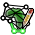

---

templateKey: 'user-manual'
title: 'Chapter 2: Introducing The Main Window'
prev: 'Introduction_Gplates'
next: 'DataFileTypes'

---

This section describes the **Main Window**, the heart of the GPlates user interface. Below we present annotated screenshots of GPlates, label the key areas of the window, and provide a brief overview of each.

The Main Window
===============

When you start GPlates, the first window you will encounter is the **Main Window**. This contains your view of the globe, and is the starting-point of all tasks within GPlates. It is here that you can control your view of the globe, choose your reconstruction time, load and unload data, and interact with geological features.

<table>
   <colgroup>
      <col style="width: 13%" />
      <col style="width: 28%" />
      <col style="width: 57%" />
   </colgroup>
   <thead>
      <tr class="header">
         <th style="text-align: left;">Item</th>
         <th style="text-align: left;">Name</th>
         <th style="text-align: left;">Description</th>
      </tr>
   </thead>
   <tbody>
      <tr class="odd">
         <td style="text-align: left;">1</td>
         <td style="text-align: left;">Menu Bar</td>
         <td style="text-align: left;">This region of the Main Window contains the titles of the menus.</td>
      </tr>
      <tr class="even">
         <td style="text-align: left;">2</td>
         <td style="text-align: left;">Tool Palette</td>
         <td style="text-align: left;">A collection of tools which are used to interact with the globe and geological features via the mouse pointer.</td>
      </tr>
      <tr class="odd">
         <td style="text-align: left;">3</td>
         <td style="text-align: left;">Time Controls</td>
         <td style="text-align: left;">A collection of user-interface controls for precise control of the reconstruction time.</td>
      </tr>
      <tr class="even">
         <td style="text-align: left;">4</td>
         <td style="text-align: left;">Animation Controls</td>
         <td style="text-align: left;">A collection of tools to manipulate the animation of reconstructions.</td>
      </tr>
      <tr class="odd">
         <td style="text-align: left;">5</td>
         <td style="text-align: left;">Zoom Slider</td>
         <td style="text-align: left;">A mouse-controlled slider which controls the zoom level of the Globe View camera.</td>
      </tr>
      <tr class="even">
         <td style="text-align: left;">6</td>
         <td style="text-align: left;">Task Panel</td>
         <td style="text-align: left;">Task-specific information and controls which correspond to the currently-activated tool.</td>
      </tr>
      <tr class="odd">
         <td style="text-align: left;">7</td>
         <td style="text-align: left;">View Control</td>
         <td style="text-align: left;">Controls which projection is used to display data and the exact zoom level as a percentage.</td>
      </tr>
      <tr class="even">
         <td style="text-align: left;">8</td>
         <td style="text-align: left;">Camera Coordinate</td>
         <td style="text-align: left;">An information field which indicates the current globe position of the Globe View camera.</td>
      </tr>
      <tr class="odd">
         <td style="text-align: left;">9</td>
         <td style="text-align: left;">Mouse Coordinate</td>
         <td style="text-align: left;">An information field which indicates the current globe position of the mouse pointer.</td>
      </tr>
      <tr class="even">
         <td style="text-align: left;">10</td>
         <td style="text-align: left;">Clicked Geometry Table</td>
         <td style="text-align: left;">Displays a summary of each geometry or feature touched by the last mouse click.</td>
      </tr>
   </tbody>
</table>

<table>
   <tbody>
      <tr>
         <td class="icon" style="width:5rem; display:inline-table;">
            
         </td>
         <td class="content">The appearance of the <strong>Main Window</strong> - particularly the layout of the different window components - will change as GPlates continues to evolve.</td>
      </tr>
   </tbody>
</table>

Reconstruction View
===================

The reconstruction view provides the user with a display of their data on the GPlates globe or map reconstructed to a moment in time. Control of the current reconstruction time is located under the menu bar on the left (see image below). The time can be controlled by both a text field, forwards and backwards time buttons, and the animation slider. In addition the shortcut `Ctrl+T` to enter a time value in the text field.

Camera Control
--------------

When  Drag Globe tool is activated the GPlates globe can be re-oriented freely using the mouse with a simple click and drag motion. If another tool is selected the globe can still be dragged by holding down `Ctrl`.

If the user wishes to adjust the camera position to a particular latitude and longitude, pressing `Ctrl+Shift+L` will pop up a window allowing manual entry of coordinates.

The amount of camera zoom can be controlled by the following:

-   Zoom In via mouse-wheel up.

-   Zoom Out via mouse-wheel down.

-   Zoom Control field allowing direct entry of percentage value (between 100% and 10000%). Click the text field, type in a new value and press Enter to change the zoom.

-   Zoom Slider, which works on a power scale.

-   Keyboard shortcuts: use the *+* and *-* keys to zoom in and out, and the *0* key to reset the zoom level to 1:1 (100%) scale.

The position of the camera and mouse pointer are provided along the bottom of the reconstruction view.

The Menu Bar
============

Each item in a menu is an operation. Related operations are grouped into menus, with the menu title indicating the common theme. For example, the **View Menu** in the image below contains operations which manipulate the user’s view of the globe. Within a menu, similar operations are grouped visually by horizontal lines or within sub-menus. In the **View Menu** below, the **Camera Location**, **Camera Rotation**, and **Camera Zoom** controls are grouped into their own sub-menus.

Some menu items use check boxes or tick marks to *switch* or *choose* operations. For example; **Show Bottom Panel** in the **Window** menu is activated by a small cross or tick that will be displayed next to the menu item when selected.

Tool Palette
============

The **Tool Palette** is used to control your view and interaction with the GPlates globe and maps. You may recognise the concept of tools from graphics editing software (e.g. drawing tools in Photoshop ) or GIS software (e.g. ArcGIS mapping tools).

The **Tool Palette** includes camera positioning tools, feature selection tools and drawing tools. A tool is activated by clicking on it; only one tool can be active at any time. The task panel will reflect the current tool that is activated.

<table>
   <colgroup>
      <col style="width: 11%" />
      <col style="width: 22%" />
      <col style="width: 11%" />
      <col style="width: 55%" />
   </colgroup>
   <tbody>
      <tr class="odd">
         <td>
            
Icon

         </td>
         <td>
            
Tool

         </td>
         <td>
            
Shortcut

         </td>
         <td>
            
Operation

         </td>
      </tr>
      <tr class="even">
         <td>
            

         </td>
         <td>
            
Drag Globe

         </td>
         <td>
            
D

         </td>
         <td>
            
Drag to re-orient the globe. <code>Shift+drag</code> to rotate the globe

         </td>
      </tr>
      <tr class="odd">
         <td>
            

         </td>
         <td>
            
Zoom In

         </td>
         <td>
            
Z

         </td>
         <td>
            
Click to zoom in. <code>Shift+click</code> to zoom out. <code>Ctrl+drag</code> to re-orient the globe

         </td>
      </tr>
      <tr class="even">
         <td>
            

         </td>
         <td>
            
Measure

         </td>
         <td>
            
S

         </td>
         <td>
            
Click to measure distance between points, or measure the selected feature’s geometry

         </td>
      </tr>
      <tr class="odd">
         <td>
            

         </td>
         <td>
            
Choose Feature

         </td>
         <td>
            
F

         </td>
         <td>
            
Click a geometry to choose a feature. <code>Shift+click</code> to query immediately. Ctrl+drag to re-orient globe

         </td>
      </tr>
      <tr class="even">
         <td>
            

         </td>
         <td>
            
Digitise Polyline Geometry

         </td>
         <td>
            
L

         </td>
         <td>
            
Click to draw a new vertex. <code>Ctrl+drag</code> to re-orient the globe

         </td>
      </tr>
      <tr class="odd">
         <td>
            

         </td>
         <td>
            
Digitise Multi-point Geometry

         </td>
         <td>
            
M

         </td>
         <td>
            
Click to draw a new point. <code>Ctrl+drag</code> to re-orient the globe

         </td>
      </tr>
      <tr class="even">
         <td>
            

         </td>
         <td>
            
Digitise Polygon Geometry

         </td>
         <td>
            
G

         </td>
         <td>
            
Click to draw a new vertex. <code>Ctrl+drag</code> to re-orient the globe

         </td>
      </tr>
      <tr class="odd">
         <td>
            

         </td>
         <td>
            
Move Vertex

         </td>
         <td>
            
V

         </td>
         <td>
            
Drag to move a vertex of the current feature. You can still drag the globe around

         </td>
      </tr>
      <tr class="even">
         <td>
            

         </td>
         <td>
            
Insert Vertex

         </td>
         <td>
            
I

         </td>
         <td>
            
Insert a new vertex into the feature geometry

         </td>
      </tr>
      <tr class="odd">
         <td>
            

         </td>
         <td>
            
Delete Vertex

         </td>
         <td>
            
X

         </td>
         <td>
            
Remove a vertex from a multi-point, polyline or polygon geometry

         </td>
      </tr>
      <tr class="even">
         <td>
            

         </td>
         <td>
            
Split Feature

         </td>
         <td>
            
T

         </td>
         <td>
            
Click to split the geometry of the selected feature at a point to create two features

         </td>
      </tr>
      <tr class="odd">
         <td>
            

         </td>
         <td>
            
Move Pole

         </td>
         <td>
            
O

         </td>
         <td>
            
Change the pole location used by the Modify Reconstruction Pole tool

         </td>
      </tr>
      <tr class="even">
         <td>
            

         </td>
         <td>
            
Modify Reconstruction Pole

         </td>
         <td>
            
P

         </td>
         <td>
            
Drag or <code>Shift+drag</code> the current geometry to modify its reconstruction pole. <code>Ctrl+drag</code> to re-orient the globe by holding down <code>Ctrl</code>

         </td>
      </tr>
      <tr class="odd">
         <td>
            

         </td>
         <td>
            
Build New Line Topology

         </td>
         <td>
            
H

         </td>
         <td>
            
Create a new dynamic polyline (for use as a section in a dynamically closing plate polygon) by adding sections of other features that define a line

         </td>
      </tr>
      <tr class="even">
         <td>
            

         </td>
         <td>
            
Build New Boundary Topology

         </td>
         <td>
            
B

         </td>
         <td>
            
Create a new dynamically closing plate polygon by adding sections of other features (and dynamic polylines) that define a boundary

         </td>
      </tr>
      <tr class="odd">
         <td>
            

         </td>
         <td>
            
Build New Network Topology

         </td>
         <td>
            
N

         </td>
         <td>
            
Create a new dynamic deforming network topology from an existing or new polygon

         </td>
      </tr>
      <tr class="even">
         <td>
            

         </td>
         <td>
            
Edit Topology Sections

         </td>
         <td>
            
E

         </td>
         <td>
            
Edit the selected topological feature’s sections

         </td>
      </tr>
      <tr class="odd">
         <td>
            

         </td>
         <td>
            
Create Small Circle

         </td>
         <td>
            
C

         </td>
         <td>
            
Create small circles using mouse to define centre and radii, or enter manually, or generate centre from a stage pole

         </td>
      </tr>
      <tr class="even">
         <td>
            

         </td>
         <td>
            
Select Hellinger Geometries

         </td>
         <td>
            
Q

         </td>
         <td>
            
Select the geometries for the Hellinger. Launches the Hellinger dialog.

         </td>
      </tr>
      <tr class="odd">
         <td>
            

         </td>
         <td>
            
Adjust Pole Estimate

         </td>
         <td>
            
R

         </td>
         <td>
            
Adjust the pole estimate for the hellinger tool by clicking the bottom of the pole symbol and dragging to desired location on the globe.

         </td>
      </tr>
   </tbody>
</table>

The tools are arranged into groups (tabs in the **Tool Palette**). For example the **Digitisation** group is used when digitising new geometries and the **Feature Inspection** group is used when querying existing features. Some tools appear in more than one group. For example the **Move Vertex** tool appears in both the **Digitisation** and **Feature Inspection** groups since it is used in the **Digitisation** group to modify newly digitised geometries and it is used in the **Feature Inspection** group to modify geometries of existing features.

 

The availability of certain tools within a group can change depending on what you currently have selected. For instance, the **Modify Reconstruction Pole** tool can only be used once a feature to be modified has been selected with the **Choose Feature** tool.

The tools are also accessible via the **Tools** menu which also shows the shortcut key for each tool. The **Tools** menu also contains a check box **Use Small Icons** that reduces the size of the tool icons in the **Tool Palette**. This is useful if your screen resolution is low enough to force the bottom tools off the screen - this can happen if you are using a low-resolution screen projector.

List of Menu Operations
=======================

-   A description of the operations within each menu will be explained in further detail in their respective chapters.

-   Shortcut keys are listed beside some menu items. On macOS, please substitute the `Command` (⌘) key in place of `Ctrl`.

<table>
   <tbody>
      <tr>
         <td class="icon" style="width:5rem; display:inline-table;">
            
         </td>
         <td class="content">Clicking on a menu item from the list below will take you to the appropriate chapter for further information</td>
      </tr>
   </tbody>
</table>

File
----

-   [Open Feature Collection](/docs/user-manual/LoadingAndSaving/) `[Ctrl+O]`

-   [Open Project](/docs/user-manual/Projects_and_Recent_Sessions/)

-   [Save Project](/docs/user-manual/Projects_and_Recent_Sessions/)

-   [Save Project As](/docs/user-manual/Projects_and_Recent_Sessions/)

-   [Open Recent Session](/docs/user-manual/Projects_and_Recent_Sessions/)

-   [Clear Session](/docs/user-manual/Projects_and_Recent_Sessions/)

-   Import

    -   [Import Raster](/docs/user-manual/DataFileTypes/)

    -   [Import Time-Dependent Raster](/docs/user-manual/DataFileTypes/)

-   Connect WFS

-   [Manage Feature Collections](docs//user-manual/LoadingAndSaving/) `[Ctrl+M]`

-   [View Read Errors](/docs/user-manual/LoadingAndSaving/)

-   Quit `[Ctrl+Q]`

Edit
----

-   Undo `[Ctrl+Z]`

    Undo the last geometry edit performed by a Digitisation tool (eg, undo adding a point).

-   Redo `[Ctrl+Y]`

    Redo the last undo of a geometry edit performed by a Digitisation tool (eg, redo adding a point).

-   [Query Feature](/docs/user-manual/Interacting_Features/) `[Ctrl+R]`

-   [Edit Feature](/docs/user-manual/Interacting_Features/) `[Ctrl+E]`

-   [Copy Geometry to Digitise Tool](/docs/user-manual/Interacting_Features/)

-   [Clone Feature](/docs/user-manual/Interacting_Features/)

-   [Delete Feature](/docs/user-manual/Interacting_Features/) `[Delete]`

-   Clear Selection | Clear Geometry | Clear Quick Measure | Clear | Reset Rotation `[Ctrl+K]`

    This menu item differs depending on which tool in the **Tool Palette** is currently selected, and
    is only present for the following tools:

    - *Choose Feature* - **Clear Selection** is displayed and it will unselect any currently selected feature.

    - *Digitise New (Polygon | Polyline | Multi-point) Geometry* - **Clear Geometry** is displayed and
      it will clear the geometry currently being digitised.

    - *Build New (Line | Boundary | Network) Topology* - **Clear** is displayed and it will clear any
       topology currently being built.

    - *Edit Topology Sections* - **Clear** is displayed and it will clear any topology currently being edited.

    - *Modify Reconstruction Pole* - **Reset Rotation** is displayed and it will reset (to zero) the current
      rotation being manipulated.

-   Preferences `[Ctrl+Comma]`

View
----

-   [Set Projection](/docs/user-manual/Controlling_View/)

-   [Camera Location](/docs/user-manual/Controlling_View/)

    -   Set Location `[Ctrl+Shift+L]`

    -   Move Up

    -   Move Down

    -   Move Left

    -   Move Right

-   [Camera Rotation](/docs/user-manual/Controlling_View/)

    -   Rotate Clockwise `]`

    -   Rotate Anti-clockwise `[`

    -   Reset Orientation `^`

-   [Camera Zoom](/docs/user-manual/Controlling_View/)

    -   Set Zoom

    -   Zoom In `+`

    -   Zoom Out `-`

    -   Reset Zoom `0`

-   [Configure Text Overlay](/docs/user-manual/Controlling_View/)

-   [Configure Velocity Legend Overlay](/docs/user-manual/Controlling_View/)

-   [Configure Graticules](/docs/user-manual/Controlling_View/)

-   [Choose Background Colour](/docs/user-manual/Controlling_View/)

-   Show Stars

    Select this to show stars in the background of the 3D globe (stars are not visible in the 2D map views).

-   [Geometry Visibility](/docs/user-manual/Controlling_View/)

    -   Show Static Points

    -   Show Static Lines

    -   Show Static Polygons

    -   Show Static Multipoints

    -   Show Topological Sections

    -   Show Topological Lines

    -   Show Topological Polygons

    -   Show Topological Networks

    -   Show Velocity Arrows

    -   Show Rasters

    -   Show 3D Scalar Fields

    -   Show Scalar Coverages

Features
--------

-   Manage Colouring

-   Load Symbol file (.sym)

-   Unload Symbol file

-   View Total Reconstruction Sequences

-   View Shapfile Attributes

-   Create VGP

-   Assign Plate IDs

-   Generate Deforming Mesh Points

-   Generate Velocity Domain Points
   
    -   CitcomS

    -   Terra

    -   Latitude Longitude

Reconstruction
--------------

-   Reconstruct to Time `[Ctrl+T]`

-   Step Backward One Frame `[Ctrl+Shift+I]`

-   Step Forward One Frame `[Ctrl+I]`

-   Reset Animation

-   Play Animation

-   Configure Animation

-   Specify Anchored Plate ID `[Ctrl+D]`

-   View Total Reconstruction Poles `[Ctrl+P]`

-   Export

Utilities
---------

-   Calculate Reconstruction Pole

-   Calculate Finite Rotation

-   Open Kinematics Tool `[Ctrl+Shift+K]`

-   Open Python Console `[F12]`

Tools
-----

-   Use Small Icons

-   Drag Globe `[D]`

-   Zoom In `[Z]`

-   Measure `[S]`

-   Choose Feature `[F]`

-   Digitise New Polyline Geometry `[L]`

-   Digitise New Multi-point Geometry `[M]`

-   Digitise New Polygon Geometry `[G]`

-   Move Vertex `[V]`

-   Insert Vertex `[I]`

-   Delete Vertex `[X]`

-   Split Feature `[T]`

-   Modify Reconstruction Pole `[P]`

-   Build New Line Topology `[H]`

-   Build New Boundary Topology `[B]`

-   Build New Network Topology `[N]`

-   Edit Topology Sections `[E]`

-   Move Pole `[O]`

-   Modify Reconstruction Pole `[P]`

-   Create Small Circle `[C]`

-   Select Hellinger Geometries `[Q]`

-   Adjust Pole Estimate `[R]`

Window
------

-   Open New Window `[Ctrl+N]`

    Creates a new instance of GPlates. Currently each instance created this way is completely separate with its own main window and dialogs. Any program state such as files loaded prior to selecting **New Window** is not transferred across to the new instance. This feature is useful mainly for macOS where it is not possible to run multiple instances of the same application from the *Finder*.

-   Show Layers `[Ctrl+L]`

-   Log

-   Show Bottom Panel

-   Full Screen `[F11]`

Help
----

-   View Online Documentation

-   About

