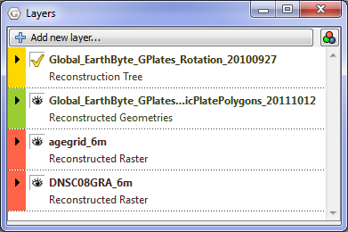
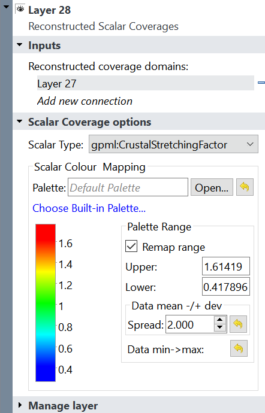
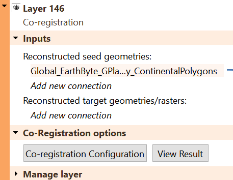
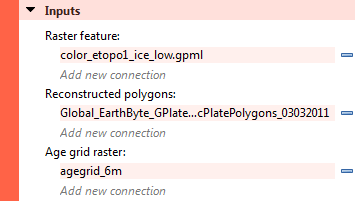
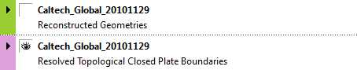
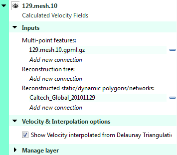
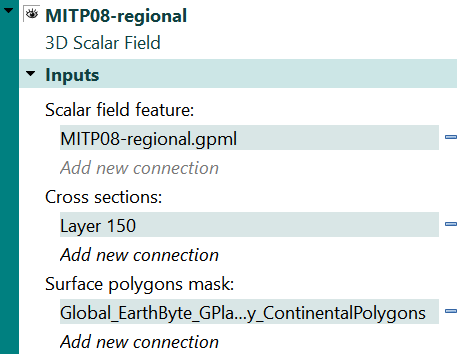
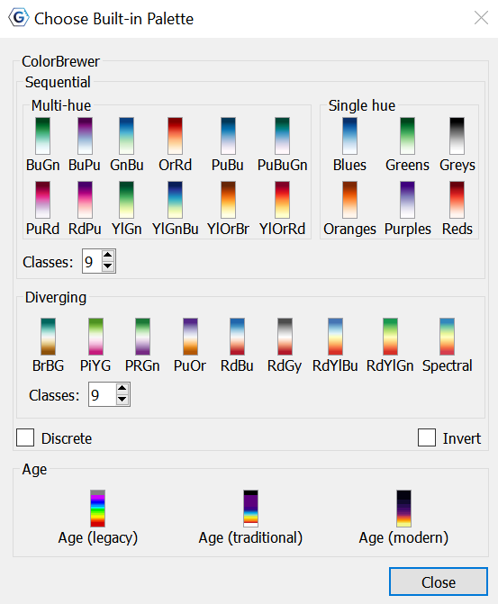
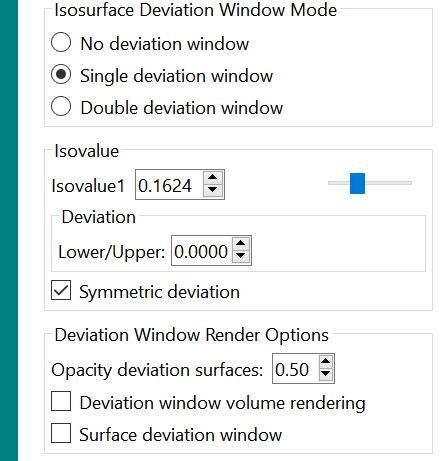

Introduction
============

This chapter covers the layers system, how they are created, what they do, how they are visualised and the various types of layers.

Layers in GPlates
=================

Layers provide a way to connect the various processing capabilities of GPlates to data sources (such as loaded feature collections). The outputs of these layers can then be visualised directly in the globe and map views and/or passed to the input of other layers for further processing.

What’s the difference between a layer and a file?
=================================================

A file contains a collection of features (a *feature collection*).

A **layer** processes one or more inputs into an output. Inputs to a *layer* can include, but are not necessarily restricted to, *feature collections*. For example some types of *layers*, such as the **Reconstructed Geometries** layer, accept both *feature collections* **and** the output of another *layer*.

In the case of the **Reconstructed Geometries** layer:

-   the *feature collection* input contains (in the feature properties themselves) both the geometries to be reconstructed and the information on how to reconstruct them (such as reconstruction plate ID),

-   the **layer** input (in this case the output of a **Reconstruction Tree** layer) contains the rotations needed to perform the reconstruction,

-   the **layer** itself does the actual reconstruction and generates the reconstructed geometries, and

-   the **layer** output contains the reconstructed features.

The reason the rotations come from the output of another *layer* rather than a *feature collection* (containing rotation features) is because a rotation hierarchy needs to be generated from the rotation features themselves and so this process is performed by a different type of layer (the **Reconstruction Tree** layer). See the **More on Reconstructions** chapter for more information about rotation hierarchies.

The output of most types of layers (exceptions include **Reconstruction Tree** layers) contain geometries and hence can be visualised in the globe and map views.

The Layers dialog
=================

The **Layers** dialog is usually displayed automatically when you first load a feature collection. To show/hide the dialog, select the **Show Layers** menu item in the **Window** menu or use the `Ctrl+L` shortcut key.

The **Layers** dialog contains all layers and is the central place to configure layer visibility, draw order, input connections and layer-specific options.

The collapsed view of each layer in the dialog shows a layer name, type and colour. The type and colour are associated (for example, a *green* layer is always of type **Reconstructed Geometries**). The layer name depends on how the layer was created (see the [Creating layers](#creating-layers) section for more details).

Changing layer visibility
-------------------------

The visibility of each layer can be individually disabled (or enabled) by clicking the   icon to the left of the layer name.

<table class ="note">
   <tbody>
      <tr>
         <td class="icon">
            
         </td>
         <td class="content" >Some types of layers (such as the **Reconstruction Tree** layer) do not have a visibility icon  . This is because those layer types do not output geometries and hence there is nothing to visualise in the globe and map views.</td>
      </tr>
   </tbody>
</table>

Each layer contains a small black arrow   that can be clicked on to expand the layer and show the input connections and any layer-specific options. Once expanded you can click on the   symbol to collapse the layer again.

Changing layer input connections
--------------------------------

Every layer has an "`Input channels`" section that displays the current inputs and also allows the user add, remove or change inputs to each layer. Each layer type can have different *types* of input channels. In the **Reconstructed Geometries** example above there are *two* types of input channel, one labelled "`Reconstructable features`" and the other labelled "`Reconstruction tree`". The types of input channel are specific to each layer type and will be covered in greater detail in the **Types of layers** section.

Input connections can be:

-   added using the "`Add new connection`" option, and

-   removed using the   symbol to the right of each existing connection.

Enabling and disabling a layer
------------------------------

In the "`Manage layer`" section of each layer you can *Enable* and *Disable* the layer.

<table class ="note">
   <tbody>
      <tr>
         <td class="icon">
            
         </td>
         <td class="content" >When a layer is disabled it is greyed out in the *Layers* dialog and cannot be changed until it is enabled again.</td>
      </tr>
   </tbody>
</table>

The "`Disable layer`" and "`Enable layer`" options determine if a layer does any processing or not. If a layer is disabled then that layer is effectively switched off and nothing is generated or output by that layer. It also means nothing will be drawn in the globe and map views for that layer (regardless of that layer’s visibility). And it means any other layer receiving input from that layer will receive nothing.

<table class ="note">
   <tbody>
      <tr>
         <td class="icon">
            
         </td>
         <td class="content" >For example, if the visibility of a *Reconstructed Geometries* layer is turned off but the layer is still enabled then feature geometries are still reconstructed internally by GPlates for that layer (they are just not displayed). This is useful if you want the output of a *Reconstructed Geometries* layer to feed into the input of another layer but you don’t want the reconstructed geometries to be visible. Currently there aren’t any good examples of when you might want to do this but there will be in the near future.</td>
      </tr>
   </tbody>
</table>

How do I make one layer draw on top of another?
-----------------------------------------------

Layers are drawn onto the globe and map views in the order in which they are displayed in the *Layers* dialog. Layers at the top are drawn on top of layers below them.

To change the visual ordering of a layer simply drag it onto another layer.

<table class ="note">
   <tbody>
      <tr>
         <td class="icon">
            
         </td>
         <td class="content" >Either the unexpanded part of the layer (the part containing the layer name and type) or the coloured bar on the left (expanded or unexpanded) can be grabbed in this way. You can still grab a layer when it is expanded - you just need to grab in those areas of the layer. Typically the mouse cursor changes to a hand grab icon over areas that allow layer dragging.</td>
      </tr>
   </tbody>
</table>

In this example, the raster layers are at the bottom and hence are drawn underneath the other layers. And the user has selected only one raster to be visible (the visibility icon   is on for only one raster layer).

<table class ="note">
   <tbody>
      <tr>
         <td class="icon">
            
         </td>
         <td class="content" >The layer positions of <b>Reconstruction Tree</b> layers are not important since they produce no visible output.</td>
      </tr>
   </tbody>
</table>

Previous versions of GPlates required layers containing vector geometries to be drawn on top of any raster layers otherwise the raster layers would obscure them (especially if they were global rasters). However GPlates now supports adjusting raster transparency (and intensity) individually per raster layer - see [Reconstructed Raster Layer](##reconstructed-raster-layer) for more details. The following image shows a raster layer (with opacity set to 0.64) on top of layer containing coastlines - the coastlines are under the raster but are partially visible through it.

Creating layers
===============

There are two ways in which a layer can be created. Either automatically by GPlates when the user loads a feature collection or explicitly when the user creates a new layer.

Automatically created layers
----------------------------

When you load a feature collection usually one (or more) layers are created.

Loading these feature collections…

…will result in these layers being automatically created (in this case one layer per feature collection)…

<table class ="note">
   <tbody>
      <tr>
         <td class="icon">
            
         </td>
         <td class="content" >The layer name is obtained from the feature collection filename.</td>
      </tr>
   </tbody>
</table>

<table class ="note">
   <tbody>
      <tr>
         <td class="icon">
            
         </td>
         <td class="content" >Unloading   a feature collection through the <strong>Manage Feature Collections</strong> dialog will also remove the corresponding layer or layers that were automatically created for it.</td>
      </tr>
   </tbody>
</table>

In some situations loading one feature collection can create two layers.

Here **one** feature collection containing both *Topological Closed Plate Polygon* features **and** the regular features referenced by them is loaded…

…and **two** layers are automatically created…

One layer reconstructs the regular features that are referenced by the plate polygons and the other layer does the work of stitching the features together, intersecting them and creating the dynamic polygon boundary.

<table class ="note">
   <tbody>
      <tr>
         <td class="icon">
            
         </td>
         <td class="content" >Because there are two layers, the dynamic plate polygon boundaries can be made visible while the features used to construct the dynamic boundary can be made invisible.</td>
      </tr>
   </tbody>
</table>

Layers created by the user
--------------------------

Layers can be explicitly created by the user.

After selecting *Add new layer…* at the top of the *Layers* dialog you can then select the type of layer you want to create. Here is example of creating a new **Calculated Velocity Fields** layer.

A new layer is then created and inserted at the top of the layer stack.

<table class ="note">
   <tbody>
      <tr>
         <td class="icon">
            
         </td>
         <td class="content" >The layer name will be "`Layer`" suffixed with an integer (for example, "`Layer 21`"). It is not based off a feature collection filename because it is not automatically created when a feature collection is loaded.</td>
      </tr>
   </tbody>
</table>

<table class ="note">
   <tbody>
      <tr>
         <td class="icon">
            
         </td>
         <td class="content" >The new layer’s input channels are all unconnected and you will need to make the connections explicitly in order for the layer to function correctly. It is OK to leave a layer in an unconnected state - it will then simply do nothing.</td>
      </tr>
   </tbody>
</table>

Types of layers
===============

There are various types of layers each represented by a different colour in the *Layers* dialog.

Each layer provides a different type of functionality, has different types of inputs and generates different outputs.

Reconstruction Tree Layer
-------------------------

This layer combines rotation features from one or more feature collections to form a reconstruction tree or rotation hierarchy (see the [Reconstructions](/docs/user-manual/Reconstructions/) chapter for more information about rotation hierarchies). This rotation hierarchy can then determine the equivalent absolute rotation of a plate relative to the top of the hierarchy (the anchored plate).

### Reconstruction Tree Options

A *Reconstruction Tree* layer has the following configuration options:

Since this type of layer does not produce visible geometries it does not have the visibility icon   to enable/disable visibility.

Instead it has the icon   to set/indicate the default *Reconstruction Tree* layer - see **Default Reconstruction Tree** below.

The `Input channels` section has one type of input:

-   "*Reconstruction features*" which is a list of input feature collections that contain rotation features.

<table class ="note">
   <tbody>
      <tr>
         <td class="icon">
            
         </td>
         <td class="content" >More than one feature collection can be connected to the input of a <strong>Reconstruction Tree</strong> layer. For example, one feature collection may represent absolute rotations while another represents relative rotations. When they are both input to the same <strong>Reconstruction Tree</strong> layer they are combined together inside the layer to form a single rotation hierarchy.</td>
      </tr>
   </tbody>
</table>

<table class ="note">
   <tbody>
      <tr>
         <td class="icon">
            
         </td>
         <td class="content" >If there are no rotation features in any input feature collections then no rotation hierarchy is generated which means nothing using this <strong>Reconstruction Tree</strong> layer will rotate or reconstruct.</td>
      </tr>
   </tbody>
</table>

<table class ="note">
   <tbody>
      <tr>
         <td class="icon">
            
         </td>
         <td class="content" >If an input feature collection contains both <strong>rotation</strong> and <strong>non-rotation</strong> features then the <strong>non-rotation</strong> features are simply ignored (by the <strong>Reconstruction Tree</strong> layer) since they cannot contribute to a rotation hierarchy. The <strong>non-rotation</strong> features will however have resulted in the automatic creation of a <strong>Reconstructed Geometries</strong> layer (along with the automatic creation of this <strong>Reconstruction Tree</strong> layer). So the <strong>non-rotation</strong> features won’t be ignored altogether - they are just ignored by the <strong>Reconstruction Tree</strong> layer. In turn, the <strong>Reconstructed Geometries</strong> layer will ignore the <strong>rotation</strong> features.
      </tr>
   </tbody>
</table>

`View Total Reconstruction Poles` displays a dialog to view a variety of information about the reconstruction poles and the plate hierarchy for that particular *Reconstruction Tree* layer (at the current reconstruction time). See the [Reconstructions](/docs/user-manual/Reconstructions/) chapter for more information on that dialog.

### Default Reconstruction Tree

One fundamental difference between *Reconstruction Tree* layers and other types of layers is you can set a default *Reconstruction Tree* layer. Only one *Reconstruction Tree* layer can be the default and you can tell which one is the default because it will be the only layer with the   icon visible next to the layer name.

Selecting another *Reconstruction Tree* layer with no visible   icon will make it the new default.

When a feature collection (containing rotation features) is loaded, its associated *Reconstruction Tree* layer becomes the new **default** *Reconstruction Tree* layer. If you want your previous default *Reconstruction Tree* layer to remain as the default (when subsequent rotation files are loaded) you will need to check the `Keep as default tree upon file open` check box. This prevents subsequently loaded *Reconstruction Tree* layers from becoming the default.

The default *Reconstruction Tree* layer is only applicable if another layer (such as a *Reconstructed Geometries* layer) requires a *Reconstruction Tree* input **and** has not explicitly connected one to its input.

<table class ="note">
   <tbody>
      <tr>
         <td class="icon">
            
         </td>
         <td class="content" >If all layers with a *Reconstruction Tree* input have an explicit user connection then the default <strong>Reconstruction Tree</strong> layer effectively does not apply. However as soon as the user disconnects a <strong>Reconstruction Tree</strong> input on any layer, the default <strong>Reconstruction Tree</strong> layer will again apply.</td>
      </tr>
   </tbody>
</table>

Reconstructed Scalar Coverages Layer
------------------------------------

There is one type of input for this `Inputs` section:

-   '*Reconstructed coverage domains*' is where you can connect a *reconstructed geometries* layer.

*See the chapter on **Crustal Deformation** for more information into the *Scalar Coverage Options*.

Reconstructed Geometries Layer
------------------------------

This layer reconstructs features from one or more feature collections using the current reconstruction time. Typically for each input feature geometry there is a corresponding reconstructed geometry (a rotated version of the present-day geometry). This layer is designed to handle different reconstruction methods in the one layer type. Examples of reconstruction methods include rigid plate rotation and half-stage rotation (such as at a Mid-Ocean Ridge).

In order to rotate the present-day geometries of features, a rotation hierarchy is required and this is obtained by connecting a **Reconstruction Tree** layer.

### Reconstructed Geometries Options

A *Reconstructed Geometries* layer has the following configuration options:

The visibility icon   determines whether the reconstructed geometries are drawn in the globe and map views.

The `Input channels` section has two types of input:

-   "*Reconstructable features*" is one or more feature collections containing reconstructable features. These are features that have geometry and have properties that provide enough information, aside from a rotation hierarchy, for GPlates to be able to reconstruct their geometry (such as a reconstruction plate ID).

-   "*Reconstruction tree*" is zero or one *Reconstruction Tree* layer. This input layer provides the rotation hierarchy that enables GPlates to reconstruct the features in the *Reconstructable features* input channel. If there is no *Reconstruction Tree* layer connected then the default *Reconstruction Tree* layer is used (see the section on **Reconstruction Tree Layer** for more details on the default *Reconstruction Tree*).

The following is an example of an *implicit* connection to the **default** *Reconstruction Tree* layer (because there is no *explicit* connection)…

…if you then changed which layer was the default *Reconstruction Tree* layer then the new default would be implicitly connected. This is useful if you have a lot of *Reconstructed Geometries* layers open and you want to change the *Reconstruction Tree* layer that they all use without having to reconnect each layer individually. In this case you would just need to change the default *Reconstruction Tree* layer.

On the other hand if you explicitly connect a *Reconstruction Tree* layer then the default is ignored (until you explicitly disconnect it).

Note that, in this example, "`Add new connection`" is disabled (and greyed out) since only one *Reconstruction Tree* input connection is allowed. You can still have multiple rotation feature collections as input to a *Reconstruction Tree* layer though.

`Set VGP visibility` displays a dialog to specify how Virtual Geomagnetic Pole (VGP) features are displayed. This option only applies to VGP features - for other feature types these settings are ignored.

`Draw Style Setting` displays a dialog to control the colouring of features 

The `Filled polygons` check box can be selected to colour fill features containing polygon geometries. Currently the colour of each filled polygon will be the same as the polygon outline colour (ie, same colour as unfilled polygons).

The following image shows filled polygons for the static polygons in the GPlates sample data.

Co-registration Layer
---------------------

There are two input options for the `Inputs` section of this layer:

-   '*Reconstructed seed geometries*' where you can upload any *Reconstructed Geometries* layer.

-   '*Reconstructed target geometries/rasters*' is where you can upload any *Reconstructed Geometries* or *Reconstructed Raster* layer.

*For more on this layer, see the Chapter on **Spatiotemporal Co-registration**.*

Reconstructed Raster Layer
--------------------------

This layer can display a single raster feature (containing a single raster image or a time-dependent sequence of raster images) in the following configurations:

-   a raster (or time-dependent raster sequence) that is *not* reconstructed, or

-   a raster (or time-dependent raster sequence) that is reconstructed using a set of static polygons, or

-   a raster (or time-dependent raster sequence) that is reconstructed using a set of static polygons and an age grid.

<table class ="note">
   <tbody>
      <tr>
         <td class="icon">
            
         </td>
         <td class="content" >Rasters are displayed at the highest resolution available for the current monitor screen size and amount of view zoom. As you zoom in, higher resolutions versions of the original raster are progressively loaded and displayed until the resolution of the original raster is exceeded.</td>
      </tr>
   </tbody>
</table>

<table class ="note">
   <tbody>
      <tr>
         <td class="icon">
            
         </td>
         <td class="content" >Rasters are displayed both the <b>Globe</b> and <b>Map</b> views. Previous versions of GPlates only displayed rasters in the <b>Globe</b> view.</td>
      </tr>
   </tbody>
</table>

### Reconstructed Raster Options

A *Reconstructed Raster* layer has the following configuration options:

The visibility icon   determines whether the raster is drawn in the globe and map views.

The `Input channels` section has three types of input:

-   "*Reconstruction tree*" is zero or one *Reconstruction Tree* layer. This input layer provides the rotation hierarchy that enables GPlates to reconstruct the static polygon features in the *Polygon features* input channel. If there is no *Reconstruction Tree* layer connected then the default *Reconstruction Tree* layer is used (see the section on **Reconstruction Tree Layer** for more details on the default *Reconstruction Tree*).

-   "*Reconstructed polygons*" is zero, one (or more) *Reconstructed Geometries* layers. The features in the *Reconstructed Geometries* layers should contain static polygon features (the *static* meaning the polygon shapes don’t change) and should contain a reconstruction plate ID property on each polygon feature. If there are no polygon features then the raster is not reconstructed.

-   "*Age grid raster*" is zero or one *Reconstructed Raster* layer containing an age-grid raster. Each pixel of the age grid raster is a floating-point value representing the age of present-day oceanic crust.

<table class ="note">
   <tbody>
      <tr>
         <td class="icon">
            
         </td>
         <td class="content" >Previous versions of GPlates required the age grid to be in a special age grid layer type and required a special band name for the age grid raster. GPlates no longer has these requirements - an age grid raster is no longer a special case raster - it is just another raster like any other.
</td>
      </tr>
   </tbody>
</table>

`Opacity` controls the transparency of the raster allowing layers drawn underneath a raster layer to become visible through the raster to varying degrees.

`Intensity` differs from transparency in that it only darkens the raster but does not allow layers underneath to become visible through the raster.

If the raster is non-RGBA (such as a floating-point NetCDF raster) then there are extra options in the *Raster options* section related to colour palettes.

In the "*Raster options*" section you can configure the colour palette, for a specific raster band, used to convert each floating-point pixel value to an RGB(A) colour value by selecting a CPT file. Note that this only applies to rasters that are not already in RGB(A) format - see the [Importing Rasters and 3D Scalar Fields](/docs/user-manual/Import/) chapter for more information on raster formats. CPT files come in two forms - categorical and regular. Categorical is typically used for non-numerical data (where interpolation of values is undefined). Regular is for numerical, continuously-varying data and is more applicable for rasters. The regular CPT file allows the user to map floating-point pixel values to colours with linear interpolation inbetween.

Selecting "*Use Default*" will map floating-point pixel values to a small set of pre-defined arbitrary colours. Pixel values two standard deviations away from the mean pixel value will be continously mapped to the small range of colours (with linear interpolation between the colours).

<table class ="note">
   <tbody>
      <tr>
         <td class="icon">
            
         </td>
         <td class="content" >There is no colour palette option for an RGBA raster.</td>
      </tr>
   </tbody>
</table>

### Configuring a raster that is *not* reconstructed

This is the default configuration where no input channels are connected (except the raster feature itself).

The raster is rendered as a non-rotating (or non-reconstructing) georeferenced raster (in this example a global raster). Changing the reconstruction time makes no difference unless the raster feature is a time-dependent raster in which case the image itself will change over time (but will still remain stationary on the globe)…

### Configuring a raster that is reconstructed using static polygons

This configuration does everything the above configuration does (including resolving a time-dependent raster over time) in addition to reconstructing the raster.

The reconstruction is peformed using a set of static polygons. Conceptually the single raster image (or time-resolved raster image for a time-dependent sequence) is cookie cut into multiple polygon-shaped pieces using the present-day location of each static polygon. Then each polygon is reconstructed using its reconstruction plate ID. As each polygon is reconstructed back in time it rotates independently (for polygons with different plate IDs) and transports its cookie-cut piece of raster image with it.

Only polygons whose valid time range (between age of appearance and disappearance) includes the current reconstruction time will be rendered. This is most noticeable near mid-ocean ridges where long thin polygons adjacent the ridge appear/disappear as you go fowards/backwards in time to simulate accretion or crust material at the mid-ocean ridge. This is also the reason why a reconstructed global raster covers the entire globe at present-day but covers a progressively smaller area of the globe as you reconstruct back in time.

<table class ="note">
   <tbody>
      <tr>
         <td class="icon">
            
         </td>
         <td class="content" >Currently polygons (and their associated cookie-cut raster pieces) with higher plate IDs are drawn on top of polygons with lower plate IDs. This is because higher plate IDs tend to be further from the anchor plate in the plate circuit - although this is not necessarily the case.</td>
      </tr>
   </tbody>
</table>

This configuration is obtained by connecting the "`Reconstructed polygons`" input channel to a *Reconstructed Geometries* layer containing static polygons.

The resulting reconstructed raster…

…note the thin gap along the mid-ocean ridge between South America and Africa. This is an example of a thin ridge-aligned polygon popping out, as you reconstruct backwards in time, because its time of appearance is after the current reconstruction time (34Ma in the example).

<table class ="note">
   <tbody>
      <tr>
         <td class="icon">
            
         </td>
         <td class="content" >Currently self-intersecting polygons (even if only negligbly intersecting) are ignored which can result in "holes" in the raster. The static polygons GPML file distributed in the GPlates sample data currently contains no self-intersecting polygons. <i>In a future release GPlates will be modified to handle self-intersecting polygons</i>.</td>
      </tr>
   </tbody>
</table>

### Configuring a raster that is reconstructed using static polygons and present-day age grid

This configuration builds on the previous configuration "*Configuring a raster that is reconstructed using static polygons*" by adding an age-grid raster.

When an age grid is *not* used the static polygons pop in and out as whole polygons when the reconstruction time changes. Thus the subduction and accretion of oceanic crust is simulated using lots of thin polygons with small differences in age. The age grid takes this even further by providing per-pixel (rather than per-polygon) age comparisons to provide a more continuous transition at plate boundaries. Here the age of the pixel is used instead of the age of the polygon.

<table class ="note">
   <tbody>
      <tr>
         <td class="icon">
            
         </td>
         <td class="content" >Pixel values, in the age grid raster, that are NaN (a special floating-point value representing "Not a number") represent non-oceanic crust. For these pixels the polygon age is used instead of the pixel age. So basically the pixel age is used only where it is valid.</td>
      </tr>
   </tbody>
</table>

<table class ="note">
   <tbody>
      <tr>
         <td class="icon">
            
         </td>
         <td class="content" >The per-pixel age comparison test is currently performed on the graphics card where it is significantly faster. Hence the cost to interactivity, of age grids, is small.</td>
      </tr>
   </tbody>
</table>

<table class ="note">
   <tbody>
      <tr>
         <td class="icon">
            
         </td>
         <td class="content" >Changing the rotation model requires re-generating the age grid - this process is performed outside GPlates.</td>
      </tr>
   </tbody>
</table>

This configuration is obtained by connecting the "`Reconstructed polygons`" input channel to a *Reconstructed Geometries* layer containing static polygons **and** connecting the "`Age grid raster`" input channel to a *Reconstructed Raster* layer containing an age grid.

The resulting reconstructed raster (with the assistance of an age grid)…

…note the absense of the thin gap along the mid-ocean ridge between South America and Africa. This is due to the per-pixel age comparison (as opposed to the per-polygon age comparison).

<table class ="note">
   <tbody>
      <tr>
         <td class="icon">
            
         </td>
         <td class="content" >There will still be small gaps of varying size if there are differences in the rotation model used to generate the age grid (offline) and the rotation model used to reconstruct the static polygons.</td>
      </tr>
   </tbody>
</table>

<table class ="note">
   <tbody>
      <tr>
         <td class="icon">
            
         </td>
         <td class="content" >With previous versions of GPlates the resolution displayed on screen was the lowest of the source raster and the age grid raster - which meant if you had an age grid that was lower resolution than your source raster then your source raster could never be displayed at its highest resolution (no matter how much you zoomed into the view). This is no longer a restriction and the highest resolution of both source raster and age grid raster is now available.</td>
      </tr>
   </tbody>
</table>

<table class ="note">
   <tbody>
      <tr>
         <td class="icon">
            
         </td>
         <td class="content" >Even though the "age grid raster" input channel references a <b>Reconstructed Raster</b> layer the age grid is only sampled at present day (0Ma).</td>
      </tr>
   </tbody>
</table>

<table class ="note">
   <tbody>
      <tr>
         <td class="icon">
            
         </td>
         <td class="content" >It is possible to "reconstruct" an age grid raster <b>and</b> use it to assist with the reconstruction of another raster at the same time.</td>
      </tr>
   </tbody>
</table>

Resolved Topological Geometries Layer
--------------------------------------------------

This layer generates dynamic plate polygons by closing the plate boundary at each reconstruction time. The plate boundary consists of a sequence of regular features whose geometry is reconstructed and then stitched together to form a closed polygon region for each plate polygon feature. See the **Topology Tools** chapter for more information of topological features.

### Resolved Topological Geometries Options

A *Resolved Topological Geometries* layer has the following configuration options:

The visibility icon   determines whether the resolved topological closed plate polygons are drawn in the globe and map views.

Here is an example of turning off the visibility of the *Reconstructed Geometries* layer so that only the topological polygons are visible.

The `Input channels` section has three types of input:

-   "*Topological geometry features*" is one (or more) *feature collections* containing topological closed plate polygon features. These are features topologically reference regular features and form a continuously closing dynamic plate polygon from them through geological time.

-   "*Reconstruction tree*" is zero or one *Reconstruction Tree* layer.

-   "*Topological sections*" is any *Resolved Topological Geometries* or *Reconstructed Geometries* layer. 

`Set Draw Style` displays a dialog to control the colouring of features.

The `Filled polygons` check box can be selected to colour fill the topological polygon geometries. Currently the colour of each filled polygon will be the same as the polygon outline colour (ie, same colour as unfilled polygons). The `Fill opacity` and `Fill intensity` can also be altered. By making the polygons semi-transparent in this section it can assist the perception of other geometries. 

<table class ="note">
   <tbody>
      <tr>
         <td class="icon">
            
         </td>
         <td class="content" >The regular features, that make up the boundaries of each topological plate polygon, are reconstructed in another layer - a <b>Reconstructed Geometries</b> layer.</td>
      </tr>
   </tbody>
</table>

<table class ="note">
   <tbody>
      <tr>
         <td class="icon">
            
         </td>
         <td class="content" >The user does not need to make a connection to the <b>Reconstructed Geometries</b> layer.</td>
      </tr>
   </tbody>
</table>

Resolved Topological Networks Layer
-----------------------------------

This layer generates dynamic plate polygons in a manner similar to a *Resolved Topological Geometries* layer with the addition of deforming the plate region. See the **Topology Tools** chapter for more information of topological features.

### Resolved Topological Networks Options

A *Resolved Topological Networks* layer has the following configuration options:

The `Input channels` section has two types of input:

-   "*Topological network features*" is one (or more) *feature collections* containing topological network features.

-   "*Reconstruction tree*" is zero or one *Reconstruction Tree* layer.

The various `Show…` options under `Network & Triangulation options` are used to display different aspects of the triangulation generated in the deforming region. These are mostly debugging and visualisation aids.

`Draw Style Setting` displays a dialog to control the colouring of features - see [Manage Colouring](/docs/user-manual/Controlling_View/#5-manage-colouring)

Calculated Velocity Fields Layer
--------------------------------

This layer calculates plate velocities at a set of static locations. Here *static* means non-rotating (the points do *not* move across the globe as the reconstruction time changes).

The velocities are calculated by determining which topological closed plate polygon contains each static point location. Then the finite rotation corresponding to that plate polygon’s reconstruction plate ID is used to calculate the velocity at the static point location.

This type of layer is automatically created when a *feature collection* containing features of type *gpml:MeshNode* is loaded. These features contain multi-point geometry that defines the set of static locations at which to calculate velocity.

An associated *Reconstructed Geometries* layer is also created to visualise the point locations. The *Calculated Velocity Fields* layer visualises the velocities as arrows (longer arrows represent larger velocities).

The velocity arrows are not drawn at every static point location. Instead they are spaced apart so that they are minimum distance from each other on the "screen" (on the computer monitor). This so they can be distinguished visually even for very dense meshes.

<table class ="note">
   <tbody>
      <tr>
         <td class="icon">
            
         </td>
         <td class="content" >You can also explicitly create a new <b>Calculated Velocity Fields</b> layer and connect its input channels. This is useful for calculating velocities at the points in a multi-point, polyline or polygon features - for the purpose of velocity calculations each geometry is viewed simply as a collection of points (regardless of whether it’s a polyline or polygon or not).</td>
      </tr>
   </tbody>
</table>

### Calculated Velocity Fields Options

A *Calculated Velocity Fields* layer has the following configuration options:

The visibility icon   of the *Calculated Velocity Fields* layer determines whether the velocity arrows are drawn in the globe and map views. And the visibility icon   of the *Reconstructed Geometries* layer determines whether the set of static points (at which velocities are calculated) are drawn.

The `Input channels` section has three types of input:

-   "*Mesh-point Features*" is one (or more) *feature collections* containing features of type *gpml:MeshNode* (or other feature types if you explicitly created your own velocity layer) representing the set of static point locations at which to calculate velocity.

-   "*Reconstruction tree*" is zero or one *Reconstruction Tree*. The *Reconstruction Tree* layer is used to calculate velocities. Note that this *should* actually be the rotation tree used by the *Resolved Topological Closed Plate Boundaries* layer (the one connected on the "*Source Features*" input channel). *This will be fixed in a future release*.

-   "*Reconstructed static/dynamic polygons/networks*\* is one (or more) *layers* of type *Reconstructed Geometries* (containing static polygons), *Resolved Topological Closed Plate Boundaries* (containing dynamic polygons) and/or *Resolved Topological Networks* (containing deforming dynamic polygons) that generates the "surfaces" that the velocities are calculated in.

<table class ="note">
   <tbody>
      <tr>
         <td class="icon">
            
         </td>
         <td class="content" >When a <b>Calculated Velocity Fields</b> layer is automatically created (when the appropriate feature collection is loaded) GPlates will search for all <b>Resolved Topological Closed Plate Boundaries</b> and <b>Resolved Topological Networks</b> layers and connect their output to the input of the new <b>Calculated Velocity Fields</b> layer.</td>
      </tr>
   </tbody>
</table>

<table class ="note">
   <tbody>
      <tr>
         <td class="icon">
            
         </td>
         <td class="content" >When a Resolved Topological Closed Plate Boundaries (or Resolved Topological Networks) layer is automatically created (when the appropriate feature collection is loaded) GPlates will search for all <b>Calculated Velocity Fields</b> layers and connect their input to the output of the new Resolved Topological Closed Plate Boundaries (or Resolved Topological Networks) layer.</td>
      </tr>
   </tbody>
</table>

3D Scalar Field Layer
---------------------

3D Volume Visualisation in GPlates involves the rendering of **sub-surface 3D scalar fields**, containing any scalar quantity, such as *mantle temperature* or *seismic tomography wave speed*, to name a few. GPlates has the ability to render a scalar field as **Isosurfaces** (surfaces of constant scalar value), or **Cross sections** (2D vertical slices).

The 3D volumes are represented as a sequence of 2D depth layers when imported. The scalar fields can be imported as a sequence of 2D rasters combined to form a single 3D scalar field. They can also be imported as a time-sequence of 3D scalar fields, where you import a sequence of 2D rasters, where each raster represents a specific depth and time. 

Once a Scalar Field has been imported, via a *.gpml* file, a 3D Scalar Field layer is constructed. In this layer, various parameters can be set to determine the properties of the projected volume. 

## Inputs

The `input` section has three types of input:

-   '*Scalar field feature*' is the .gpml scalar field file.

-   '*Cross sections*' is where either a *Reconstructed Geometry*, *Resolved Topological Geometry*, or *Resolved Topological Network* is used as a blueprint for the cross section.

-   '*Surface polygons mask*' can be connected to any *Reconstructed Geometry*, *Resolved Topological Geometry*, or *Resolved Topological Network* to create a mask over the scalar field.

## 3D scalar field options

### Isosurfaces

The user can choose to visualise scalar fields as either **Isosurfaces** or **Cross sections**. When they select Isosurfaces they are presented with the options seen in the image below.

The isosurface uses a specific **scalar value** (*isovalue*) to represent a surface through the scalar field. It is rendered via a ray-tracing process through the scalar field at each screen pixel location, recognising when an isosurface is found. Each pixel excecutes an independent shader program on the graphics hardware. The scalar field gradient is used in the *Lambert diffuse reflectence lighting model*. A *white sphere* is rendered at the lowest depth of the imported scalar field. 

#### Isosurface Colour Mode

If the user selects Isosurface as their 3D Volume Visualisation **Render Mode**, they are presented with a selection of **Isosurface colour mode** options.

##### Depth

Colour varies with depth in this mode, using hard-coded colouring. The colours range from blue at the bottom/deepest layer, and cyan at the top/shallowest layer for the lower isosurface, and from red (at inner sphere) to yellow (at out sphere) for the upper isosurface. It uses shades of blue and red on the front and back of an isosurface, indicative of mantle temperature scalar fields, where downgoing slabs are shades of blue (cooler than surroundings), and the mantle upwellings are shades of red (hotter than surroundings). It does **not** use a colour palette (CPT file). *It is also an **isosurface-only colour mode**, therefore non-applicable under the cross-section render mode.* 

##### Scalar

The **scalar colour mode** uses isosurface scalar value to look up the colour palette that is either chosen from the Built-in Palette selection below, or a colour palette loaded from a *GMT* regular *CPT* file. For an isosurface, the scalar colour mode covers the entire surface in the same colour, as it represents a single isovalue. To change the colour, you **must** modify the isovalue. 

##### Gradient

The **gradient colour mode** uses isosurface gradient magnitude to look up the colour palette. This allows users to visualise how rapidly the scalar values are increasing or decreasing in the direction perpendicular to the isosurface. An isosurface divides the space containing the scalar field into two regions, one containing higher scalar values, and the other lower scalar values. The front side of the isosurface, facing the region with higher scalar values, maps the negative of the gradient magnitude to colour, while the back side, facing the region with lower scalar values, maps the positive gradient magnitude to colour. Given that only one side of the isosurface is visible at any given stage, this difference helps distinguish whether the scalar field is increasing (viewing back side) or decreasing (viewing front side) along the view direction. 

<table class ="note">
   <tbody>
      <tr>
         <td class="icon">
            
         </td>
         <td class="content" >The user can choose a <i>GMT</i> color palette file (<i>CPT</i> file) to map isovalues, or gradients, to colour.</td>
      </tr>
   </tbody>
</table>

#### Scalar Colour Mapping

This dialog demonstrates the broad range of **Built-in Palette** options, from *Sequential* (multi-hue and single hue) to *Diverging*, to *Age* based palettes. All colour palettes under **ColorBrewer** have the ability to become discrete or inverted and have the number of classes defined. The Built-in colour palettes are accessible via the Gradient or Scalar colour modes. 

#### Isosurface Deviation Window Mode

An **Isosurface Deviation window** involves the main isosurface, in addition to an offset deviaiton window either side of it. The level in which these deviation windows are offset can be adjusted in the *Isovalue* section seen in the dialog boxes below. 

The main isosurface remains opaque and white, while the two offset deviation windows are semi-transparent (so the main isosurface is visible) and coloured dependent on the user's colour mode selection.

The deviation window provides an alternative visualisation of gradients along the main isosurface since locations with higher gradients will result in larger distances between the main and deviation isosurfaces. 

##### Single deviation window

A single deviation window is possible, where you have one isosurface at value V and its two semi-transparent deviation isosurfaces at 'V+dev1' and 'V-dev2'.

##### Double deviation window

A double deviation window is also possible, consisting of two single nonoverlapping deviaiton windows, that can each be separately configured by isovalue and deviation offset. 

##### No Deviation window

The option to choose **No Deviation Window** is also there if the user wishes not to have one. 

#### Isovalue

This is where the user can adjust the *isovalue* to investigate different isosurfaces.

#### Surface Polygons Mask and Depth Restriction (Radius)

A **surface polygon mask** is an optional constraint for the visualisation of isosurfaces and cross-sections, in addition to a restricted depth range. A surface mask is the concave interior of one or more surface polygon geometries, and the **depth range** is defined by a minimum and maximum radius. Only isosurface regions directly beneath the surface mask and within the depth range are rendered. The user can define these parameters in the 3D Scalar Field layer, and choose to **restore actual depth range** at any time. 

<table class ="important">
   <tbody>
      <tr>
         <td class="icon">
            
         </td>
         <td class="content" >To Enable the surface polygons mask, you must have the latest graphics hardware driver installed. Also try switching to the dedicated GPU if using a dual-GPU system.</td>
      </tr>
   </tbody>
</table>

#### Quality/Performance

Display quality can be enhanced by increasing the **sampling rate** in addition to the **bisection iteral**. There is also an option to **reduce the sampling rate during global drag** to improve movement around the globe. The amount in which the sampling rate is reduced can be defined by the **reduction factor**. 

### Cross sections

The users can also choose to visualise their 3D volume through a **Cross section**. A Cross section is a 2D vertical slice through the scalar field. Any existing surface geometries (*polylines* or *polygons*) can be used as the source of these cross sections. These polylines/polygons are extruded down inside the Earth and map the 3D scalar field values (that intersect these extruded surfaces) to colours. The user can implement a variety of the canvas tools to interactively manipulate the cross section by moving, inserting, or deleting surface geometry vertices. Cross sections can even be 1D vertical lines extruded from surface points or multi-points. 

When the user selects Cross sections as their **Render mode** in their 3D Scalar Field layer, they are presented with these options.

#### Cross Sections Colour Mode

Similar to isosurfaces, cross-sections can be coloured through either the **Scalar** or **Gradient** colour modes. Unlike isosurfaces however, when mapping a cross section with the gradient colour mode, only the *positive range of values to colours* are mapped, due to the fact that a magnitude is positive by deifinition. *See above for further insight into these options*.

#### Scalar Colour Mapping

Colour mapping for cross sections is identical to isosurfaces. *See above for further insight into these options*. 

#### Surface Polygons Mask and Depth Restriction (Radius)

Again, the user can create a surface polygon mask for their cross-sections and restrict it via a depth (radius). *See above for further insight into these options.*

## Exporting 3D scalar fields

SVG export includes 3D scalar fields (and rasters).
