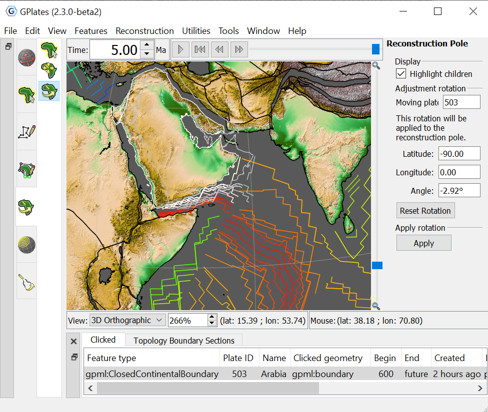
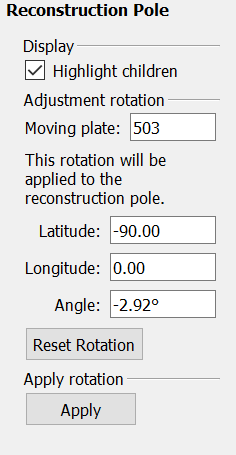
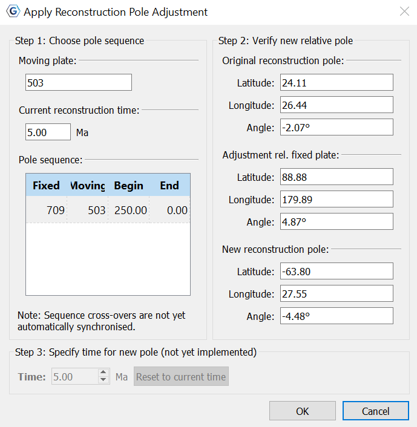
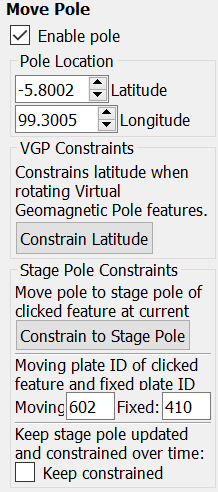

This chapter describes how to manipulate the reconstruction pole hierarchy using the Modify Reconstruction Poles tool.

1 Modify Reconstruction Poles Tool
================================

Found on the **Tool Palette**, the **Modify Reconstruction Poles** Tool is used to interactively modify the reconstruction poles for a given plate ID.

<table>
   <colgroup>
      <col style="width: 11%" />
      <col style="width: 22%" />
      <col style="width: 11%" />
      <col style="width: 55%" />
   </colgroup>
   <tbody>
      <tr class="odd">
         <td>
            
Icon

         </td>
         <td>
            
Tool

         </td>
         <td>
            
Shortcut

         </td>
         <td>
            
Operation

         </td>
      </tr>
      <tr class="even">
         <td>
            

         </td>
         <td>
            
Modify Reconstruction Pole

         </td>
         <td>
            
P

         </td>
         <td>
            
Drag or <code>Shift+drag</code> the current geometry to modify its reconstruction pole. <code>Ctrl+drag</code> to re-orient the globe by holding down <code>Ctrl</code>

         </td>
      </tr>
   </tbody>
</table>

1.1 Choosing a Plate ID to move
---------------------------

To select a Plate ID to move, the Plate needs to be in the field of view, and the *reconstruction time* needs to be at the correct *geological time*.

The second step is to select a feature which belongs to the plate ID that should be changed. Select the Choose Feature tool,  , then click the mouse cursor on the feature. You can confirm that you have selected the correct plate ID by checking the **Current Feature Panel**.

Now select the Modify Reconstruction Poles tool,  . Notice that all features belonging to the chosen plate ID are now highlighted.

1.2 Adjusting a Reconstruction Pole
-------------------------------

After the feature plate has been selected with the **Choose Feature** tool   it can be dragged anywhere on the globe. The plate can also be rotated by holding down **Shift** and dragging. The globe can still be re-orientated whilst dragging the plate by holding down Ctrl. The **Task Panel** will display information about the reconstruction pole.

**Highlight Children.**

Ticking this option will also highlight any plates that would be affected as a result of moving the selected plate due to the current rotation model.

1.3 Committing Changes to a Reconstruction Pole
-------------------------------------------

1.  Choose a pole sequence

2.  Verify new relative pole

2   Move Pole
=============

<table>
   <colgroup>
      <col style="width: 11%" />
      <col style="width: 22%" />
      <col style="width: 11%" />
      <col style="width: 55%" />
   </colgroup>
   <tbody>
      <tr class="odd">
         <td>
            
Icon

         </td>
         <td>
            
Tool

         </td>
         <td>
            
Shortcut

         </td>
         <td>
            
Operation

         </td>
      </tr>
      <tr class="even">
         <td>
            

         </td>
         <td>
            
Move Pole

         </td>
         <td>
            
O

         </td>
         <td>
            
Click on the pole marker and drag it to the desired location, or specify its location in the <b>Move Pole</b> Task Panel.

         </td>
      </tr>
   </tbody>
</table>

The **Move Pole** task panel allows users to manipulate the poles location by latitude and longitude. The panel also includes VGP and Stage Pole constraints.

