1 Sessions
========

A session consists of loaded feature collection files and layers (including individual layer settings).

Unlike previous versions, GPlates 2.0 now saves and restores *all* layer information including layer order, visibility and all settings within each layer (such as colour styles and colour palette filenames).

2 Projects and Recent Sessions
============================

A previous GPlates session can be restored by either opening a *project* or opening a *recent session*.

A *project* is a session that a user has saved to a project file, whereas a *recent session* is a session that has been [automatically saved](#automatic_save) and stored internally by GPlates.

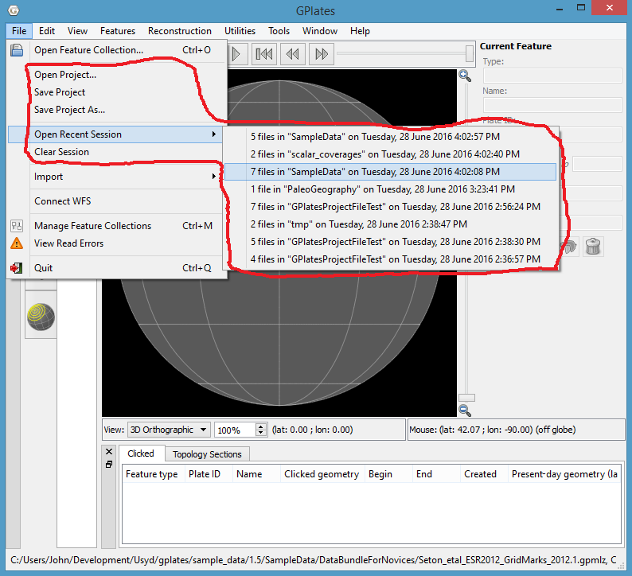

3 Opening and Project
===================

There is more than one way to open a project file.

These include the **File** menu, dragging a project file onto GPlates, double-clicking a project file, and starting up GPlates (with a project file) on the command-line.

3.1 File Menu
---------

Select a project file using the **File** menu (**File &gt; Open Project**)…

3.2 Drag’n'drop
-----------

Select a project file in the file system (Windows Explorer, Mac Finder, etc) and drag it onto an open GPlates main window…

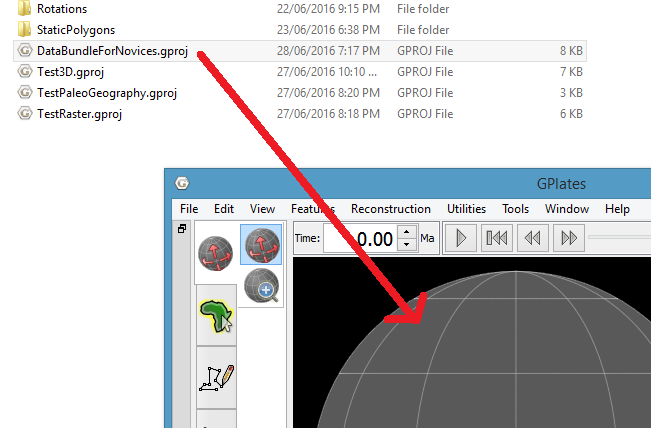

3.3 Double-click (*macOS*)
-----------------------

Double-click a project file (in Finder) to open it with GPlates (note that GPlates will start up first if it is not already running).

For this to work you first need to associate project files with a specific GPlates application. To do this right-click (*CTRL* + click) on any project file and select **Open With &gt; Other** …

Then select the GPlates 2.0 application. Also ensure the *'Always Open With'* checkbox is checked…

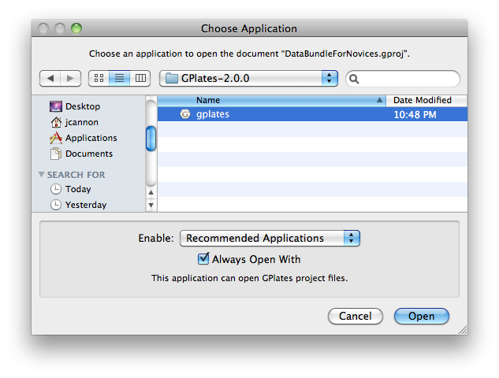

3.4 Command Line
------------

Start GPlates in a command-line terminal (Windows console, Mac Terminal, etc) and supply the project filename as the *'-p'* option:

4 Opening a recent session
========================

A list of the most recent sessions is available in the **File** menu (**File &gt; Open Recent Session**).

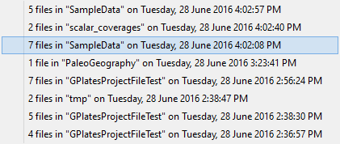

These are sessions that have been [automatically saved](#automatic_save) and stored internally by GPlates.

Each recent session in the list has a description containing:

-   The number of feature collections in the session.

-   A common ancestor directory:

    -   Common directory path of all feature collection files in the session.

    -   Note: if there is no common directory then this field is missing.

-   The time and date that the session was automatically saved.

When the mouse hovers over a recent session, its feature collection files will be displayed in the status bar (bottom of GPlates). Though there is usually only room to display at most one or two files.

The maximum number of stored recent sessions defaults to 8, but this can be changed in the **Preferences** dialog (**GPlates &gt; Preferences** on Mac OS and **Edit &gt; Preferences** on Windows and Linux).

In the **Preferences** dialog you can also configure the directories to open feature collection files and project files, and whether to (1) always use the default directory, (2) use the default the first time after start-up and then use the last-used directory, or (3) always use the last-used directory.

5 Restoring missing files in a session
====================================

When GPlates restores a session ([opening a project](#open_project) or [opening a recent session](#open_rs)) the data files associated with the session are also restored. The data files are the feature collections (and any colour palette files used in the colouring styles or layer settings).

If any data files associated with a restored session are missing then a dialog lists the missing files and gives you the opportunity to individually locate each file before loading the session, or abort loading the session altogether. This is useful if data files were moved after the session (project file or recent session) was saved.

The following dialog lists the files missing in a restored project (note that only missing files are listed). Initially all listed files are highlighted red to indicate they are missing…

Files that have been located are no longer highlighted in red…

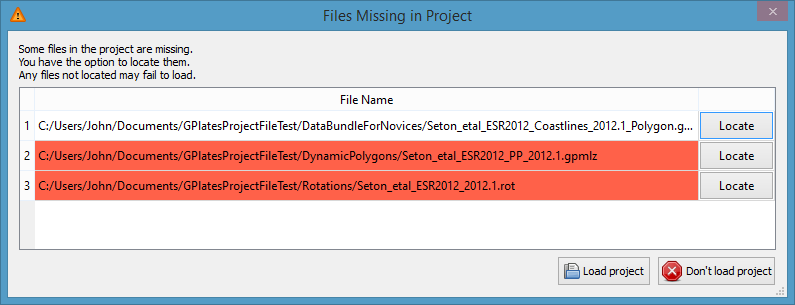

You do not need to locate all the files (or any of them). Any missing files that were not located will fail to load.

In the following case we selected *'Load project'* and the two remaining missing files show up in the **Read Errors** dialog as *'Error opening file'*…

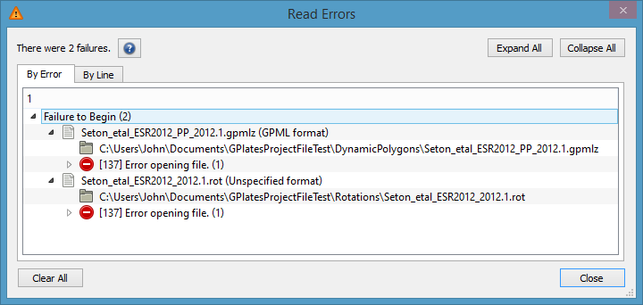

And the layers associated with those two files are also absent in the restored session.

However if we instead locate all three missing files then all is restored including the layer settings in the associated layers…

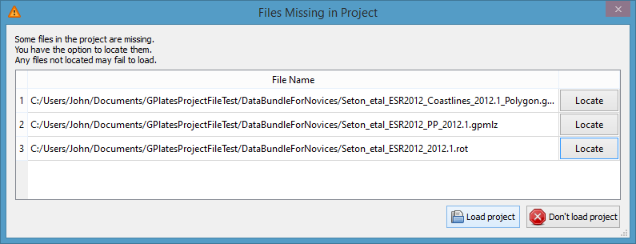

Note that our restored project now has an [unsaved change](#unsaved_change) since the names of the located files are different to what was stored in the project file. So we will want to save our restored project, otherwise if we try to open a different project then we will get the following unsaved changes warning…

6 When is a project open?
=======================

When a project is open the GPlates window title includes the name of the project file. This is the easiest way to determine whether a project is currently open or not.

For example, the following shows the *'DataBundleForNovices.gproj'* project file open in GPlates…

More formally, a project is open when:

-   A project file has been opened, or

-   The current session has been saved to a project file.

A project is not open when:

-   GPlates first starts up (without a project), or

-   A *recent session* has been opened, or

-   The current session has been cleared.

7 Clearing the current session
============================

The current session can be cleared using the **File** menu (**File&gt;Clear Session**).

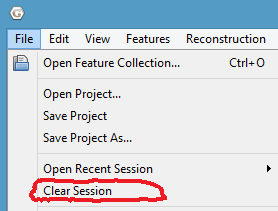

This unloads all feature collections and clears all layers

Note that if a project is [currently open](#pro_open) then this will also close the project.

8 Saving a project
================

The **File** menu (**File &gt; Save Project** and **File&gt;Save Project As**) can be used to save the current session to a project file.

**File &gt; Save Project** will save the currently open project file ([if a project is open](#pro_open)). However if a project is not currently open then you will be asked to select a project file, which will then become the currently open project.

In contrast, **File &gt; Save Project As** will always ask you to select a project file (even if a project is already open). This can be used to save the currently open project to a different project file.

Note that **File &gt; Save Project** and **File &gt; Save Project As** behave the same if a project is *not* currently open (both will ask you to select a project file).

Also note that any [unsaved feature collections](#usfc) must first be saved before you can save a project otherwise you will get the following message…

9 Automatic saving of sessions
============================

In contrast to projects (which are manually saved by the user) the current session is automatically saved immediately prior to losing the current session. This happens when:

-   [Opening a new project](#open_project), or

-   [Opening a recent session](#open_rs), or

-   [Clearing the current session](#clear_session), or

-   Closing GPlates.

However, note that if there are any unsaved *feature collections* then you will have the choice to discard those unsaved changes (and the current session will not be saved) or to remain in the current session. Please see [unsaved changes warning](#uscw) for more details.

Saving the current session either replaces an existing session in the list of *recent sessions* (if any have the same feature collections) or inserts a new session (and pops the least recent session off the list). In both cases the current session becomes the most recent session in the list.

10 Unsaved Changes
===============

Unsaved changes are classified into:

1.  Unsaved *feature collections*:

    -   Modified feature collections not yet saved, and

    -   Unnamed feature collections (new collections not yet saved).

2.  Unsaved *session* changes:

    -   Modified layer settings not yet saved.

    -   [Missing files restored in session](#rmfs).

10.1 Unsaved changes warning
-----------------------

If the current session has unsaved changes then a warning will pop up if you attempt an action that will lose the current session including:

-   [Opening a new project](#open_project), or

-   [Opening a recent session](#open_rs), or

-   [Clearing the current session](#clear_session), or

-   Closing GPlates.

You will then have the choice to either:

1.  Discard the unsaved changes (and continue with your chosen action), or

2.  Abort your chosen action.

The following sections cover a project with (i) unsaved *feature collections*, (ii) unsaved *session changes* and (iii) both unsaved *feature collections* and unsaved *session changes*.

10.2 Unsaved feature collections
---------------------------

To demonstrate unsaved *feature collections* we will start with a newly opened project called *'Test3D'* (containing a 3D scalar field)…

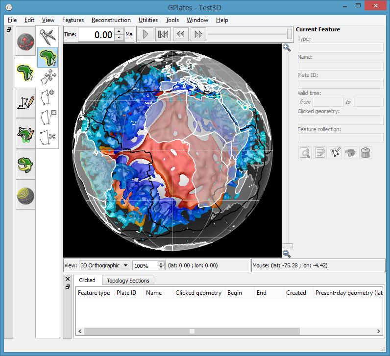

If we modify a feature collection (eg, change the plate ID of a coastline feature) and then attempt to open another project (**File &gt; Open Project**), without first saving our change, then we will get the following unsaved changes warning…

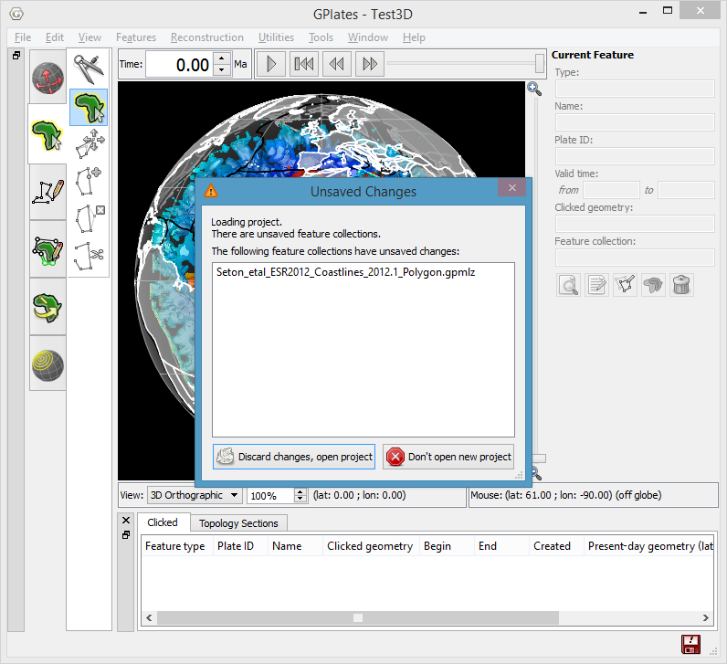

The warning displays a list of unsaved feature collections and gives us the option to *'Discard changes, open project'* or *'Do not open new project'*…

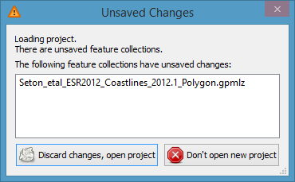

If we do not care about saving our modified feature collection then we can choose *'Discard changes, open project'* and then select a new project to open.

However, if we want to save our change then we need to choose *'Do not open new project'* and then save our modified feature collection. The modified feature collection is highlighted in red in the **Manage Feature Collections** dialog and must be manually saved…

Once we have saved our modified feature collection we can open a new project (**File &gt; Open Project**) without getting an unsaved changes warning.

10.3 Unsaved session changes
-----------------------

To demonstrate unsaved *session changes* we will again start with a newly opened 3D scalar field project…

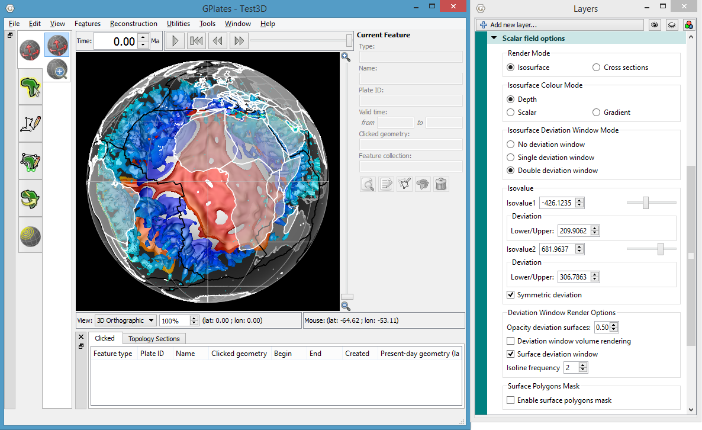

But this time we will change the isosurface colour mode (in the layer settings) and then attempt to open another project (**File &gt; Open Project**), without first saving our change, and get a slightly different unsaved changes warning…

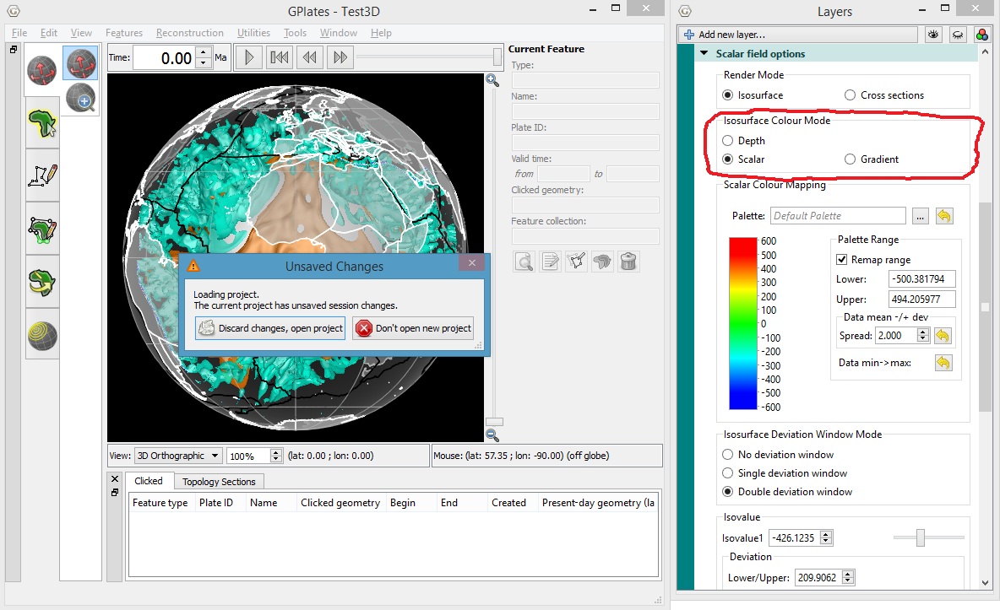

There is no longer a list of unsaved feature collections, but we do have the same option to *'Discard changes, open project'* or *'Do not open new project'*…

If we do not care about saving our isosurface change then we can choose *'Discard changes, open project'* and then select a new project to open.

However, if we want to save our change then we need to choose *'Do not open new project'* and then save our current project (**File &gt; Save Project**). Then we can open a new project (**File &gt; Open Project**) without getting an unsaved changes warning.

10.4 Unsaved feature collection and session changes
----------------------------------------------

If a currently open project has both unsaved feature collections and unsaved session changes then the unsaved changes warning will indicate this…

If we do not care about saving our modified feature collections or our session changes then we can choose *'Discard changes, open project'* and then select a new project to open.

However, if we choose to save any of our changes then we need to choose *'Do not open new project;'*. If we only want to save our *modified feature collection* (and not our *session changes*) then we can do that, and then open a new project and select *'Discard changes, open project'* to discard our unsaved *session changes*. However, if we want to save both our modified feature collection and our session changes, then we first need to save our modified feature collection…

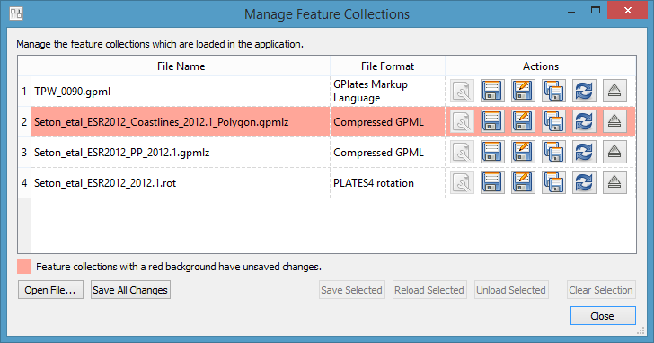

…and then save our project…

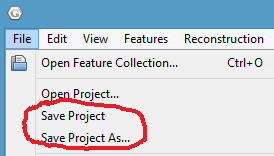

Note that you will need to save the feature collection before saving the project otherwise you will get the following message…

This is primarily because the project file stores the *filenames* of the feature collections and so we first need to give a filename to each *unnamed* feature collection (by saving it) before we can save the project file.

In the following example, cross-sections (for the 3D scalar field) have been digitised into a new *unnamed* feature collection which needs to be saved before the project can be saved…

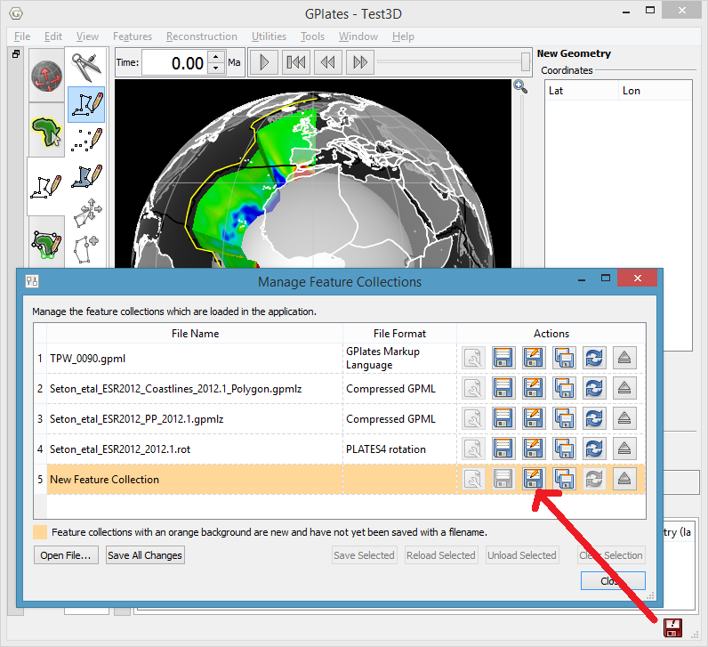

10.5 Project versus recent sessions
------------------------------

Changes to *feature collections* are saved to feature collection files (such as .gpml). Whereas *session changes* are automatically saved as recent sessions, and can also be saved to project files (.gproj).

As such you are always warned of unsaved *feature collections* (in case you want to save the feature collection files). However you are only warned of unsaved *session changes* when a [project is currently open](#pro_open) (in case you want to save the project file), otherwise no warning is necessary because unsaved *session changes* are automatically saved as a recent session.

11 Relocating projects
===================

A project consists of a project file and the data files used in that project (such as feature collection files, and any colour palette files used in the colouring styles or layer settings). When GPlates opens a project file it also opens the associated data files. This is possible because the project file stores the names and locations of the data files.

A project has been relocated if its project file is in a different location from where GPlates saved it.

There are two ways to relocate a project:

1.  Relocate *only* the project file:

    -   Useful when moving a project within your *local* computer.

2.  Relocate *both* the project file and associated data files:

    -   Useful when copying a project to *another* computer.

11.1 Moving a project within your *local* computer
---------------------------------------------

Moving only a project file (but not its associated data files) works well when moving a project within your *local* computer.

This is because the full (*absolute*) path of each data file is recorded in the project file and hence the data files can still be found when the project file is moved. This enables several projects, referencing the same set of data files, to be reorganised without having to move the data files.

However if you copied only the project file to *another* computer then the same data files would need to be accessible from both computers. This could work if the data files were on a network share (which was mapped to the same path on both computers). A more reliable option is to copy *both* the project file and its associated data files to the second computer as covered in the next section.

11.2 Copying a project to *another* computer
---------------------------------------

Copying a project file, together with its associated data files, works well when copying a project to *another* computer.

In this case, the path of each data file relative to the project file must be maintained when copying. The easiest way to achieve this is to copy the entire sub-directory tree containing the project file and its associated data files. For example, the sub-directory tree could be zipped up on the source computer and unzipped anywhere on the destination computer. The following example copies the *'C:/paleogeography/ directory tree on the source computer (Windows) to the /home/john/paleogeography/'* directory on the destination computer (Linux):

1.  Source computer:

    -   Project file: *'C:/paleogeography/paleogeography.gproj'*

    -   Data file 1: *'C:/paleogeography/data/paleogeography.gpml'*

    -   Data file 2: *'C:/paleogeography/colouring/paleogeography.cpt'*

2.  Destination computer:

    -   Project file: *'/home/john/paleogeography/paleogeography.gproj'*

    -   Data file 1: *'/home/john/paleogeography/data/paleogeography.gpml'*

    -   Data file 2: *'/home/john/paleogeography/colouring/paleogeography.cpt'*

Note that any colour palette files (*'\*.cpt'*) used by layers in the project should be included when copying the project, otherwise the user on the destination computer will be asked to [locate them](#rmfs).

### 11.2.1 Including colour palette files

A project can use colour palette files *indirectly* in colour styles and *directly* in some layers (such as Rasters, 3D Scalar Fields, Resolved Topological Networks and Reconstructed Scalar Coverages). Colour palette files used directly in layers need to be included, but only those colour palette files in colour styles that are actually used by layers in the project need to be included (unused styles can be ignored).

If a colour palette file is not in the directory you are copying (zipping up) to send to another computer then you will first need to copy it there and also set up your project to use that file. In our current paleogeography example, the project is using a colour style named *'PaleoGeography'* which references a *'paleogeography.cpt'* colour palette file. However let us assume the referenced colour palette file is not the one in the *'C:/paleogeography/* directory tree that we want to copy (zip up). To rectify this we create a new colour style using the *'Add'* button and give it the same name *(*PaleoGeography*)*. GPlates then automatically changes the name to *'PaleoGeography\_1'* to avoid a name clash. We then copy the *'property\_name'* value across and then select the *'C:/paleogeography/colouring/paleogeography.cpt'* colour palette file using the *'open'* button.

Now our *'paleogeography'* layer is using the colour palette file that we will be copying (zipping up). So we can save the project file (as *'C:/paleogeography/paleogeography.gproj'*) and then copy (zip up) the *'C:/paleogeography/'* directory tree and send it to another computer.

When the copied (unzipped) project is opened on the destination computer, a new *'PaleoGeography'* colour style will appear in the **Draw Style** dialog (referencing the destination colour palette file *'/home/john/paleogeography/colouring/paleogeography.cpt'*) and it will be used to colour the *'paleogeography'* layer.

Note that when a project is opened it will only create a new colour style if a matching one does not already exist in the **Draw Style** dialog. Matching colour styles have compatible names (differing only by *'1'*, *'2'*, etc, suffixes) and their configuration parameters match. So in our paleogeography example, colour styles *'PaleoGeography'* and *'PaleoGeography\_1'* are matching if they reference the same colour palette filename (and have the same *'property\_name'* value). So if prior to opening the project, the destination computer already had a colour style *'PaleoGeography'* referencing *'/home/john/paleogeography/colouring/paleogeography.cpt'* (and same *'property\_name'* value) then it would be used (instead of creating a new colour style).

11.3 Ambiguous projects
------------------

An ambiguous project is a relocated project that has some data files in original locations and some in current locations (relative to the relocated project file).

When GPlates opens a project, it detects if the project file has moved from the location it was saved. If so, then GPlates will either open **all** data files from their *original* locations or open **all** data files from their *current* locations (relative to current project file location). If GPlates finds data files in both locations then it resolves the ambiguity by asking the user to choose (all original or all current).

In the following example, the *'DataBundleForNovices.gproj'* project file was moved from the *'D:/GPlatesProjectFileTest/'* directory to *'C:/Users/John/Documents/GPlatesProjectFileTest/'*, but only some of the associated data files were moved with it. So opening the project produces the following **Project Has Moved** dialog…

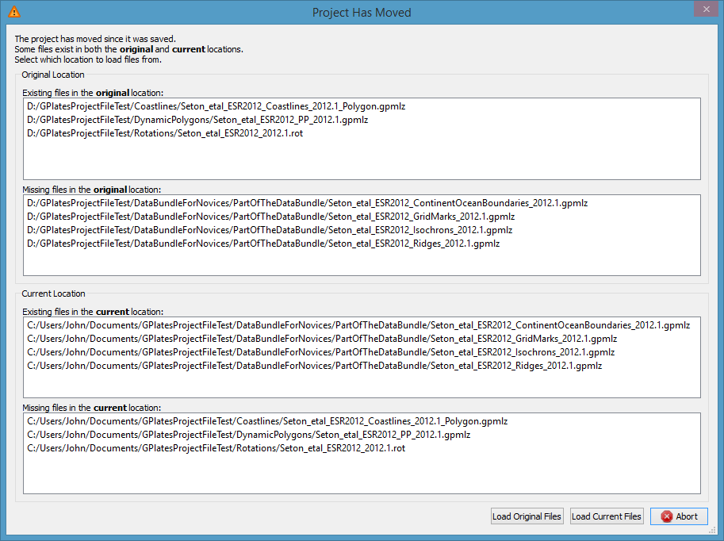

Roughly half the data files remain in the original location and the other half in the current location. GPlates is unsure whether to use the original or current locations and so it asks us whether to *'Load Original Files'*, or *'Load Current Files'*, or *'Abort'* opening the project altogether.

If we select *'Load Current Files'* then the **Files Missing in Project** dialog asks us to locate the missing files in the current location…

Note that a similar dialog would have appeared if we had selected *'Load Original Files'* instead.

At this point we have probably realised that we forgot to move half of the data files when we moved our project. In which case we would select *'Do not load project'* (or *'Abort'* in the prior **Project Has Moved** dialog) and then move the remaining files over. Opening the project again should then succeed without presenting the **Project has moved** dialog again (since no files remain in the original location).

A more obscure example of an ambiguous project can happen on a Windows computer when the data files of a relocated project exist on multiple drives (eg, *C:* and *D:*). In the following example we moved a project file and its data files on drive *C:* but we did not move its data file on drive *D:* (because that data file has no path relative to the project):

1.  Original location:

    -   Project file: *'C:/original/projects/project.gproj'*

    -   Data file 1: *'C:/original /data/data1.gpml'*

    -   Data file 2: *'C:/original /data/data2.gpml'*

    -   Data file 3: *'D:/raster\_data/raster.gpml'*

2.  Current location:

    -   Project file: *'C:/Users/John/current/projects/project.gproj'*

    -   Data file 1: *'C:/Users/John/current/data/data1.gpml'*

    -   Data file 2: *'C:/Users/John/current/data/data2.gpml'*

    -   Data file 3: *'D:/raster\_data/raster.gpml'*

Note that *D:/raster\_data/raster.gpml* is the same in both locations. This is because a relative path cannot be formed between *'C:/original/projects/'* and *'D:/raster\_data/'* due to different drive letters and so GPlates uses the original location as the current location. In this case GPlates will ask us to choose the *original* or *current* location (since *'D:/raster\_data/raster.gpml'* is in both locations).

12 Compatibility of sessions across GPlates versions
=================================================

GPlates 1.5 (and older versions) save and restore the feature collection filenames, the associated layer types and their layer connections. GPlates 2.0 additionally saves and restores all layer information including layer order, visibility and all layer settings within each layer (including colour styles and colour palette filenames).

GPlates 2.0 can open projects and recent sessions saved by all prior versions of GPlates. However the information saved by those versions is limited (the feature collections, layer types and layer connections).

GPlates 1.5 can open projects and recent sessions saved by GPlates 2.0 (provided the data files were not moved after the project or recent session was saved). However the information restored is limited to the feature collections, layer types and layer connections (the extra information saved by GPlates 2.0 is ignored).

<table class ="note">
   <tbody>
      <tr>
         <td class="icon">
            
         </td>
         <td class="content" >This means if you work on a project (or recent session) in GPlates 2.0, then work on it in GPlates 1.5 and then work on it again in GPlates 2.0 then it will not get completely restored the second time it is opened in GPlates 2.0 (like it was the first time). This is because the session information saved by GPlates 1.5 is limited.</td>
      </tr>
   </tbody>
</table>

