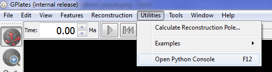
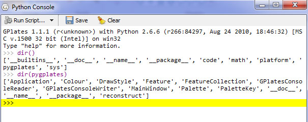
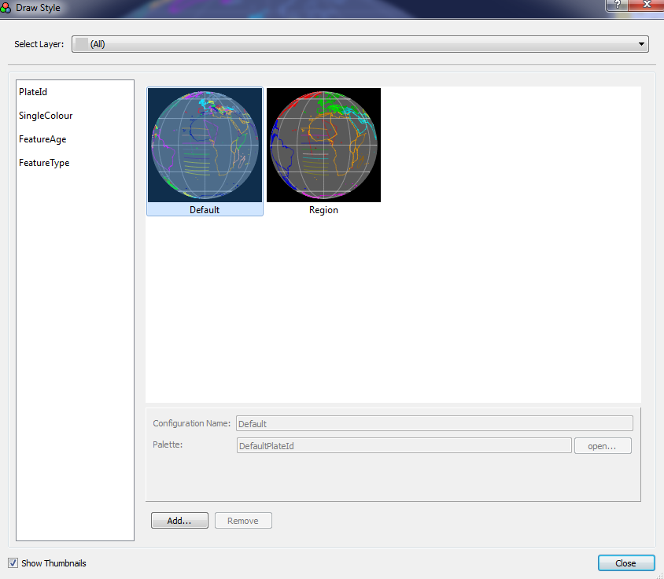
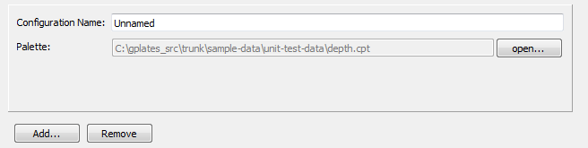
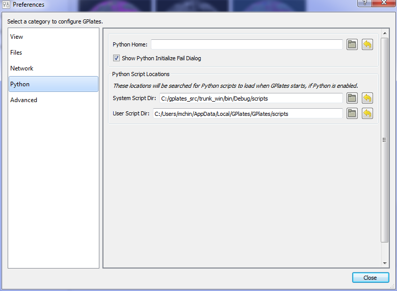

Introduction
============

Starting from 1.2 release, GPlates has scripting support using **Python** language. The GPlates Python APIs are a set of interfaces through which Python script can interact with GPlates. Python script can be executed either in the embedded Python Console or as a GPlates Python Plugin.

Python Console
==============

To open embedded Python Console, select the **Open Python Console** menu item in the **Utilities** menu or press **F12**.

Python plugins
==============

So far GPlates only allows users to provide **Draw Style** plugins, which can be used to control the appearance of geometries in globe or map view, for example colouring. More types of plugins will be supported in the future.

Draw Style plugins
------------------

The registered Draw Styles will be listed in the **Draw Style Dialog**.

The following paragraphs cover how to create a **Draw Style** plugin and register it with GPlates.

The following python code defines a **Draw style** plugin class called `PlateId`. It assigns a colour to the geometries contained in the given feature based on its **plate id**. The `register()` function at the bottom creates and registers an instance of the `PlateId` plugin with GPlates by calling the GPlates Python API function `register_draw_style()` and passing the `PlateId` instance as the function argument.

    class PlateId:                                  # the definition of "Draw Style" plugin.
            def __init__(self):                     # standard Python constructor function.
                    pass

            # The get_style() function is called by GPlates when rendering a feature.
            # A feature reference is passed in as function parameter.
            # The style data can be sent back by the "style" object reference.

            def get_style(self, feature, style):
                    id = feature.plate_id()                 # get "plate id" from the feature
                    id = int(id)                            # convert the id to integer
                    palette = self.cfg['my_palette']        # get user-defined palette by name from configuration dict
                    p_id = pygplates.PaletteKey(id)         # create a palette key from plate id
                    style.colour = palette.get_color(p_id)  # get colour from palette and put it into style object

            def get_config(self):                           # GPlates calls this function to get configuration info
                    self.cfg_dict = {}
                    self.cfg_dict['my_palette/type'] = 'Palette'
                    return self.cfg_dict

            def set_config(self, config):                   # GPlates calls this function to set configuration info
                    self.cfg = config

    def register():
            pygplates.Application().register_draw_style(PlateId())

The `register()` function in Python script files residing in the **GPlates Python Script Directory** will be called by GPlates automatically when GPlates starts up.

The `get_config()` function is called by GPlates to generate a **Draw Style** configuration GUI panel.

The following python code defines a **Palette** item called `my_palette`.

    self.cfg_dict['my_palette/type'] = 'Palette'    # defines a Palette item called my_palette.

So far three types of configuration item are supported, namely **Palette**, **Color** and **String**.

The `set_config()` is called by GPlates to set the configuration dictionary into the current Python object instance, so that it can be retrieved later.

GPlates Python Script Directory
-------------------------------

Currently, GPlates looks into two directories for Python script files.

-   ./scripts

-   $system_app_data_dir/script

The **Python Script Directory** setting can be changed in the **Preferences Dialog**. To open the **Preferences Dialog**, select the **Preferences** menu in the **Edit** menu, or press `Ctrl+,`.

