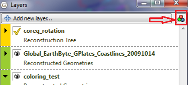

Introduction
============

Starting from 1.2 release, GPlates has scripting support using **Python** language. The GPlates Python APIs are a set of interfaces through which Python script can interact with GPlates. See **Appendix A** for API reference. Python script can be executed either in the embedded Python Console or as a GPlates Python Plugin.

Python Console
==============

To open embedded Python Console, select the **Open Python Console** menu item in the **Utilities** menu or press **F12**.

Python plugins
==============

So far GPlates only allows users to provide **Draw Style** plugins, which can be used to control the apparence of geometries in globe or map view, for example colouring. More types of plugins will be supported in the future.

Draw Style plugins
------------------

The following python code defines a draw style plugin class called PlateId. It assigns colour to geometries contained in the given feature based on its **plate id**. The register() function at the bottom creates and registers an instance of **PlateId** plugin with GPlates by calling GPlates Python API **register\_draw\_style()** and passing through the plugin object instance as function parameter. The registered Draw Styles will be listed in "Draw Style Dialog".

There are three ways to open "Draw Style Dialog". \* Select **Manage Colouring** item from **Feature** menu.

-   Click button in **Layer** dialog.

-   Click **Draw Style Setting** link in "Layer Options".

    class PlateId:                                  #the definition of "Draw Style" plugin.
            def __init__(self):                     #standard Python constructor function.
                    pass

            #The get_style() function is called by GPlates when rendering a feature.
            #A feature reference is passed in as function parameter.
            #The style data can be sent back by the "style" object reference.

            def get_style(self, feature, style):
                    id = feature.plate_id()                 #get "plate id" from the feature
                    id = int(id)                            #convert the id to integer
                    palette = self.cfg['my_palette']        #get user defined palette by name from configuration dictionary.
                    p_id = pygplates.PaletteKey(id)         #create a palette key from plate id
                    style.colour = palette.get_color(p_id)  #get colour from palette and put it into style object

            def get_config(self):                           #GPlates calls this function to get configuration information.
                    self.cfg_dict = {}
                    self.cfg_dict['my_palette/type'] = 'Palette'
                    return self.cfg_dict

            def set_config(self, config):                   #GPlates calls this function to set configuration information.
                    self.cfg = config

    def register():
            pygplates.Application().register_draw_style(PlateId())

-   The "register()" function in Python script files residing in **GPlates Python Script Directory** will be called by GPlates automaticly during GPlates starts up.

-   The "get\_config()" function is called by GPlates to generate **Draw Style** configuration GUI panel.

The following python code defines a **Palette** item called "my\_palette".

    self.cfg_dict['my_palette/type'] = 'Palette'    #defines a Palette item called my_palette.

So far three types of configuration item are supported, namely **Palette**, **Color** and **String**.

-   The "set\_config()" is called by GPlates to set configuration dictionary into the current Python object instance, so that it can be retrieved later.

GPlates Python Script Directory
-------------------------------

Currently, GPlates looks into two directories for Python script files.

-   ./scripts

-   $system\_app\_data\_dir/script

The **GPlates Python Script Directory** setting can be changed in **Preference Dialog**. To open the **Preference Dialog**, select the **Reference** menu in the **Edit** menu or press **Ctrl+,**.

Disable Python
==============

In case the embedded Python interpreter caused unexpected problems, users can disable GPlates' Python functionality by starting GPlates with "no-python" command line option.

Type in the following command in your terminal.

    gplates --no-python

