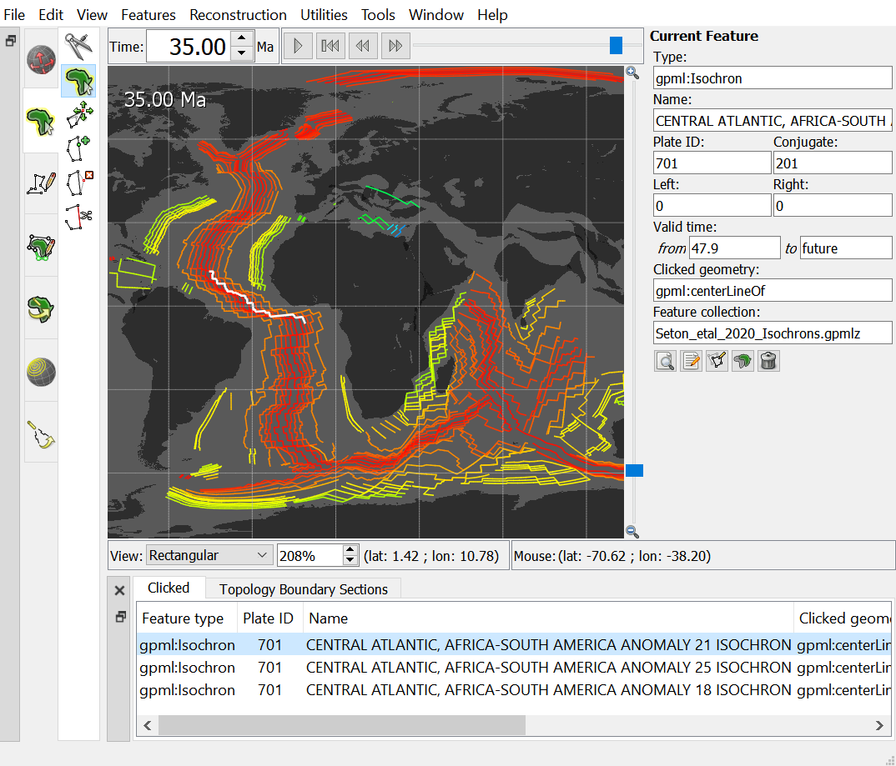
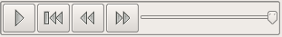
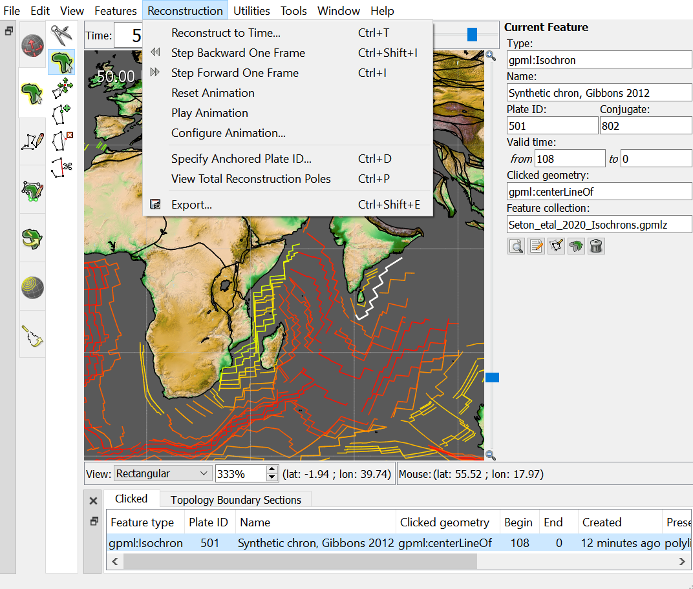
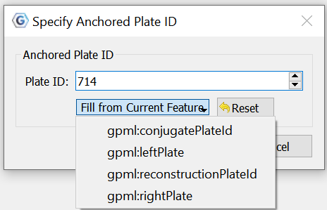
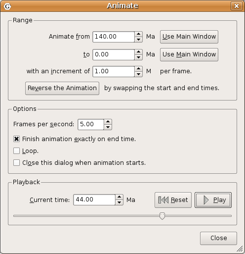

Introduction
============

The motions of tectonic plates through geological time may be described and simulated using plate-tectonic reconstructions. Plate-tectonic reconstructions are the calculations of the probable positions, orientations and motions of tectonic plates through time, based upon the relative (plate-to-plate) positions of plates at various times in the past which may be inferred from other data. Geological, geophysical and paleo-geographic data may be attached to the simulated plates, enabling a researcher to trace the motions and interactions of these data through time.

Geological time instants in GPlates are measured in units of Mega-annum (Ma), in which 1 Ma is equal to one million years in the past. For example, the allowable range for reconstructions is from 0 to 10 000 Ma (i.e. present day to 1010 years ago).

<table class ="tip">
   <tbody>
      <tr>
         <td class="icon">
            
         </td>
         <td class="content" >The current age of the Earth is approximately 4.5 x 109 years!</td>
      </tr>
   </tbody>
</table>

Reconstruction Theory
====================

### Plate IDs

As discussed earlier in this documentation, GPlates uses the concept of a **Plate ID** to ascribe tectonic motion to a feature. All features using the same plate ID move in unison when reconstructed back through time. A plate ID is a non-negative whole number. Assigning specific meanings to specific plate IDs, such as making plate ID 714 correspond to northwest Africa, is up to the creator of the rotation file.

Plate IDs do not correspond to a physical tectonic plate, although they may represent the motion of features which are on that physical plate. Plate IDs can also be assigned to represent the motion of things on the same physical plate relative to one another - for example, the motion of an island arc caused by back-arc spreading. A subduction zone can be assigned one plate ID, and its associated island arc can be assigned another plate ID. The motion of both of these plate IDs can be anchored to a third plate ID, representing the global motion of the physical plate underneath the subduction zone and island arc.

### Finite Rotations

Euler’s Displacement Theorem tells us that any displacement on the surface of the globe can be modelled as a rotation about some axis. This combination of axis and angle is called a **finite rotation**. Finite rotations are used by GPlates as the elementary building blocks of plate motion.

### Total Reconstruction Poles

Total Reconstruction Poles tie finite rotations to plate motion. A total reconstruction pole is a finite rotation which "reconstructs" a plate from its present day position to its position at some point in time in the past. It is expressed as the combination of a "fixed" plate id, a "moving" plate id, a point in time and a finite rotation.

Reconstructions are defined in a relative fashion; A single total reconstruction pole defines the motion of one plate id (the "moving" plate id) relative to another (the "fixed" plate id) at a specific moment in geological time. A sequence of total reconstruction poles is needed in order to fully model the motion of one particular plate across the surface of the globe throughout time.

### Anchored Plate ID

A sequence of total reconstruction poles is used to model the motion of a single plate across the surface of the globe. The total reconstruction poles describe the relative motion between each plate, but ultimately this motion has to be traced back to a single plate ID which is considered "anchored". GPlates calls this the **Anchored Plate ID**. Generally, this plate ID corresponds to an absolute reference frame, such as a hotspot, paleomagnetic, or mantle reference frame. The convention is to assign the anchored plate ID to 000, but GPlates allows any plate ID to be used as the anchored plate ID.

### The Rotation Hierarchy

To create the model of global plate rotations that is used in GPlates, total reconstruction poles are arranged to form a hierarchy, or tree-like structure. At the top of the hierarchy is the anchored plate ID. Successive plate IDs are further down the chain, linked by total reconstruction poles. To calculate the absolute rotation of a plate ID of a plate with a given plate ID. (relative to the fixed reference defined by the anchored plate ID, at a given time), GPlates starts at that point in the hierarchy and works its way up to the top - to the root of the tree.

Main Window Interface Components
================================

Slider
------

Interface to interact with reconstruction animations in GPlates, discussed in further detail below.

###   Play

Starts animation, when pressed it changes to the pause button

###   Pause

Halts animation, when pressed it changes to play button

###   Reset

Returns animation to the start time

###   Fast Forward

Step forwards one frame in the animation

###   Rewind

Step backwards one frame in the animation

Step Forwards One Frame / Step Backwards One Frame (Fast Forward and Rewind):
-----------------------------------------------------------------------------

These buttons are used to change the current reconstruction time that you are viewing in small steps. Pressing the buttons once, or using their shortcut keys (`Ctrl+I` for forwards; `Ctrl+Shift+I` for backwards) will adjust the reconstruction time by one frame. The time interval between frames can be adjusted via the **Configure Animation Dialog**, accessed via the **Reconstruction menu**.

<table class ="note">
   <tbody>
      <tr>
         <td class="icon">
            
         </td>
         <td class="content" >The Step Forwards one Frame / Step Backwards one Frame buttons can be held down to move through time rapidly.</td>
      </tr>
   </tbody>
</table>

The forwards and backwards buttons apply relative to the current animation time. Normally, the present day (0 Ma) is at the right-hand side of the animation slider, and the distant past is on the left-hand side.

GPlates makes it possible for you to set a reverse animation, where the start time is the present day (or near past), and the end time is in the distant future. When an animation is set up this way, the slider and buttons behave as consistently as possible; your start time (the present) is on the left, and your end time (the distant past) is on the right. Using the **Step Forwards one Frame** button moves the slider to the right (into the past), and the **Step Backwards one Frame** button does the opposite, as you would expect.

<table class ="note">
   <tbody>
      <tr>
         <td class="icon">
            
         </td>
         <td class="content" >The default settings for the **Slider** are: a time range of 140Ma to present and a time increment per frame of 1 million years</td>
      </tr>
   </tbody>
</table>

Reconstruction Menu
===================

The **Reconstruction Menu** provides access to the following tools:

<table>
   <colgroup>
      <col style="width: 28%" />
      <col style="width: 14%" />
      <col style="width: 57%" />
   </colgroup>
   <tbody>
      <tr class="odd">
         <td>
            
Menu Item

         </td>
         <td>
            
Shortcut

         </td>
         <td>
            
Operation

         </td>
      </tr>
      <tr class="even">
         <td>
            
Reconstruct to Time…

         </td>
         <td>
            
<code>Ctrl+T</code>

         </td>
         <td>
            
Show a reconstruction for the user-specified time

         </td>
      </tr>
      <tr class="odd">
         <td>
            
Step Backward One Frame

         </td>
         <td>
            
<code>Ctrl+Shift+I</code>

         </td>
         <td>
            
Step backward one frame in the animation

         </td>
      </tr>
      <tr class="even">
         <td>
            
Step Forward One Frame

         </td>
         <td>
            
<code>Ctrl+I</code>

         </td>
         <td>
            
Step forward one frame in the animation

         </td>
      </tr>
      <tr class="odd">
         <td>
            
Reset Animation

         </td>
         <td></td>
         <td>
            
Return to the first frame of the animation

         </td>
      </tr>
      <tr class="even">
         <td>
            
Play Animation

         </td>
         <td></td>
         <td>
            
Start reconstructing each frame through the animation

         </td>
      </tr>
      <tr class="odd">
         <td>
            
Configure Animation…

         </td>
         <td></td>
         <td>
            
Pop up the <strong>Configure Animation</strong> dialog to control the animation parameters

         </td>
      </tr>
      <tr class="even">
         <td>
            
Specify Anchored Plate ID…

         </td>
         <td>
            
<code>Ctrl+D</code>

         </td>
         <td>
            
Specify the anchored plate in the plate hierarchy

         </td>
      </tr>
      <tr class="odd">
         <td>
            
View Total Reconstruction Poles

         </td>
         <td>
            
<code>Ctrl+P</code>

         </td>
         <td>
            
Pop up the Total Reconstruction Poles dialog

         </td>
      </tr>
      <tr class="even">
         <td>
            
Export…

         </td>
         <td></td>
         <td>
            
Opens the <strong>Export Dialog</strong> for exporing aspects of the reconstruction to files

         </td>
      </tr>
   </tbody>
</table>

Reconstruct to Time
-------------------

When this menu item is invoked, it will activate the Time field in the Main Window, which is used to specify the current reconstruction time. The user can type a new reconstruction time, or increase or decrease the value using the Up and Down arrow keys or the mouse scroll-wheel, before pressing the Enter key to execute the reconstruction.

The current frame of the animation always corresponds to the reconstruction time. Changing the reconstruction time will simultaneously change the current frame of the animation. If the specified time is outside the current range of the animation, the range will be extended.

Step Forward One Frame
----------------------

This button is used to change the current reconstruction time forward that you are viewing in small steps.

Step Backward One Frame
-----------------------

This button is used to change the current reconstruction time backward that you are viewing in small steps.

Specify Anchored Plate ID
-------------------------

The **Specify Anchored Plate ID** command on the Reconstruction menu can be used to change which plate ID GPlates considers to be the globally fixed reference when performing reconstructions. Enter a new plate ID to be the anchor in the dialog that pops up, and GPlates will automatically rearrange the [rotation hierarchy](#the-rotation-hierarchy) so that the specified plate ID is at the top.

View Total Reconstruction Poles
-------------------------------

The [Total Reconstruction Pole](#total-reconstruction-poles) Dialog is accessed from the Reconstruction menu. It contains four tables of information, relevant to the current reconstruction time and the current [anchored plate ID](#anchored-plate-id).

### Relative Rotations

This table lists all the total reconstruction poles in terms of the relative motions between plates, for the current reconstruction time.

### Equivalent Rotations Relative To Anchored Plate

Similar to the **Relative Rotations** table, this lists rotations for each plate. However, the data presented here has been converted from individual relative rotations into the equivalent absolute rotation, relative to the [anchored plate ID](#anchored-plate-id). Again, these apply to the current reconstruction time.

### Reconstruction Tree

Here the reconstruction hierarchy is presented in a more natural, tree-like form. Relative rotations are listed, but individual nodes of the tree (plate IDs) can be expanded or collapsed, to explore the branches of the plate rotation model.

### Plate Circuits To Stationary Plate

This tab of the [Total Reconstruction Poles](#total-reconstruction-poles) dialog can be used to trace a series of total reconstruction poles from any given plate ID back to the top of the hierarchy, the [anchored plate ID](#anchored-plate-id). It is useful to quickly identify the other plate IDs that a chosen plate ID depends on.

Animations
==========

The animation dialog, found in the Reconstruction menu, allows you to automate a reconstruction backwards or forwards through time. The user can set the start and end times by either entering the age or using the current time displayed in the main window. The options, frames per second can be set and there is also the option to loop the animation.

Configure Animation
----------------

### Range

This group of controls specifies the time range that the animation should cover. The **Use Main Window** buttons are a convenient way of quickly entering the time that the main window is currently viewing.

### Options

Additional options to fine-tune the behaviour of the animation are presented here. The **Frames per second** number controls the rate at which GPlates will limit the display of animation frames when presenting an animation interactively. Larger numbers produce a slower animation.

<table class ="note">
   <tbody>
      <tr>
         <td class="icon">
            
         </td>
         <td class="content" >If calculating the next step of the animation takes too long, perhaps due to a large amount of data, GPlates may skip some frames to try and keep the animation running at the correct rate.</td>
      </tr>
   </tbody>
</table>

### Playback

These controls allow simple playback and seeking within the animation from this dialog. They behave identically to the equivalent controls found in the **Reconstruction View**.

