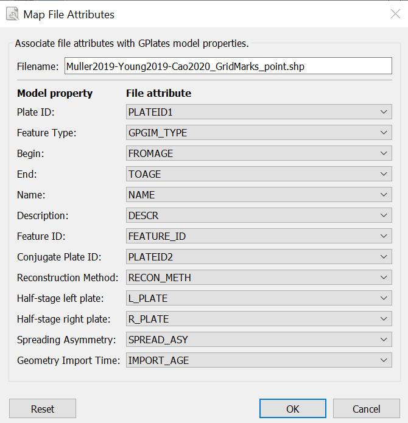
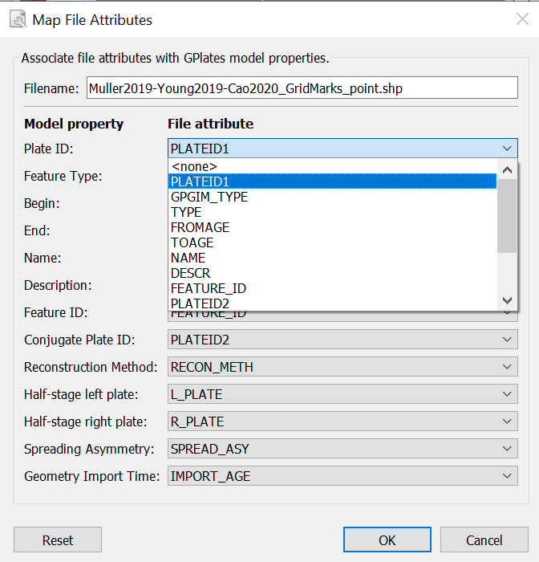
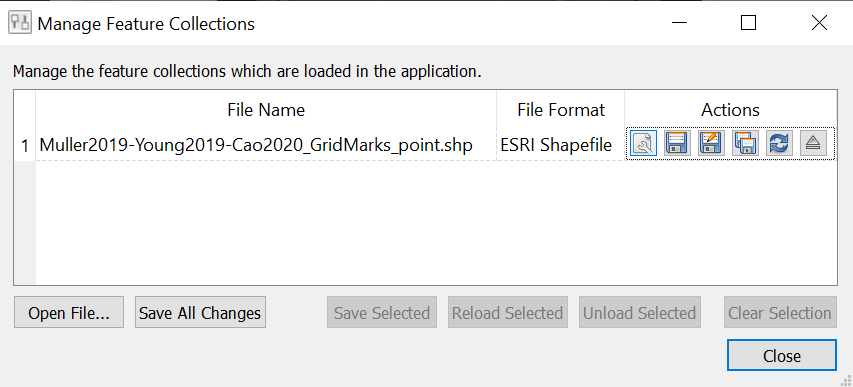
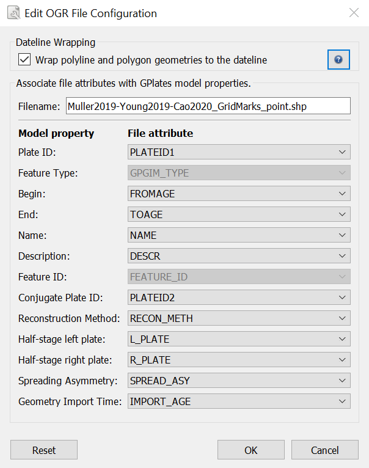
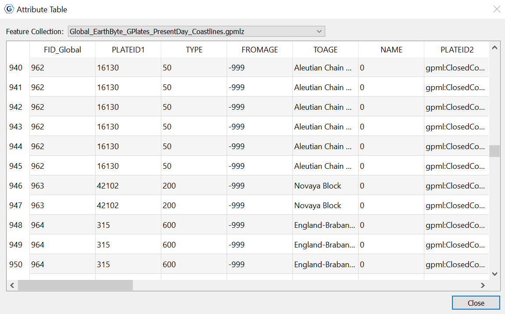

1 Introduction
============

ESRI Shapefiles are one of the recognised Feature Collection file formats in GPlates. Loading a feature collection from a Shapefile follows the same procedure as any other feature data file - see the **Loading and Saving** chapter.

Much of this chapter also applies to OGR-GMT and GeoJSON file formats. These formats, along with shapefiles, are all handled by the OGR third-party library.

2 Shapefile attributes
====================

Shapefile attributes can contain meta-data associated with the geospatial data. This data could specify, for example, the feature’s reconstruction plateID, or the times of appearance and disappearance of the feature. GPlates allows you to specify which shapefile attribute field names will be associated with GPlates feature properties, such as the reconstruction plateID. GPlates records this information on disk so that in subsequent GPlates sessions the last used association will be loaded by default. You can change this association at any time during a GPlates session.

2.1 Mapping shapefile attributes
----------------------------

The first time a shapefile has been loaded, you will see the **Map File Attributes** dialog.

This dialog allows the user to select which file attribute fields will be associated with GPlates feature properties. The feature properties are listed on the left-hand side of the dialog.

<table>
   <colgroup>
      <col style="width: 22%" />
      <col style="width: 51%" />
      <col style="width: 25%" />
   </colgroup>
   <thead>
      <tr class="header">
         <th style="text-align: left;">Feature property</th>
         <th style="text-align: left;">Explanation</th>
         <th style="text-align: left;">Expected values</th>
      </tr>
   </thead>
   <tbody>
      <tr class="odd">
         <td style="text-align: left;">PlateID</td>
         <td style="text-align: left;">The reconstrution plateID for the feature</td>
         <td style="text-align: left;">Integer</td>
      </tr>
      <tr class="even">
         <td style="text-align: left;">Feature type</td>
         <td style="text-align: left;">The type (e.g. Coastline, COB) of the feature</td>
         <td style="text-align: left;">Two letter code</td>
      </tr>
      <tr class="odd">
         <td style="text-align: left;">Begin</td>
         <td style="text-align: left;">The time of appearance of the feature</td>
         <td style="text-align: left;">Real</td>
      </tr>
      <tr class="even">
         <td style="text-align: left;">End</td>
         <td style="text-align: left;">The time of disappearance of the feature</td>
         <td style="text-align: left;">Real</td>
      </tr>
      <tr class="odd">
         <td style="text-align: left;">Name</td>
         <td style="text-align: left;">The name of the feature</td>
         <td style="text-align: left;">Text</td>
      </tr>
      <tr class="even">
         <td style="text-align: left;">Description</td>
         <td style="text-align: left;">A description of the feature</td>
         <td style="text-align: left;">Text</td>
      </tr>
      <tr class="odd">
         <td style="text-align: left;">Feature ID</td>
         <td style="text-align: left;">A unique ID for the feature</td>
         <td style="text-align: left;">Text</td>
      </tr>
      <tr class="even">
         <td style="text-align: left;">Conjugate Plate ID</td>
         <td style="text-align: left;">The plate ID of any conjugate plate</td>
         <td style="text-align: left;">Integer</td>
      </tr>
      <tr class="odd">
         <td style="text-align: left;">Reconstruction Method</td>
         <td style="text-align: left;">The method used to reconstruct plate positions</td>
         <td style="text-align: left;">Text</td>
      </tr>
      <tr class="even">
         <td style="text-align: left;">Half-stage left plate</td>
         <td style="text-align: left;">For half-stage reconstructions, the left plate ID</td>
         <td style="text-align: left;">Integer</td>
      </tr>
      <tr class="odd">
         <td style="text-align: left;">Half-stage right plate</td>
         <td style="text-align: left;">For half-stage reconstructions, the right plate ID</td>
         <td style="text-align: left;">Integer</td>
      </tr>
      <tr class="even">
         <td style="text-align: left;">Spreading Asymmetry</td>
         <td style="text-align: left;">For half-stage reconstructions, the spreading asymmetry</td>
         <td style="text-align: left;">Real</td>
      </tr>
      <tr class="odd">
         <td style="text-align: left;">Geometry Import Time</td>
         <td style="text-align: left;">The time the geometry is imported at</td>
         <td style="text-align: left;">Integer</td>
      </tr>
   </tbody>
</table>

Alongside each feature property is a drop-down box showing the name of the file attribute field which will be associated with the feature property. You can use the drop-down boxes to change the file attribute fields which you want to associate with each feature property.

By default GPlates will look for certain file attribute field names, and will initialise the drop-down boxes with the following values:

<table>
   <colgroup>
      <col style="width: 45%" />
      <col style="width: 54%" />
   </colgroup>
   <thead>
      <tr class="header">
         <th style="text-align: left;">Feature property</th>
         <th style="text-align: left;">Default attribute field name</th>
      </tr>
   </thead>
   <tbody>
      <tr class="odd">
         <td style="text-align: left;">PlateID</td>
         <td style="text-align: left;">PLATEID1</td>
      </tr>
      <tr class="even">
         <td style="text-align: left;">Feature type</td>
         <td style="text-align: left;">GPGIM_TYPE</td>
      </tr>
      <tr class="odd">
         <td style="text-align: left;">Begin</td>
         <td style="text-align: left;">FROMAGE</td>
      </tr>
      <tr class="even">
         <td style="text-align: left;">End</td>
         <td style="text-align: left;">TOAGE</td>
      </tr>
      <tr class="odd">
         <td style="text-align: left;">Name</td>
         <td style="text-align: left;">NAME</td>
      </tr>
      <tr class="even">
         <td style="text-align: left;">Description</td>
         <td style="text-align: left;">DESCR</td>
      </tr>
      <tr class="odd">
         <td style="text-align: left;">Feature ID</td>
         <td style="text-align: left;">FEATURE_ID</td>
      </tr>
      <tr class="even">
         <td style="text-align: left;">Conjugate Plate ID</td>
         <td style="text-align: left;">PLATEID2</td>
      </tr>
      <tr class="odd">
         <td style="text-align: left;">Reconstruction Method</td>
         <td style="text-align: left;">RECON_METH</td>
      </tr>
      <tr class="even">
         <td style="text-align: left;">Half-stage left plate</td>
         <td style="text-align: left;">L_PLATE</td>
      </tr>
      <tr class="odd">
         <td style="text-align: left;">Half-stage right plate</td>
         <td style="text-align: left;">R_PLATE</td>
      </tr>
      <tr class="even">
         <td style="text-align: left;">Spreading Asymmetry</td>
         <td style="text-align: left;">SPREAD_ASY</td>
      </tr>
      <tr class="odd">
         <td style="text-align: left;">Geometry Import Time</td>
         <td style="text-align: left;">IMPORT_AGE</td>
      </tr>
   </tbody>
</table>

If the default field name for a feature property cannot be found in the shapefile, the drop-down box will be initialised with &lt;none&gt;.

Once you have selected the mapping you want, clicking **OK** will load the shapefile.

2.2 Recording the mapping
---------------------

Once a mapping has been selected, GPlates records this information on disk. If the shapefile was called **mydata.shp**, the mapping information will be stored in the same folder in a file called **mydata.shp.gplates.xml**. The next time a user loads **mydata.shp**, GPlates will look for the file **mydata.shp.gplates.xml**. If this mapping file is found, GPlates will use the mapping contained in it, and will not force the user to use the **Map File Attributes** dialog.

2.3 Changing the mapping
--------------------

The mapping can be reset at any time during a GPlates session.

**To reset the mapping for a feature collection:**

1.  Open the **Manage Feature Collections** dialog (**Ctrl+M**) 

2.  Select the **File Properties** icon   for the file whose mapping you want to change.

3.  The **Edit OGR Configuration** dialog will appear; the lower part of this dialog behaves in the same way as the **Map File Attributes** dialog described above.  
    

4.  When you have selected the fields for your mapping, click **OK**.

<table class ="note">
   <tbody>
      <tr>
         <td class="icon">
            
         </td>
         <td class="content" >Re-mapping the shapefile attributes will update the \*.shp.gplates.xml file on disk.</td>
      </tr>
   </tbody>
</table>

2.4 Dateline wrapping
-----------------

Shapefile datasets which contain geometries spanning the dateline (180/-180 degrees longitude) can be problematic to view in GIS tools such as ArcGIS (where such geometries might appear rendered with horizontal lines). If desired, GPlates can clip such dateline-spanning geometries to the dateline, making it more suitable for viewing in ArcGIS. (Note that this will also result in geometries being divided up into multiple geometries).

To enable this feature, select the **Wrap polyline and polygon geometries to the dateline** checkbox at the top of the **Edit OGR File Configuration** dialog. If this is selected, geometries will be clipped to the dateline the next time the file is saved to disk.

<table class ="note">
   <tbody>
      <tr>
         <td class="icon">
            
         </td>
         <td class="content" >Dateline Wrapping is also available as an option in the <b>Export</b> tool.</td>
      </tr>
   </tbody>
</table>

2.5 Viewing Shapefile attributes
----------------------------

Shapefile attributes can be viewed in two ways:

-   For an entire feature collection.

-   For individual features in a feature collection.

**To view shapefile attributes for a feature collection**

1.  Go to the **Features Menu** in the menu bar.

2.  Select **View Attribute Table**

3.  The **Attribute Table** dialog will appear.

The file attribute field names are displayed at the top of each column. Each row of the table corresponds to a single feature in the feature collection, and displays the attribute values for that feature. If there is more than one shapefile feature collection loaded, you can use **Feature Collection** drop-down box at the top of the dialog to select the feature collection whose attributes you want to view.

**To view file attributes for a single feature.**

File attributes for a single feature can be viewed through the **Query Feature Properties** dialog - see the **Interacting with Features** chapter.

2.6 Editing Shapefile attributes
----------------------------

Shapefile attributes can be edited through the **Edit Feature Properties** dialog - see the **Interacting with Features** chapter.

<table class ="note">
   <tbody>
      <tr>
         <td class="icon">
            
         </td>
         <td class="content" >Only the <b>value</b> of shapefile attributes can be edited. Field names and field types cannot be edited.</td>
      </tr>
   </tbody>
</table>

<table class ="note">
   <tbody>
      <tr>
         <td class="icon">
            
         </td>
         <td class="content" >You cannot create new shapefile attribute fields or delete existing shapefile attribute fields.</td>
      </tr>
   </tbody>
</table>

3 Spatial Reference Systems
=========================

Some shapefiles, and other OGR-supported files, provide a spatial reference system (SRS) along with geometrical and attribute data (see **More about the Shapefile format** below). Such an SRS can provide information such as scales, projections, and datums, and determines how the geometries are interpreted and displayed on the GPlates canvas. If a shapefile provides an SRS, it will be detected automatically by GPlates. GPlates will internally convert any non-WGS84 SRS into WGS84. If no SRS is provided, GPlates will interpret the data as having a WGS84 SRS.

On saving a shapefile which had a non-WGS84 SRS, GPlates will prompt the user to select either saving in the original SRS, or saving in WGS84.

Data exported from the **Export** tool are always exported using the WGS84 SRS.

4 More about the Shapefile format
===============================

The ESRI Shapefile format is a file format allowing storage of geospatial vector graphics data and metadata. An ESRI Shapefile is a collection of (at least) 3 files with file extensions ".shp", ".shx" and ".dbf". A shapefile called **mydata** will consist of the files:

     mydata.shp
     mydata.shx
     mydata.dbf

The geospatial data are stored in the ".shp" and ".shx" files; the meta-data (attributes) are stored in the ".dbf" file. When loading a shapefile feature collection, you only need to select the ".shp" file; the ".shx" and ".dbf" files are loaded automatically. The file filter used in the **Open Feature Collection** dialog will show only the ".shp" form of shapefiles.

Shapefiles will often contain extra files providing additional information; projection and SRS information for example can be provided in ".prj" files. If a shapefile provides SRS data, GPlates will read this information and internally convert the data to the WGS84 SRS (see **Spatial Reference Systems** above).

<table class ="note">
   <tbody>
      <tr>
         <td class="icon">
            
         </td>
         <td class="content" >When copying shapefiles on disk, remember to copy all the relevant parts of the shapefile.</td>
      </tr>
   </tbody>
</table>

The ESRI shapefile specification can be downloaded from <http://www.esri.com/library/whitepapers/pdfs/shapefile.pdf>.

