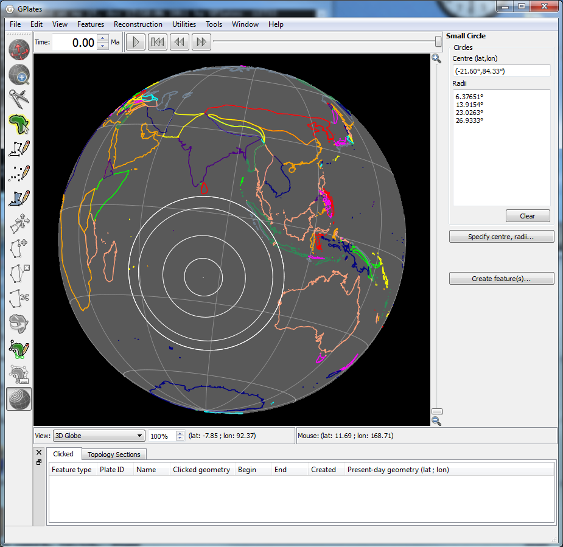
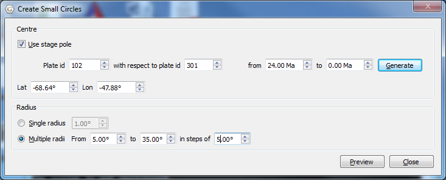

Introduction
============

Small circle feautures can be created and displayed on the globe and map. The small circles can be drawn with the mouse directly on the globe or map, or explicitly specified by the user. The centres of small circles can also can be generated from a stage-pole calculation. Small circle features can be exported and imported like regular GPML features.

Creating small circles with the mouse.
======================================

To create small circles, select the **Create Small Circles** canvas tool. This will open the Small Circle Task Panel. To draw a small circle using the mouse, left-click once to define the centre of the circle, and left-click a second time to define a point on the circumference. To draw multiple small circles sharing the same centre, click once to define the centre, and shift-left-click to define a point on each circumference. Left-click to define a point on the last circumference.

Creating small circles by specifying the centre and radius.
===========================================================

To provide the centre and angular radii of small circles, select the **Specify Centre, Radii** button. This will open the **Create Small Circle** dialog. Next choose how the centre will be determined. If you know the lat-lon of the centre already, enter them in the **Lat** and **Lon** boxes. If you want the centre to be calculated from a stage-pole calculation, select the **Use stage pole** checkbox, and provide two plate ids and two times for the stage pole. Clicking **Generate** will fill the **Lat** and **Lon** boxes with the stage pole centre.

Next choose the radius or radii of the small circle(s), and select **Preview**. You should then see small cirles on the globe, and their centre and radii in the **Small Circle Task Panel**.

Creating small cirle features
=============================

To create small circle features from the circles previewed on the globe or map, press the **Create feature(s)** button. This will take you through a Create Small Circle wizard, similar to that in the **Creating New Features** chapter.

