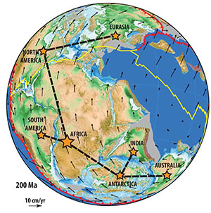
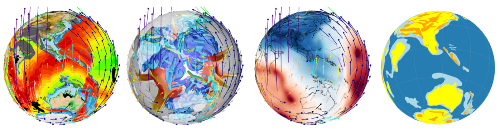
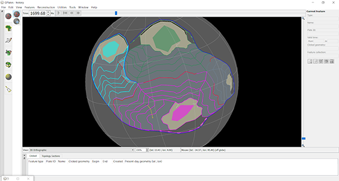

### Science Teachers’ Workshop

The unifying **Theory of Plate Tectonics** explains the evolution of Earth’s surface in episodes of continental breakup, supercontinent amalgamation and renewed continental breakup to open new oceanic basins at the expense of older oceanic gateways. The arrangement of continents is a first-order control on long-term oceanic circulation, and the ability of the hydrosphere to reduce the thermal gradient from the poles to the equator. In this exercise you will use cutting-edge tools to study the breakup of the Pangea supercontinent, and especially focus on the breakup of Australia from Antarctica. 

[Download PDF](/edu_material/STW_Geosciences_GPlates.pdf)

---

### Gondwana Reconstruction Using GPlates

The **Theory of Plate Tectonics** represents the unifying concept in Earth sciences. Modern tools have allowed us to leverage advanced computational methods, **Geographic Information Systems (GIS)**, and decades of data collection to build digital representations of Earth’s tectonic evolution. These “plate tectonic reconstructions” are used in a wide array of disciplines ranging from inputs for climate models (as arrangements of continents and ocean basins affect albedo, ocean currents, etc.), biological evolution (evolving land bridges and seaways responsible for the dispersal of plants and animals), and natural resources (tectonism as the primary mechanism for focusing ore bodies). There is an ongoing effort to unify plate motions on the surface and Earth’s convecting mantle, with an ultimate aim of creating a **“Digital Twin”** of our planet to interrogate and understand planetary processes for basic science and industry.

[Download PDF](/edu_material/GEOS1003-GPlatesPrac_Web.pdf)

[Download Data Pack](/edu_material/GEOS1003_GPlates_Prac_DataPack.zip)

---

### AN APPLE PIE FROM SCRATCH, PART V SUPPLEMENT: TECTONICS: USING GPLATES

There is a blog writen by **WORLDBUILDING PASTA**, describing how to use Gplates to turn that concept into a tangible reality. 

[Go To The Blog Page](https://worldbuildingpasta.blogspot.com/2020/06/an-apple-pie-from-scratch-part-v.html)

---