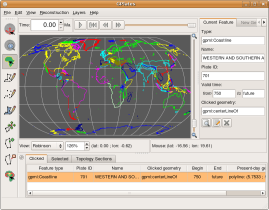

The massive GPlates 0.9.5 release in fact consists of two simultaneous software releases:

the “official” release of the GPlates “stable mainline” (like all previous 0.9.x releases), named GPlates 0.9.5
the “testing” release of the widely-anticipated extension functionality for continuously-closing plates and lithosphere velocity fields which was developed primarily at CalTech, named GPlates 0.9.5 + platepolygon-testing.
The GPlates 0.9.5 release features the following changes since 0.9.4:

GPlates can now export feature data in the Shapefile format. (This complements the existing ability to import Shapefiles into GPlates as feature data.)
Additionally, GPlates can now export “reconstructed geometries” (feature geometries at a particular reconstruction time in the past) in both the Shapefile and GMT formats.
GPlates is now able to display the Earth in a variety of map projections (in addition to the existing 3-D Orthographic Globe projection):
Rectangular
Mercator
Mollweide
Robinson
As was possible with the existing 3-D Orthographic Globe projection, each of these map-projections can be exported as a 2-D geometry snapshot (a 2-D vector-graphics image in the SVG format), for later viewing in a web-browser or vector-graphics editor.
The advanced functionality of the new Export Animation dialog enables you to harness the power of the GPlates reconstruction engine to create your own “data animations”, exporting a sequence of frames from an animation and saving it to disk in a sequence of files. Currently, the Export Animation dialog offers the following export functions:
all reconstructed feature geometries (as GMT .xy files or Shapefiles)
a 2-D vector graphics snapshot of the view (as SVG files)
all velocity fields (as GPML files)
More export functions will be added in the future.
The GPlates main window has enjoyed a minor re-design of its layout, to improve the locality of the controls: Now the reconstruction-time controls are together above the reconstruction view, and the view controls (zoom, choice of map projection, and camera and mouse positions) are together below the reconstruction view. This re-design allowed us to incorporate an integrated animation time-slider in with the time controls.
GPlates is now released as a MacOS X binary bundle in a .dmg file (in addition to the existing Windows binary installer and the Linux/UNIX and Windows source-code packages). To install GPlates on MacOS X, simply:
double-click on the .dmg file to open the disk image in Finder,
drag the GPlates binary into your Applications folder.
It's now even easier than before to manipulate geometries interactively. When you're deciding which vertex you want to move using the Move Vertex tool, each vertex will light up yellow when you pass the mouse pointer over it, and the coordinates of the vertex also light up yellow in the Task Panel. You can move vertices of existing feature geometries or vertices of partially-digitised geometries.
You can now insert vertices into the middle of an existing feature geometry, or even extend the feature geometry at either end, using the new Insert Vertex tool. If the mouse pointer is over a line-section of the geometry, the line-section will light up, and you can click the mouse button once to insert a new vertex. If the mouse pointer is past either end of the geometry, you can click once to extend the geometry from that end.
You can also delete a vertex from a geometry using the new Delete Vertex tool. The geometry which will be deleted will light up red, and the coordinates of the geometry will also light up red in the Task Panel.
GPlates offers Better handling of multi-geometries (multiple-geometries per feature): both in the loading and saving of files; and in the feature focus and canvas tools in the user-interface.
The official GPlates user-manual is now online!
The GPlates 0.9.5 + platepolygon-testing release builds upon the simultaneous GPlates 0.9.5 “stable” release, adding the following advanced extension functionality:

continuously-closing plates, utilising the new topological geometry functionality for the construction of time-varying topological plate-boundary polygons
the calculation of lithosphere velocity fields, utilising the calculation of plate-motion velocities at CitComS mesh-node locations
velocity-field arrow decorations — which are zoom-dependent, so that both the size of the arrows and the visual density of the arrows (i.e., the number of arrows drawn on the visible area of the surface of the Earth) scale automatically with zoom
the new Topology Sections table which displays, and enables tabular editing of, topologies
automated generation and export of velocity fields as GML DataBlock instances
GPlates 0.9.5 compiles and runs on Windows Vista, Windows XP, Linux and MacOS X. Qt 4.3.2 (or above) and CMake are required. Download GPlates 0.9.5 from the Download page.

GPlates-compatible data have been made available. For more information, see the Download page.