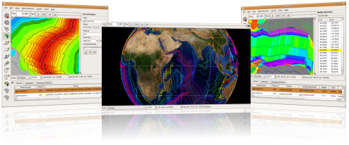

Changes since 0.9.5:

GPlates can now utilise a full screen mode, which is available by pressing F11. This mode is ideal for presenting data and animations using GPlates. It makes the user interface more minimalistic, granting a greater amount of screen space to the main view. This is especially useful on low-resolution devices such as projectors.
A new Measure Distance Tool has been implemented, allowing precise measurement of the distance between any two chosen points. It also interacts with the digitisation and feature-selecting tools, to enable easy inspection of the distances along polyline geometries and polyline segments.
Exporting the Total Reconstruction Poles table to CSV can now be done with a choice of delimiters, and more closely adheres to the CSV specifications.
The previous 0.9.6 release involved the integration of the plate polygon closure workflow into the main stable branch of GPlates. With 0.9.7.1, additional work has gone into improving the user experience and making the topology algorithms more intelligent, and enables the export of geometry sub-segments involved in topologies.
GPlates 0.9.7.1 compiles and runs on Windows Vista, Windows XP, Linux and MacOS X. Qt 4.3.2 (or above) and CMake are required. Download GPlates 0.9.7.1 from the Download page.

GPlates-compatible data have been made available. For more information, see the Download page.