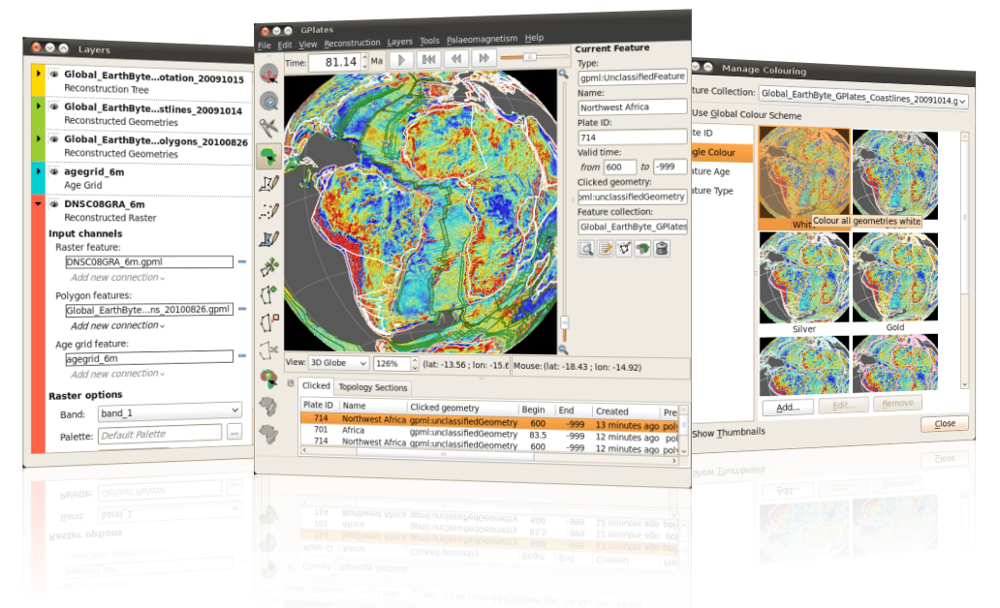

This release is a preview of raster reconstructions and layers. We have implemented raster reconstructions to take advantage of the majority of graphics systems so please let us know if you are having difficulty on your system.

If you want to reconstruct a raster, and try out the new layers system, the sample data in this release contains the following files to demonstrate this:

present-day plate polygons (in SampleData/FeatureCollections/StaticPolygons/) - Global_Earthbyte_GPlates_PresentDay_PlatePolygons_20100826.gpml,
a rotation file (in SampleData/FeatureCollections/Rotations/) - Global_Earthbyte_GPlates_Rotation_20091015.rot,
a global marine gravity raster (in SampleData/Rasters/) - DNSC08GRA_6m.gpml,
an ocean-floor age grid (in SampleData/Rasters/) - agegrid_6m.gpml.
To reconstruct the above gravity raster load all the above files into GPlates using "Open Feature Collection" from the "File" menu. And then connect the present-day plate polygons to the "Polygon features" input channel of the gravity raster. The gravity raster should now reconstruct.

For a high-detail reconstruction you can also connect the age grid raster to the "Age grid feature" input channel of the gravity raster.

With the release of GPlates 0.9.10, we have prepared a video presentation introducing all the new features which are now available:-

A completely new Raster Import workflow
Cookie-cutting of rasters with polygons
The new Layers dialog
Age grid support
NetCDF grid support
Half-stage rotation reconstruction method
Snap nearby vertices tool
GPlates 0.9.10 compiles and runs on Windows Vista, Windows XP, Linux and MacOS X. Qt 4.4.0 (or above) and CMake 2.6 are required. Download GPlates 0.9.10 from the Download page.

GPlates-compatible data have been made available. For more information, see the Download page.

