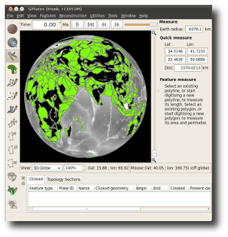

What's new in version 1.1:-

The Recent Session menu can now restore the layer connections you were using.
Can display filled polygons for dynamic and static polygons (per-layer).
Added new OGRGMT file format ('.gmt') compatible with OGR library and ogr2ogr tool.
Improvements to topology build/edit tools including:
Ability to add sections to interior and boundary of topological networks.
Options to visualise triangulations associated with each network.
Velocity layers now calculate velocities inside static polygons (in addition to topological plate polygons).
Velocity layers can now calculate velocities at the vertices of polyline/polygon geometries.
Can now load and display higher resolution rasters, including up to 0.3 minute resolution global rasters for the JPEG format.
GPlates fitted with a novel cube 'loose' quad tree spatial partition, supporting region-of-interest queries, fast insertion of reconstructed geometries, hierarchical visibility culling.
Improved layers user interface including:
A button (in top-right of Layers dialog) to open the Colouring dialog.
Layers grouped by layer type.
A 'tick' icon for 'Reconstruction Tree' layers to toggle default layer.
Can prevent the default 'Reconstruction Tree' layer from changing when opening a new rotation file.
Improved file load/unload performance when many compute-heavy files already loaded - for example, dense velocity mesh cap files.
Improved export dialog general user interface.
New export options to control granularity of exports.
New OGRGMT exports for reconstructed geometries, flowlines and motion paths.
Export resolved topologies to Shapefile format.
Improved rendering performance for flowlines.
... Plus a lot of other behind-the-scenes work to prepare for exciting future functionality.
GPlates 1.1 compiles and runs on Windows 7/Vista/XP, Linux and MacOS X. Download GPlates 1.1 from the Download page.

GPlates-compatible data have been made available. For more information, see the Download page.
