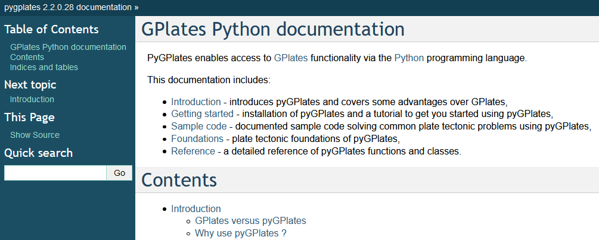

This pyGPlates beta release adds support for __Python 3__ (in addition to Python 2.7).

What's new in pyGPlates revision 28:-

* Pre-built pyGPlates libraries for Windows and macOS supporting:
  * Python 2.7
  * Python 3.5
  * Python 3.6
  * Python 3.7
  * Python 3.8
* macOS libraries signed and notarized by Apple:
  * Should no longer get security prompts (including macOS Catalina).
*  Ubuntu packages for 16.04 LTS (Xenial), 18.04 LTS (Bionic), 19.10 (Eoan) and 20.04 LTS (Focal).
  * Python 2 and 3 (32-bit and 64-bit), except Focal (Python 3 64-bit only).
* Create topological features (dynamic lines, polygons and deforming networks):
  * Usually they are built in GPlates, but this can now be done in pyGPlates.
  * See the [sample code](/docs/pygplates/sample-code/pygplates_create_topological_features.html).
* Supports deforming trenches when used with [subduction convergence script](https://github.com/EarthByte/PlateTectonicTools/blob/master/ptt/subduction_convergence.py).
* Much faster [querying of reconstructions](/docs/pygplates/generated/pygplates.RotationModel.html#pygplates.RotationModel.get_rotation).
* Bug fixes.

Download this release from the [Download](/download) page.

The pyGPlates documentation and tutorials are available on the [User Documentation](/docs) page and includes:

* an introduction to pyGPlates,
* an installation guide,
* a 'Getting Started' tutorial,
* documented sample code,
* foundations of pyGPlates, and
* a detailed reference of pyGPlates functions and classes.

The pyGPlates tutorials are Jupyter Notebooks that analyse and visualise real-world data using pyGPlates. These tutorials complement the sample code in the pyGPlates documentation by providing a more research-oriented focus.

PyGPlates enables access to GPlates functionality via the [Python](https://www.python.org/) programming language. This may be of particular use to researchers requiring more flexibility than is provided by the GPlates user interface.

PyGPlates compiles and runs on Windows 10, macOS 10.13+ and Linux.
