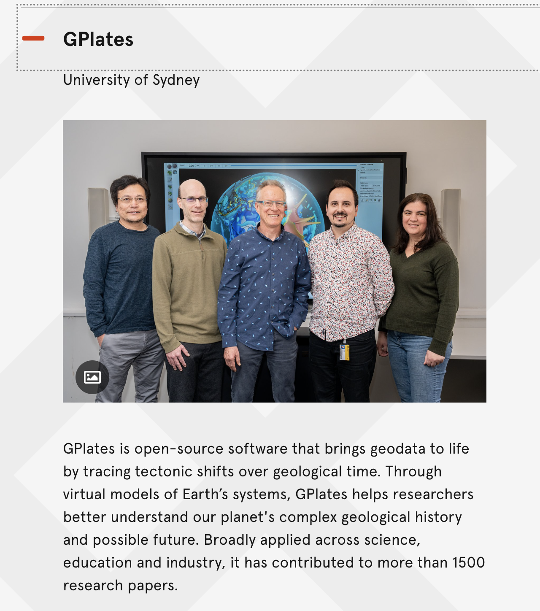
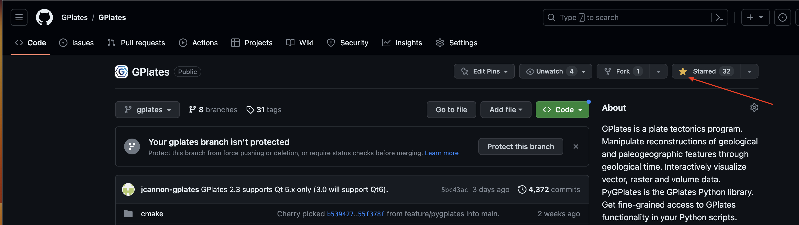

GPlates has been shortlisted for one of the 18 Australian Museum Eureka Prizes in 2023 – the Australian Research Data Commons Eureka Prize for Excellence in Research Software thanks to over 15 years of support by the AuScope National Collaborative Research Infrastructure Strategy.

### New Home for the GPlates Source Code

After keeping GPlates source code on SVN and SourceForge for nearly two decades, we are thrilled to unveil the new home for the GPlates source code at https://github.com/GPlates/GPlates. Although GPlates is a well-established project, it is new to GitHub.com, and as such, the current count of GitHub Stars doesn’t accurately mirror our true success and popularity. If you have found GPlates useful and valuable, we kindly invite you to demonstrate your support by giving us a Star at https://github.com/GPlates/GPlates. Your acknowledgment would mean a lot to us. Thank you.

