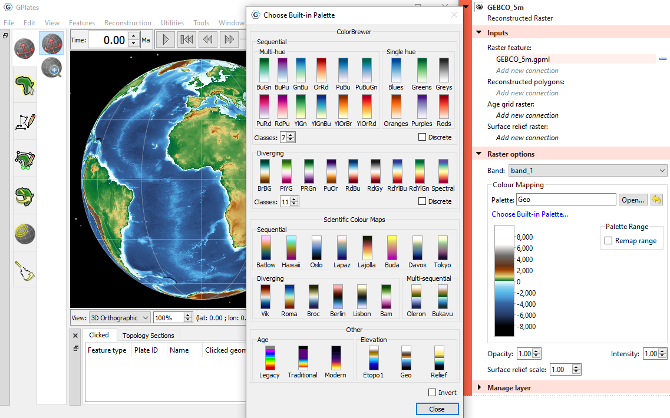

#### A note about GPlates 2.4:-

This release contains mostly bug fixes (compared to GPlates 2.3). We've also added some [Scientific Colour Maps by Fabio Crameri](https://www.fabiocrameri.ch/colourmaps/) to our builtin colour palettes.

However, most new functionality is still in development and will go into the __GPlates 3.0__ release (late 2024). This is because it depends on the graphics engine upgrade currently in progress (that enables the use of relatively modern hardware in last ten years on _all_ desktop platforms with the replacement of OpenGL with Vulkan). Dependent functionality includes generalized symbology (point symbols, line patterns, fill patterns; _eg, subduction teeth_), time-dependent 3D volumes, view tilt (in 3D globe and 2D map views) and a new 3D _perspective_ view (to complement the existing 3D _orthograhic_ view).

#### Download GPlates 2.4:-

Download GPlates 2.4 and compatible geodata from the [Download](/download) page.

#### What's new in GPlates 2.4:-

* Builtin colour palettes:
    * Added Scientific Colour Maps by Fabio Crameri.
    * Added Elevation palettes.
    * Can now invert all palettes (not just ColorBrewer).
* Bug fixes include:
    * Fixed `Net Rotation` export when using a __non-zero__ anchor plate ID.
        * Previously always used __zero__ anchor plate ID (inside _non-deforming_ topologies).
    * Fixed Shapefile geometries with Z (eg, elevation) or Measure (M) values not loading.
        * See this [forum post](https://discourse.gplates.org/t/import-shp-from-mapinfo-unsupported-geometry-type/387/1).
    * Fixed shortened map background/grid for __non-zero__ central meridians.
        * See this [forum post](https://discourse.gplates.org/t/geometries-hanging-off-edge-of-map/721).
    * Fixed missing pole sequences in `Modify Reconstruction Pole` tool.
        * Happened after using `Kinematics Tool` with a time range exceeding 512 time steps.
        * See this [forum post](https://discourse.gplates.org/t/unable-to-adjust-plates-in-gplates-2-3-0/706/10).
    * Fixed rare crash when modifying rotation with `Modify Reconstruction Pole` tool.
    * Added tooltip showing _full path_ of a missing filename when loading project/session.
    * Emit warning (instead of error) when reading Shapefile feature with no geometry.
        * See this [forum post](https://discourse.gplates.org/t/shapefile-problems/680).
    * Fixed "*Failed to install message handler...*" startup error message on Windows.
        * See this [forum post](https://discourse.gplates.org/t/help-me-plz-i-just-downloaded-gplates/722).
    * Compile fixes for latest gcc compiler (12/13) and Boost libraries (1.8x).
        * See this [forum post](https://discourse.gplates.org/t/compilation-error-with-boost-1-77/452).
    * Build improvements for latest GDAL, PROJ, Python and Qwt libraries:
        * Copies GDAL plugins (like NetCDF) into package (for recent GDAL versions).
        * Codesigns all macOS shared libraries when installing Python standard library.

See the full changelog [here](https://github.com/GPlates/GPlates/compare/GPlates-2.3...GPlates-2.4).
