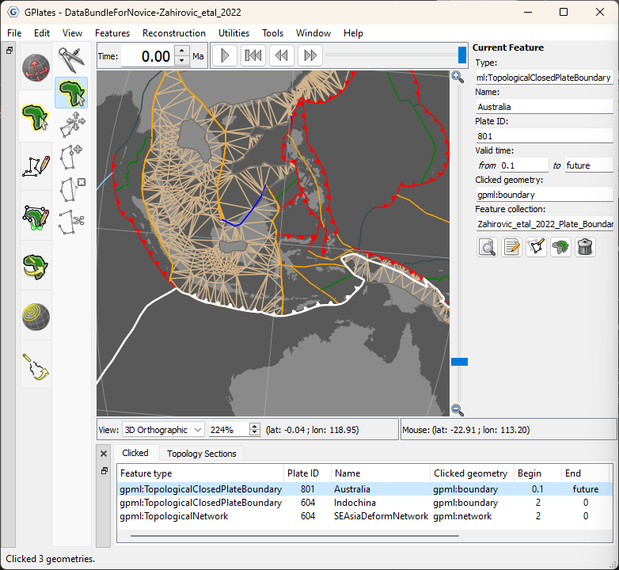

#### Download GPlates 2.5:-

Download GPlates 2.5 and compatible geodata from the [Download](/download) page.

#### What's new in GPlates 2.5:-

This release finally has subduction zone teeth!

* Subduction zone teeth pointing to overriding plates in the 3D globe and 2D map views.
* Topological boundaries coloured by individual boundary line segments.
    * Instead of each boundary polygon having its own colour.
    * Eg, subduction zones coloured differently than mid-ocean ridges.
* Topology line width multiplier (under “Tools > Configure Geometry Rendering”).
    * So topologies can be thicker than non-topologies.
* Keyboard shortcuts for show/hide geometry types (see “View > Geometry Visibility”).

See the full changelog [here](https://github.com/GPlates/GPlates/compare/GPlates-2.4...GPlates-2.5).
