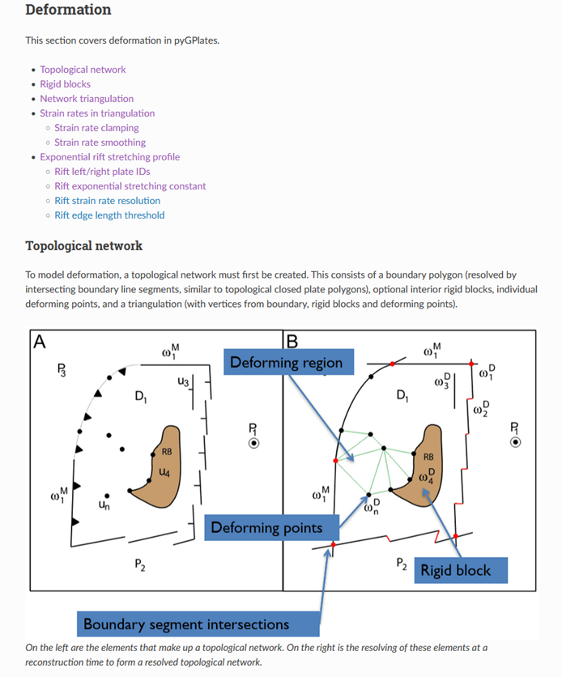

PyGPlates enables access to GPlates functionality via the [Python](https://www.python.org/) programming language.

#### Install PyGPlates 1.0.0:-

PyGPlates can now be installed using [conda](https://docs.conda.io/projects/conda/en/latest/user-guide/index.html) or [pip](https://pip.pypa.io/en/stable/).

Please see the [installation instructions](/docs/pygplates/pygplates_getting_started.html) in the pyGPlates documentation.

> __Note:__ The old method of installing a pre-compiled binary package is no longer available. This involved extracting a zip file (or installing a Debian package) and then manually adding the installed location to the `PYTHONPATH` environment variable.

#### What's new in PyGPlates 1.0.0:-

- Can now install pyGPlates using [conda](https://docs.conda.io/projects/conda/en/latest/user-guide/index.html):
  - PyGPlates [conda-forge packages](https://anaconda.org/conda-forge/pygplates/files) can be installed with:  
    `conda install -c conda-forge pygplates`
- Can now install pyGPlates using [pip](https://pip.pypa.io/en/stable/):
  - PyGPlates [pip wheels](https://pypi.org/project/pygplates/#files) can be installed with:  
    `pip install pygplates`
- Added a new [Primer](/docs/pygplates/pygplates_primer.html) chapter in the pyGPlates documentation:
  - Currently documents how to use [topologies](/docs/pygplates/pygplates_primer.html#topologies) and [deformation](/docs/pygplates/pygplates_primer.html#deformation).
    - Still a work in progress.
  - Purpose is to show users how to use pyGPlates.
    - Aim to comprehensively cover functionality in pyGPlates.
    - Complements the sample codes.
- Added [pickle](https://docs.python.org/3/library/pickle.html) support:
  - This means pyGPlates can now be used in multi-processing workflows,
    - where a multi-processing module will serialise pyGPlates objects into queues, and
    - de-serialise back into pyGPlates objects for processing on a different CPUs/nodes.
  - Most pyGPlates classes can be pickled.
    - This includes feature collections, features, and feature properties.
    - However, any classes containing reconstructed geometries cannot be pickled.
    - Each class will document whether it can be pickled or not.
- Filenames in pyGPlates can be [os.PathLike](https://docs.python.org/3/library/os.html#os.PathLike) in addition to strings:
  - Such as [pathlib.Path](https://docs.python.org/3/library/pathlib.html).
- Added [ReconstructModel](/docs/pygplates/generated/pygplates.ReconstructModel) and [ReconstructSnapshot](/docs/pygplates/generated/pygplates.ReconstructSnapshot) classes:
  - Similar to `TopologicalModel` and `TopologicalSnapshot`,
    - but for regular reconstruction instead of resolving topologies.
  - Better than using the [reconstruct()](/docs/pygplates/generated/pygplates.reconstruct) function.
    - Just like `TopologicalModel` and `TopologicalSnapshot` are better than using the `resolve_topologies()` function.
- Added net rotation:
  - Create a [NetRotationModel](/docs/pygplates/generated/pygplates.NetRotationModel) from a [TopologicalModel](/docs/pygplates/generated/pygplates.TopologicalModel).
    - And optionally specify your own point distribution (defaults to uniform lat-lon grid of points).
  - Use [NetRotationModel](/docs/pygplates/generated/pygplates.NetRotationModel) to generate a [NetRotationSnapshot](/docs/pygplates/generated/pygplates.NetRotationSnapshot) at a reconstruction time.
  - Use [NetRotationSnapshot](/docs/pygplates/generated/pygplates.NetRotationSnapshot) to calculate a [NetRotation](/docs/pygplates/generated/pygplates.NetRotation).
    - This can be:
      - the total net rotation (over all topologies), or
      - the net rotation of a specific topology.
    - See the [sample code](/docs/pygplates/sample-code/pygplates_calculate_net_rotation.html).
  - Manually accumulate your own net rotation from points and their finite rotations.
- Can generate [statistics along plate boundaries](/docs/pygplates/pygplates_primer.html#plate-boundary-statistics) (at uniformly spaced points):
  - `TopologicalSnapshot.`[calculate_plate_boundary_statistics()](/docs/pygplates/generated/pygplates.TopologicalSnapshot#pygplates.TopologicalSnapshot.calculate_plate_boundary_statistics) returns a [PlateBoundaryStatistic](/docs/pygplates/generated/pygplates.PlateBoundaryStatistic) at *each* point that contains:
    - boundary normal/length/velocity,
    - convergence velocity/obliquity/etc,
    - left/right plate velocity/etc (including strain rate), and
    - distances to start/end of plate boundary section (eg, trench).
  - See the [sample code](/docs/pygplates/sample-code/pygplates_find_divergence_at_subduction_zones_and_convergence_at_ridges.html).
- Improved velocities and deformation:
  - Added [Strain](/docs/pygplates/generated/pygplates.Strain) and [StrainRate](/docs/pygplates/generated/pygplates.StrainRate) classes.
    - Can query *strain* quantities like dilatation and principal strain.
    - Can query *strain rate* quantities like dilatation rate and total strain rate.
    - And documented the underlying deformation theory.
  - Can [query the deforming triangulation](/docs/pygplates/pygplates_primer.html#network-triangulation) of a resolved network topology.
    - And [rigid interior blocks](/docs/pygplates/pygplates_primer.html#rigid-blocks).
  - Added `Feature.create_topological_network_feature()`:
    - Enables [rift network parameters](/docs/pygplates/pygplates_primer.html#exponential-rift-stretching-profile) to be specified.
  - Can query a `TopologicalSnapshot` at *static points* to:
    - Find intersected [plates/networks](/docs/pygplates/generated/pygplates.TopologicalSnapshot.html#pygplates.TopologicalSnapshot.get_point_locations), [velocities](/docs/pygplates/generated/pygplates.TopologicalSnapshot.html#pygplates.TopologicalSnapshot.get_point_velocities) and [strain rates](/docs/pygplates/generated/pygplates.TopologicalSnapshot.html#pygplates.TopologicalSnapshot.get_point_strain_rates).
  - Can query a `ReconstructSnapshot` at *static points* to:
    - Find intersected [static polygons](/docs/pygplates/generated/pygplates.ReconstructSnapshot.html#pygplates.ReconstructSnapshot.get_point_locations) and [velocities](/docs/pygplates/generated/pygplates.ReconstructSnapshot.html#pygplates.ReconstructSnapshot.get_point_velocities).
  - Improved [topologically reconstructed points](/docs/pygplates/pygplates_primer.html#topologically-reconstruct-geometries):
    - Can *directly* extract crustal thickness, stretching factor, thinning factor and tectonic subsidence.
    - Can calculate velocities.
    - Can query strain rate and strain.
    - See the [sample code](/docs/pygplates/sample-code/pygplates_reconstruct_strain_and_strain_rate.html).
  - Can incrementally reconstruct a point [using a deforming network](/docs/pygplates/generated/pygplates.ResolvedTopologicalNetwork.html#pygplates.ResolvedTopologicalNetwork.reconstruct_point) (or [using a rigid plate](/docs/pygplates/generated/pygplates.ResolvedTopologicalBoundary.html#pygplates.ResolvedTopologicalBoundary.reconstruct_point)):
    - Same functionality as `TopologicalModel.reconstruct_geometry()` but at a finer granularity:
      - *One* network (or plate) topology reconstructs *one* point over *one* time step, rather than
      - *multiple* topologies (eg, a global model) reconstructing *multiple* points over *multiple* time steps.
    - Gives user more control over the reconstruction.
  - All reconstructed/resolved geometries can calculate *velocities* at their vertices:
    - Reconstructed geometries:
      - `ReconstructedFeatureGeometry`, `ReconstructedMotionPath`, `ReconstructedFlowline`.
      - Eg, `ReconstructedFeatureGeometry.`[get_reconstructed_geometry_point_velocities()](/docs/pygplates/generated/pygplates.ReconstructedFeatureGeometry.html#pygplates.ReconstructedFeatureGeometry.get_reconstructed_geometry_point_velocities).
    - Resolved topologies:
      - `ResolvedTopologicalLine`, `ResolvedTopologicalBoundary`, `ResolvedTopologicalNetwork`
      - Eg, `ResolvedTopologicalLine.`[get_resolved_geometry_point_velocities()](/docs/pygplates/generated/pygplates.ResolvedTopologicalLine.html#pygplates.ResolvedTopologicalLine.get_resolved_geometry_point_velocities).
      - And their sub-segments:
        - `ResolvedTopologicalSharedSubSegment`, `ResolvedTopologicalSubSegment`.
        - Eg, `ResolvedTopologicalSharedSubSegment.`[get_resolved_geometry_point_velocities()](/docs/pygplates/generated/pygplates.ResolvedTopologicalSharedSubSegment.html#pygplates.ResolvedTopologicalSharedSubSegment.get_resolved_geometry_point_velocities).
  - Fixed [quering overriding/subducting plates/networks](/docs/pygplates/generated/pygplates.ResolvedTopologicalSharedSubSegment.html#pygplates.ResolvedTopologicalSharedSubSegment.get_overriding_and_subducting_plates) (at shared boundary segments):

#### Documentation:-

Documentation and tutorials are available on the [User Documentation](/docs) page.

The [pyGPlates Documentation](/docs/pygplates/index.html) includes:

* an [Introduction](/docs/pygplates/pygplates_introduction.html) to pyGPlates,
* a [Getting Started](/docs/pygplates/pygplates_getting_started.html) chapter with an installation guide and a tutorial,
* a [Primer](/docs/pygplates/pygplates_primer.html) chapter covering the main areas of pyGPlates,
* documented [Examples](/docs/pygplates/pygplates_sample_code.html), and
* a detailed [Reference](/docs/pygplates/pygplates_reference.html) of pyGPlates functions and classes.

> __Note:__ The `Primer` chapter is new and is a work in progress.

The [pyGPlates Tutorials](https://github.com/GPlates/pygplates-tutorials) are Jupyter Notebooks that analyse and visualise real-world data using pyGPlates. These tutorials complement the sample code in the pyGPlates documentation by providing a more research-oriented focus.
