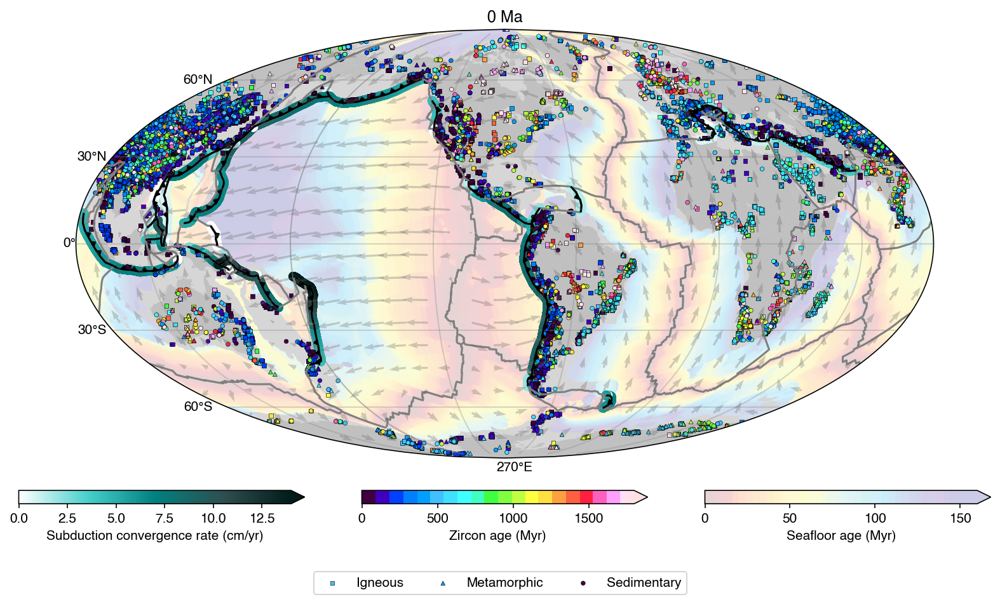

We are excited to announce the release of **[GPlately 2.0.0](https://github.com/GPlates/gplately/releases/tag/v2.0.0)**, a major update that brings significant improvements and new features, offering a significantly better programming experience and marking a major step forward in the evolution of the platform.

This release introduces a completely redesigned [online documentation](https://gplates.github.io/gplately/v2.0.0/sphinx/html/index.html), providing users with a much more intuitive and enjoyable reading experience. The newly integrated [Plate Model Manager](https://pypi.org/project/plate-model-manager/) makes it easier to access and manage model data. A revamped [logging framework](https://docs.python.org/3/library/logging.html) improves the interactivity, offering a smoother user experience. The early-stage integration of [PyGMT](https://www.pygmt.org/latest/) lays the groundwork for enhanced geospatial visualization capabilities.

We’ve also introduced a new [command-line interface](https://gplates.github.io/gplately/v2.0.0/sphinx/html/command_line_interface.html) (CLI), improving usability and enabling more streamlined workflows for users who prefer working in the terminal.

To help users get started more quickly, we’ve added a number of [new examples](https://gplates.github.io/gplately/v2.0.0/sphinx/html/examples.html) that demonstrate core functionality. Additionally, GPlately is now available as a [Docker image](https://hub.docker.com/r/gplates/gplately/tags), making the software more accessible and easier to deploy across different environments.

This release also includes a variety of bug fixes and performance enhancements that improve the overall stability and responsiveness of the system.
