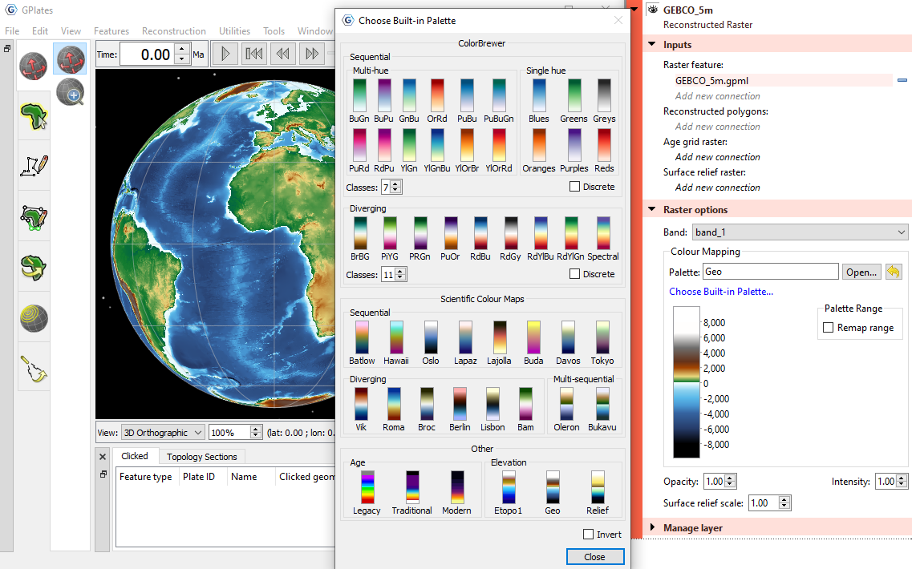

A variety of built-in colour palettes based on ColorBrewer and Scientific Colour Maps by Fabio Crameri. And a few palettes for age grids and elevation data. Also the colour palette range can be remapped to your own range.
