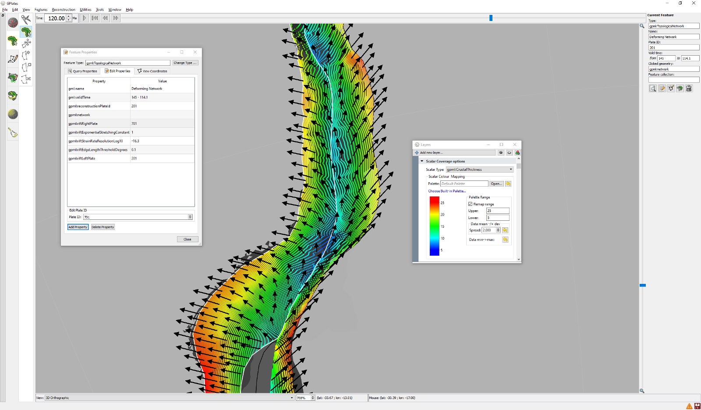

Exponential stretching between Africa and South America 120 million years ago. Black arrows indicate direction of motion and colours show crustal thickness. With exponential stretching the crust is thinner near the rifting centre. Without exponential stretching there would be constant stretching across the rift profile and crustal thinning would be uniform.
