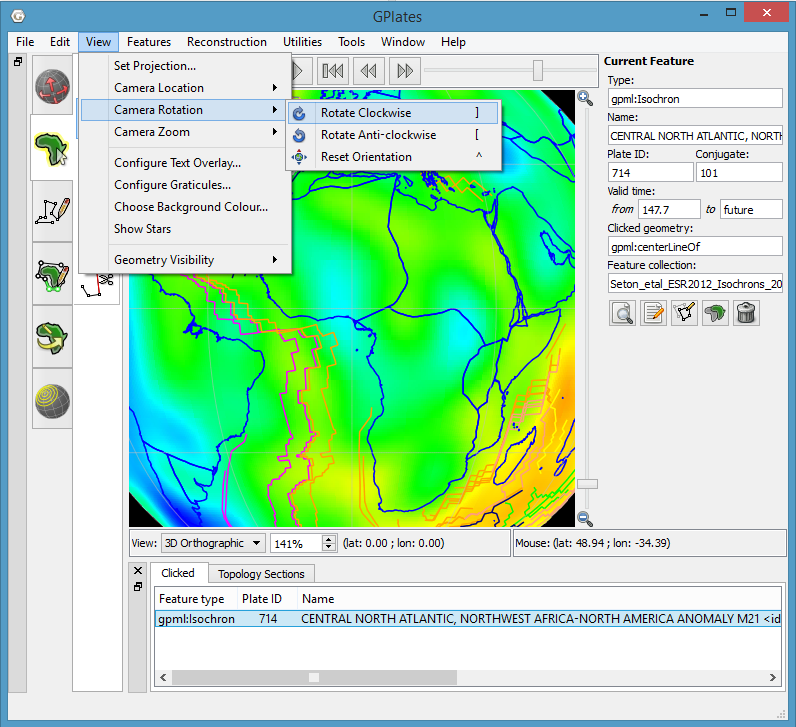
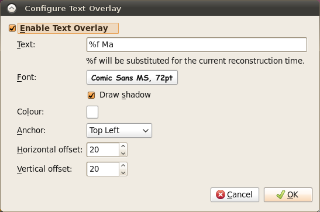
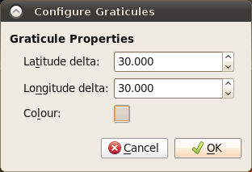
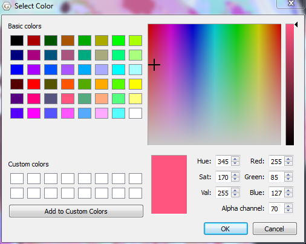
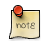
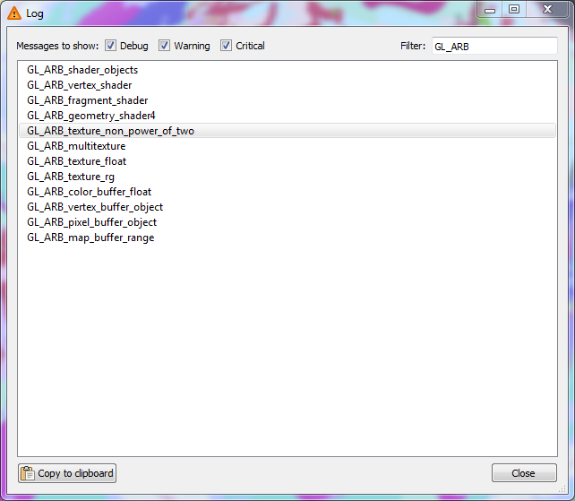
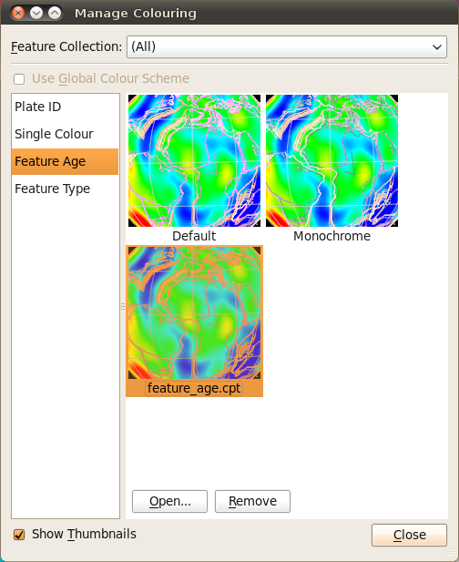

This chapter provides an overview of how to manipulate the view of the globe, and any displayed data or features.

1 Reconstruction View
===================

The **Reconstruction View** is the region of the GPlates interface which deals with plate reconstructions back through time and is displayed below.

<table>
   <colgroup>
      <col style="width: 29%" />
      <col style="width: 70%" />
   </colgroup>
   <thead>
      <tr class="header">
         <th style="text-align: left;">Name</th>
         <th style="text-align: left;">Description</th>
      </tr>
   </thead>
   <tbody>
      <tr class="odd">
         <td style="text-align: left;">Time Controls</td>
         <td style="text-align: left;">A collection of user-interface controls for precise control of the reconstruction time and animations.</td>
      </tr>
      <tr class="even">
         <td style="text-align: left;">Zoom Slider</td>
         <td style="text-align: left;">A mouse-controlled slider which controls the zoom level of the Globe View camera.</td>
      </tr>
      <tr class="odd">
         <td style="text-align: left;">View Controls</td>
         <td style="text-align: left;">A drop-down control for selecting the projection to be used for the view, and a precise percentage control for the camera zoom level</td>
      </tr>
      <tr class="even">
         <td style="text-align: left;">Camera Coordinate</td>
         <td style="text-align: left;">An information field which indicates the current globe position of the Globe View camera</td>
      </tr>
      <tr class="odd">
         <td style="text-align: left;">Mouse Coordinate</td>
         <td style="text-align: left;">An information field which indicates the current globe position of the mouse cursor</td>
      </tr>
   </tbody>
</table>

2 Tool Palette
============

The first two tools in the **Tool Palette** control your view of the GPlates globe or map. The **Tool Palette** includes camera positioning tools, feature selection tools and drawing tools. A tool is activated by clicking on it; only one tool can be active at any time. The **Current Feature Panel** will change to reflect the current tool that is activated.

<table>
   <colgroup>
      <col style="width: 11%" />
      <col style="width: 22%" />
      <col style="width: 11%" />
      <col style="width: 55%" />
   </colgroup>
   <tbody>
      <tr class="odd">
         <td>
            
Icon

         </td>
         <td>
            
Tool

         </td>
         <td>
            
Shortcut

         </td>
         <td>
            
Operation

         </td>
      </tr>
      <tr class="even">
         <td>
            

         </td>
         <td>
            
Drag Globe

         </td>
         <td>
            
D

         </td>
         <td>
            
Drag to re-orient the globe. <code>Shift+drag</code> to rotate the globe

         </td>
      </tr>
      <tr class="odd">
         <td>
            

         </td>
         <td>
            
Zoom In

         </td>
         <td>
            
Z

         </td>
         <td>
            
Click to zoom in. <code>Shift+click</code> to zoom out. <code>Ctrl+drag</code> to re-orient the globe

         </td>
      </tr>
   </tbody>
</table>

3 View Menu
=========

The **View Menu** enables the user to manipulate the globe, and includes the following options:

**Set Projection.**

Clicking this menu item will open a dialog allowing you to select what projection GPlates should use to display data. A shortcut for this functionality can be found on the bottom of the **Reconstruction View**.

**Camera Location / Rotation / Zoom.**

These menu items permit control of the camera position in order to view the globe.

3.1 Configure Text Overlay
----------------------

GPlates can display the current reconstruction time within the globe area. Selecting this menu item opens the **Configure Text Overlay** dialog.

You can choose what text should be displayed, using `%f` as a placeholder for the reconstruction time. The text can be displayed in any of the four corners of the view.

3.2 Configure Graticules
--------------------

With this menu item, the graticule spacing can be configured to use a different grid spacing than the default 30 degrees. The colour can also be changed if better contrast with a background raster is needed.

3.3 Choose Background Colour
------------------------

This option can be used to select the background colour of the globe (or map in the map view).

<table class ="note">
   <tbody>
      <tr>
         <td class="icon">
            
         </td>
         <td class="content" >If the value entered in the `Alpha channel` option is less than 255 then the globe will be semi-transparent and you will be able to see the rear of the globe (and geometries/rasters on the rear) through the front of the globe.</td>
      </tr>
   </tbody>
</table>

3.4 Geometry Visibility
-------------------

Selecting "Show Point/Line/Polygon/Multipoint Geometries" will prevent feature geometries of those types from being drawn on the globe.

Selecting "Show Arrow Decorations", when a Velocity layer is active, can be used to control the display of the velocity arrows.

4 Window Menu
===========

The **Window Menu** enables the user to control the windows GPlates opens to display aspects of your data, and includes the following options:

**Open New Window.**

Creates a new instance of GPlates. Currently each instance created this way is completely separate with its own main window and dialogs. Any program state such as files loaded prior to selecting **New Window** is not transferred across to the new instance. This feature is useful mainly for Mac OS X where it is not possible to run multiple instances of the same application from the *Finder*.

**Show Layers.**

This option shows and hides the Layers window.

**Show Bottom Panel.**

This option allows you to show or hide the **Clicked Feature** and **Topology Sections** tables.

**Log.**

This option opens a dialog that:

-   Displays low-level debug, warning and error messages in a dialog window.

-   Supports filtering of log messages with a text string entered by the user.

-   Supports copy and pasting log messages in order to, for example, email bug reports to the GPlates developers.

-   Removes duplicate messages - shows message once along with a count of the number of identical messages.

**Full Screen.**

Makes the GPlates **Main Window** fill the entire screen, and hides most of the user interface elements such as the **Tool Palette** and **Task Panel**. A shortcut for this mode is the `F11` key. This mode is ideal for doing presentations.

Tools can still be accessed via their keyboard shortcuts. While in full screen mode, a new GPlates logo button will appear in the top left hand corner. If you need to access the **Main Menu**, click this button.

To leave **Full Screen** mode, you can:

-   Press `F11` again.

-   Press `Esc`.

-   Click the **Leave Full Screen** button in the top right corner.

5 Manage Colouring
================

Currently, by default the geometry colouring is controlled by Python plugin. Go to **Chapter 19: Python** and read paragraph **3.1. Draw Style plugins** for details.

<table class ="warning">
   <tbody>
      <tr>
         <td class="icon">
            
         </td>
         <td class="content" >The following content of this paragraph is deprecated. It is only valid when you start GPlates with "--no-python" command line option. If you have no idea about the "--no-python" option, it is very likely that you should skip this paragraph and go to Chapter 19.</td>
      </tr>
   </tbody>
</table>

The **Manage Colouring** operation, found on the new **Features** menu, opens the **Manage Colouring** dialog. It allows the user to customise how feature geometries are coloured.

To change the default colouring method for all feature collections, select **(All)** from the drop-down box at the top, then choose from one of the four major categories:

1.  Colour by plate ID

2.  Colouring all features with a single user-specified colour.

3.  Colour by feature age (the time of the feature’s creation relative to the current view time)

4.  Colour by feature type

Once you have done that, a number of different options will be available in the right-hand pane. Some of these support the inclusion of user-specified Colour Palette Files (`.CPT`). A few sample `CPT` files are included with the sample data.

For further customisation, you can choose to override these default colouring schemes for individual feature collections. Select the feature collection from the drop-down box, then uncheck **Use Global Colour Scheme**. You can now select a colouring scheme to be used for geometry originating from that feature collection.

