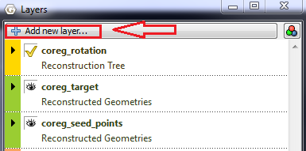
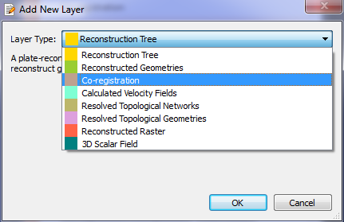
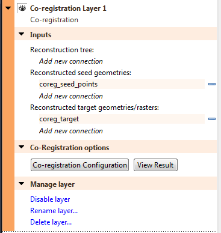
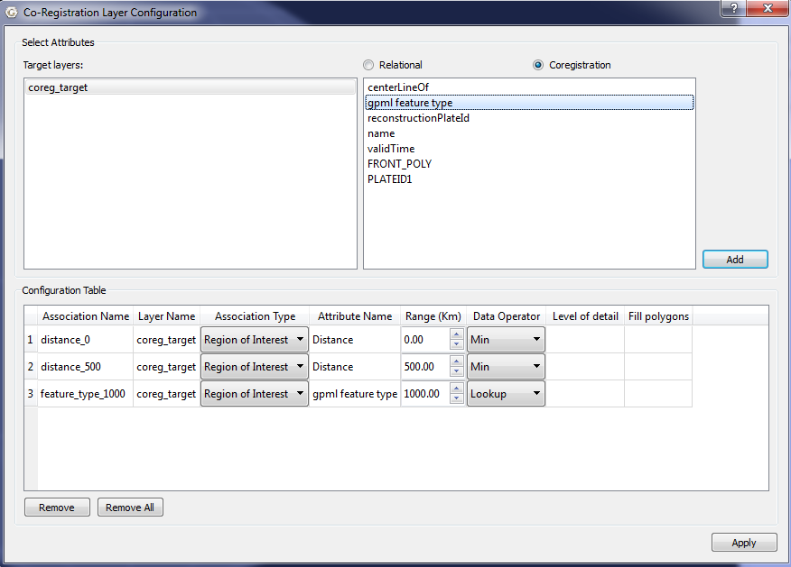
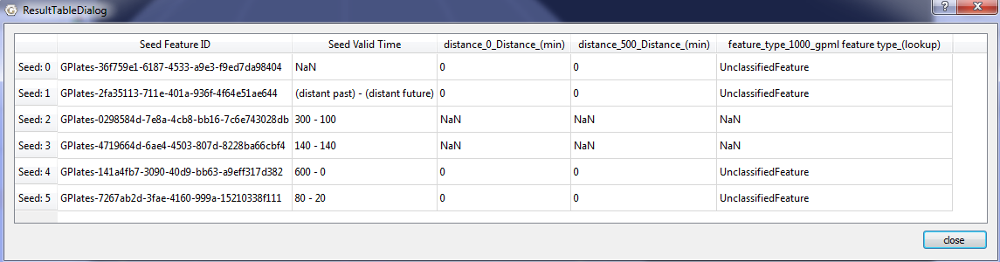
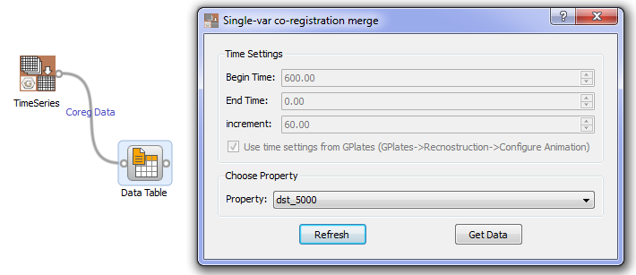
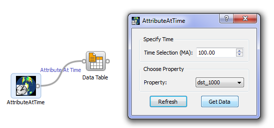
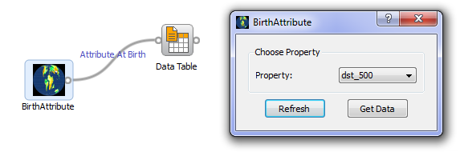
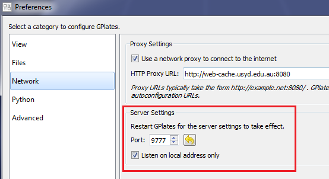

Introduction
============

The GPlates' co-registration layer allows users to combine two time-dependent datasets based on a set of user-defined associations. Then the generated data from the combined datasets can be used as input of Orange widgets which are created to analyze and visualize data.

Co-registration Layer
=====================

Open Co-registration Layer
--------------------------

In "Layers" widget, click "Add new layer…" button. The "Add New Layer" dialog will pop up. Click the "Layer Type" combobox and select "Co-registration" to add a new co-registration layer.

Configurate Co-registration Layer
---------------------------------

In "Layers" widget, expand co-registraion layer and add appropriate connections.

Click the "Co-registration Configuration" button to bring up "Co-registration Configuration" dialog.

Result Table
------------

Click the "View Result" to bring up the "Result Table" dialog.

Orange(biolab) Widgets
======================

-   TimeSeries

The TimeSeries widget gets raw co-registration data from GPlates. It then filters and integrates the data into a table according to the given time and property configurations.

-   BirthTime

The BirthTime widget gets the "begin time" of each seed from GPlates.

-   AttributeAtTime

The AttributeAtTime widget gets co-registration data at given time.

-   BirthAttribute

The BirthAttribute widget gets co-registration data at the birth time of each seed.

Network Interface
=================

The co-registration layer data can be accessed through a network interface. When GPlates starts up, an internal tcp/ip server is initialized. Users can configurate the server setting in "Preference" dialog.

gplates.py
----------

The gplates.py module is a wrapper around the network interfaces. Users can retrieve data from GPlates by calling Python methods defined in gplates.py. The class CoregistrationLayer is a delegate of coregistration layer in GPlates.

-   get\_coreg\_seeds(self)

Return the feature ids of seeds as a list.

-   get\_begin\_time(self, feature\_id)

Given the feature id, return the begin time of the seed.

-   get\_coreg\_associations(self)

Return users defined associations as a list.

-   get\_time\_setting(self)

Return the time setting in GPlates as a tuple.

-   get\_coreg\_data(self, time)

Given a time, return coregistration data as a table.

