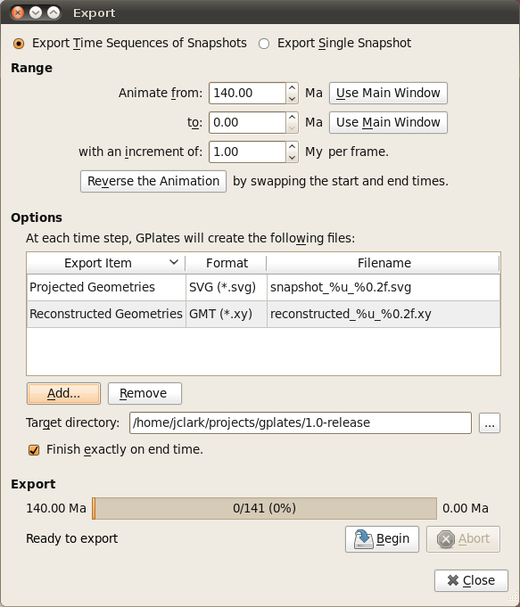
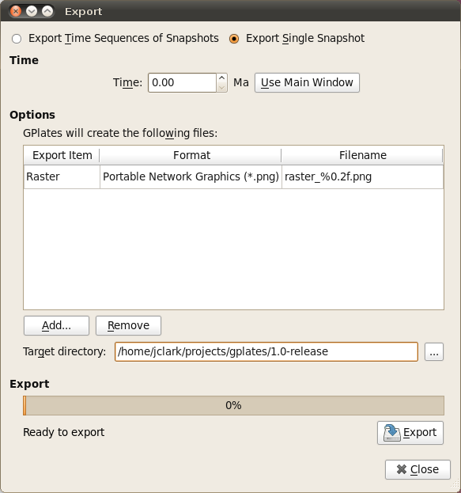
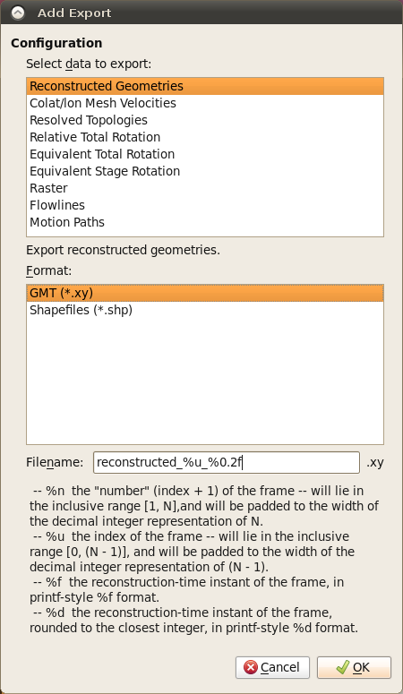

Introduction
============

The "Export" function allows users to save scientific data or images to files.

Export dialog
=============

The **Export** dialog can be accessed via the **Reconstruction** menu, by choosing the **Export…** item (shortcut **Ctrl+Shift+E**). It is used to configure what aspects of the data you want export, what time range you want to export over, and the file names and formats you want to use.

The Export process can work in two different modes: Exporting a **Time Sequence** of snapshots, or just exporting a **Single Snapshot** of data.

The controls are divided into three groups. **Range** (or **Time** for a single snapshot), **Options**, and **Export**.

Export Time Sequence of Snapshots
---------------------------------

Given a time range, export a series of files. Each file contains data at a particular time point. To activate the controls for exporting a time sequence, choose the **Export Time Sequences of Snapshots** option at the top of the dialog.

Export single Snapshot
----------------------

Export data or image at a single specific time. To activate the controls for a one-off snapshot, click the **Export Single Snapshot** option at the top of the dialog.

Range
-----

When using **Export Time Sequence of Snapshots**, the **Range** group of controls specifies the time range that the **Export** will cover. For convenience, these controls are linked to the **Animation** system, and affect the same time range that you see with the **Time Slider** and **Configure Animation** dialog - this way you can see a preview of what will be exported.

The **Use Main Window** buttons are a convenient way of quickly entering the time that the main window is currently viewing. The **Reverse the Animation** button can swap the start and end time.

Time
----

The **Time** group is used with **Export Single Snapshot** to specify a time point.

Options
-------

The **Option** group specifies the items which users want to export and the directory to store output files.

A table shows what files will be created at each time, along with the substitution pattern that will be used to create each unique file name. Users can use **Add…** and \*Remove" buttons to edit the table.

The **Target directory** specifies which directory all the files will be created in. Users can use the button on the right to select directory.

> **Important**
>
> The **Finish exactly on end time** checkbox is important if you are creating an animation with a time increment that is not an exact multiple of the range of your animation. For example, creating an animation between 18 Ma and 0 Ma, in increments of 5 M. This range leaves a 3 million year gap at the end which does not fit neatly into the supplied 18-0 range. Checking the **Finish exactly on end time** option ensures that GPlates will still write this final, shorter, frame.

Export
------

The **Export** group is used to start and stop the export, and provide progress information during the export process. Click **Begin** to commence the export and begin creating files. If you have specified a large range, this may take some time.

The **Abort** button is provided in the event that users wishes to terminate the export sequence early. In **Export single Snapshot** mode, users can not abort.

"Add Export" dialog
===================

When choosing the "Add" button to add a new export item to the table, the **Add Export** dialog is shown to allow the selection of export type, format, and filename.

Select data to export
---------------------

Users can select an entry in this list, and then the available output format will be listed in **Format** list.

Format
------

Select output file format in this list.

File name template
------------------

Specify the file name template which will be used to generate output file names.

Export Items
============

Below is a table of available export items.

<table><colgroup><col style="width: 28%" /><col style="width: 35%" /><col style="width: 35%" /></colgroup><thead><tr class="header"><th>Item</th><th>Format</th><th>Description</th></tr></thead><tbody><tr class="odd"><td>
Reconstructed Geometries
</td><td>
GMT, Shapefile
</td><td>
Export the reconstructed geometries in their paleo-coordinates.
</td></tr><tr class="even"><td>
Projected Geometries
</td><td>
SVG
</td><td>
Export projected geometries data according to the current View settings.
</td></tr><tr class="odd"><td>
Image (screenshot)
</td><td>
bmp,jpg,jpeg,png,ppm,tiff,xbm,xpm
</td><td>
Export image (screenshit) of current view (globe or map).
</td></tr><tr class="even"><td>
Colour raster
</td><td>
bmp,jpg,jpeg,png,tiff,img
</td><td>
Export 8-bit (per channel) RGBA (or RGB) coloured raster data.
</td></tr><tr class="odd"><td>
Numerical raster
</td><td>
nc,grd,tif,img
</td><td>
Export 32-bit floating-point numerical (non-coloured) raster data.
</td></tr><tr class="even"><td>
Velocities
</td><td>
xy,gpml,CitcomS,Terra
</td><td>
Export Plate velocity data.
</td></tr><tr class="odd"><td>
Resolved Topologies
</td><td>
GMT
</td><td>
Export resolved topologies as static polygons in paleo-coordinates.
</td></tr><tr class="even"><td>
Relative Total Rotation
</td><td>
CSV
</td><td>
Export relative total rotation data.
</td></tr><tr class="odd"><td>
Equivalent Total Rotation
</td><td>
CSV
</td><td>
Export equivalent total rotation data.
</td></tr><tr class="even"><td>
Relative Stage Rotation
</td><td>
CSV
</td><td>
Export relative stage rotation data.
</td></tr><tr class="odd"><td>
Equivalent Stage Rotation
</td><td>
CSV
</td><td>
Export equivalent stage rotation data.
</td></tr><tr class="even"><td>
Flowlines
</td><td>
GMT, Shapefiles
</td><td>
Export flowlines.
</td></tr><tr class="odd"><td>
Motion Paths
</td><td>
GMT, Shapefiles
</td><td>
Export motion tracks.
</td></tr><tr class="even"><td>
Net Rotations
</td><td>
CSV
</td><td>
Export net-rotation data based on a set of dynamic polygons
</td></tr></tbody></table>

File name template
==================

The **Filename** field is used as a template value that GPlates will use to name your exported files, and ensure that each Export snapshot gets assigned a unique name. Special **Placeholder** tokens can be used in this text entry box that GPlates will substitute for different values according to what is being exported and at what time.

<table><colgroup><col style="width: 6%" /><col style="width: 93%" /></colgroup><thead><tr class="header"><th>Placeholder</th><th>Description</th></tr></thead><tbody><tr class="odd"><td>
%n
</td><td>
the &quot;number&quot; (index + 1) of the frame — will lie in the inclusive range [1, N], and will be padded to the width of the decimal integer representation of N.
</td></tr><tr class="even"><td>
%u
</td><td>
the index of the frame — will lie in the inclusive range [0, (N - 1)], and will be padded to the width of the decimal integer representation of (N - 1).
</td></tr><tr class="odd"><td>
%f
</td><td>
the reconstruction-time instant of the frame, in printf-style %f format.
</td></tr><tr class="even"><td>
%d
</td><td>
the reconstruction-time instant of the frame, rounded to the closest integer, in printf-style %d format.
</td></tr><tr class="odd"><td>
%P
</td><td>
placeholder string will get replaced for each type of export.
</td></tr></tbody></table>

  
