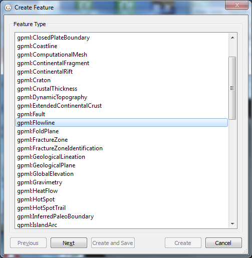
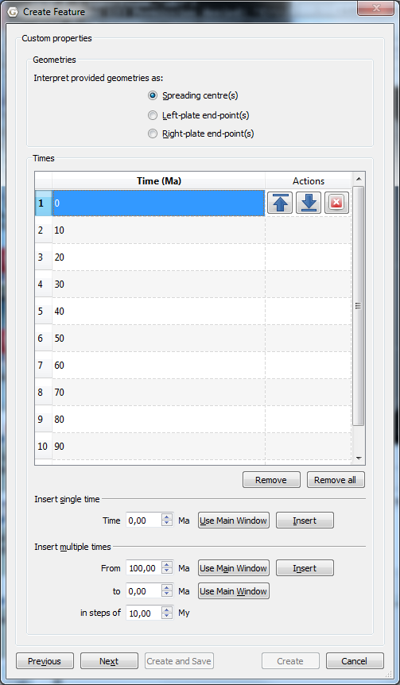
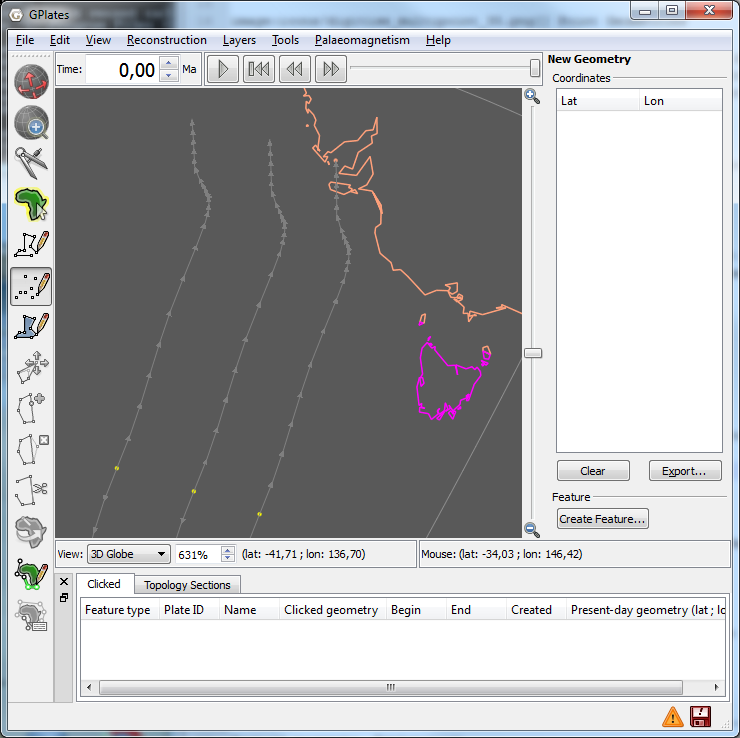
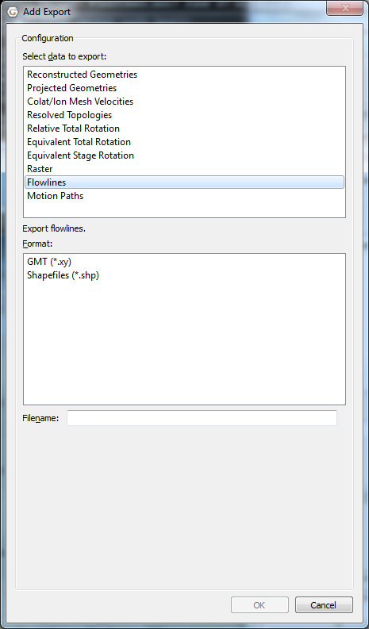

1 Introduction
============

Flowlines represent the movement of material away from a spreading centre, and are calculated based on half stage-poles between two plates at specified time-intervals. GPlates can generate and export flowlines.

2 Creating flowlines
==================

To use flowlines in GPlates, you need to create or load a flowline feature. Flowline features can be created, like other features, with the digitisation tool. See **Creating New Features** for more information on using the digitisation tool. To create a flowline, begin by selecting the **Point Geometries** icon from the **Tool Palette**:

<span style="display:inline-block; width:30px; vertical-align:middle;"> </span> Point Geometries

After choosing the Point Geometries tool, select points on the globe which represent the flowline spreading centre, or either of the flowline end points. Later in the creation process you can instruct GPlates which sort of point you have chosen. Once you are satisfied with the locations, click the **Create Feature** button and select **gpml:Flowline** as the desired feature type.

<table class ="note">
   <tbody>
      <tr>
         <td class="icon">
            
         </td>
         <td class="content" >Flowlines can be created at any reconstruction time.</td>
      </tr>
   </tbody>
</table>



The next step is to allocate left and right plate ids - representing the plates on either side of the flowline - and times of appearance and disappearance.

<table class ="note">
   <tbody>
      <tr>
         <td class="icon">
            
         </td>
         <td class="content" >Flowlines will only be generated between the feature’s time of appearance and time of disappearance.</td>
      </tr>
   </tbody>
</table>


Next select how GPlates should interpret your chosen point geometries - as spreading centres, as left end points, or as right end points of flowlines - and provide the times between which the half-stage poles are calculated.



Finally assign your new flowline feature to a feature collection.


After creating your flowline feature you should see the reconstructed flowline(s) on the globe or map. Flowlines will automatically reconstruct appropriately for the current reconstruction time.



3 Saving flowlines
================

Flowline feature collections can be saved in **gpml** format and loaded like other feature collections.

4 Editing flowlines
=================

Flowline features can be edited like other features by selecting **Choose Feature** from the **Tool Palette** and clicking on the central seed point of the flowline.

5 Exporting flowlines
===================

Reconstructed flowline geometries can be exported to GMT and ESRI Shapefile format. To export flowlines, select **Export…** from the **Reconstruction** menu. After selecting **Add**, you can select Flowlines as the export data type.



When exporting to GMT format, each reconstructed flowline point is output in the form (lon, lat, time).

**Example of an exported flowline GMT file:.**

```
>reconstructionTime 0 
>test-flow-points.gpml 
>Flowline <identity>GPlates-a5e5b41c-089a-4d3f-a877-b5cc0088f43f</identity> <revision>GPlates-550e75b5-5d27-4146-b83d-93ccfa3be165</revision> 
>Left plate: 802 
>Right plate: 801 
>Times: 0,5,10,15,20,25,30,35,40,45,50 
>Seed point: Lat: -50.3407, Lon: 139.229 
>Left-plate flowline 
139.229000 -50.340700 0.000000 
139.197261 -51.887165 5.000000 
139.325022 -53.317310 10.000000 
139.565701 -54.653181 15.000000 
139.856508 -55.970876 20.000000 
140.163463 -57.330579 25.000000 
140.449153 -58.889273 30.000000 
140.746852 -60.278992 35.000000 
141.049859 -61.184592 40.000000 
141.374462 -61.686198 45.000000 
141.655807 -62.007476 50.000000
```


