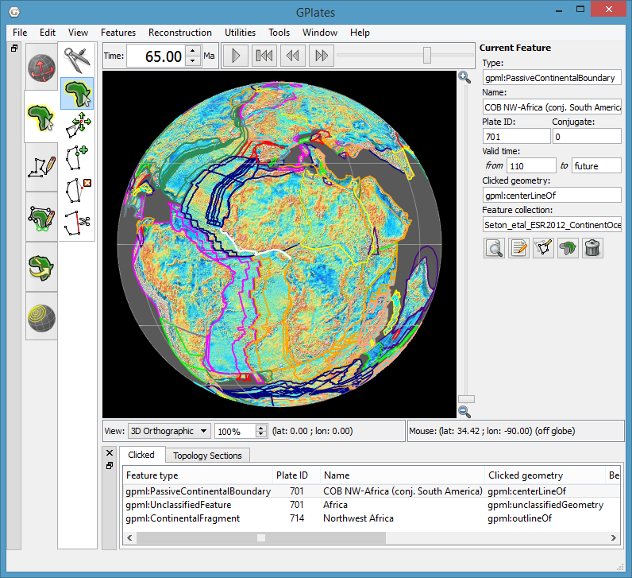

The Aim of this Manual
======================

The GPlates user manual aims to provide the reader with an almost complete understanding of the operations, applications and manipulations within GPlates software. The manual is divided into chapters based on function and tasks.

For example, a step-by-step guide to loading data into GPlates can be found in **Loading and Saving**; an overview of editing the geometries of features can be found in **Editing Geometries**.

Introducing GPlates
===================

GPlates is desktop software for the interactive visualisation of plate-tectonics.

GPlates offers a novel combination of interactive **plate-tectonic reconstructions**, geographic information system (GIS) functionality and raster data visualisation. GPlates enables both the visualisation and the manipulation of plate-tectonic reconstructions and associated data through geological time. GPlates runs on **Windows**, **Linux** and **MacOS X**.

What is a Plate-Tectonic Reconstruction?
----------------------------------------

The motions of tectonic plates through geological time may be described and simulated using **plate-tectonic reconstructions**. Plate-tectonic reconstructions are the calculations of the probable positions, orientations and motions of tectonic plates through time, based upon the relative (plate-to-plate) positions of plates at various times in the past which may be inferred from other data. Geological, geophysical and paleo-geographic data may be attached to the simulated plates, enabling a researcher to trace the motions and interactions of these data through time.

The Goals of GPlates
--------------------

-   to handle and visualise data in a variety of geometries and formats, including raster data

-   to link plate kinematics to geodynamic models

-   to serve as an interactive client in a grid-computing network

-   to facilitate the production of high-quality paleo-geographic maps.

GPlates Development
===================

GPlates is developed by an international team of scientists, professional software developers and post graduate students at:

-   the EarthByte Project (part of the AuScope National Collaborative Research Infrastructure Strategy (NCRIS) Program) in the School of Geosciences at the University of Sydney (under the direction of Prof. Dietmar Müller)

-   the Division of Geological and Planetary Sciences at CalTech (under the direction of Prof. Michael Gurnis)

-   the Geodynamics Team at the Geological Survey of Norway (NGU), and the Centre for Earth Evolution and Dynamics (CEED) at the University of Oslo (under the direction of Trond Torsvik)

Collaborating scientists at the University of Sydney, the California Institute of Technology, the Geological Survey of Norway and the University of Oslo have also been compiling sets of global data for plate boundaries, continental-oceanic crust boundaries, plate rotations, absolute reference frames and dynamic topography.

GPlates is free software (also known as open-source software), licensed for distribution under the GNU General Public License (GPL), version 2.

Further Information
===================

For more information about GPlates, contact us: <http://www.gplates.org/contact.html>
