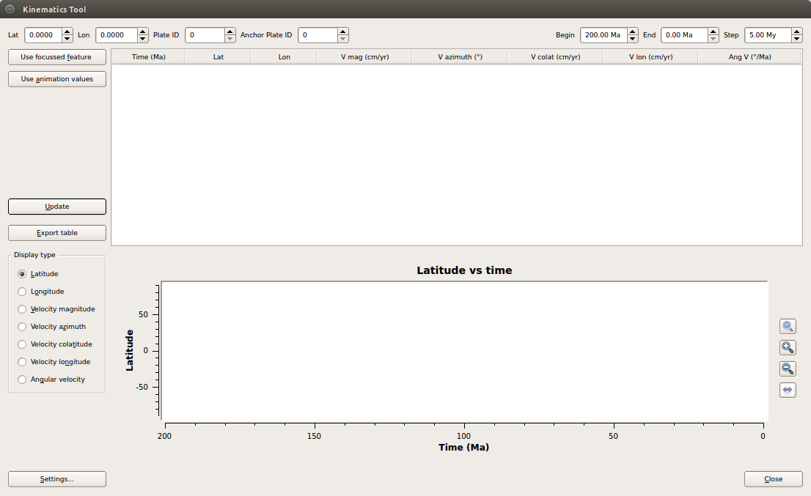
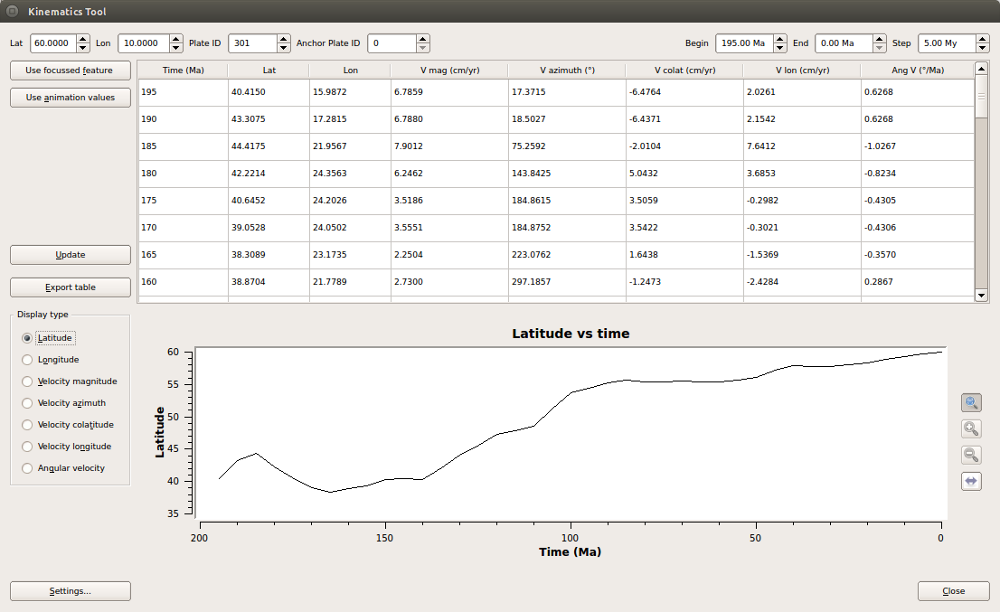
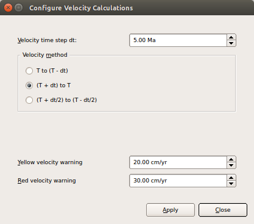

Introduction
============

The Kinematics Tool generates tables and graphs of positions, velocities, and angular velocities of selected points as a function of time. Although GPlates can also calculate and export positions and velocities through the **Export** functionality, the Kinematics Tool lets users quickly generate graphs and tables with just a few mouse clicks.

Opening the Kinematics Tool
===========================

The Kinematics Tool is opened through the **Utilities→Open Kinematics Tool** menu item (shortcut **Shift+Ctrl+K**)

Providing position, plate-id and time information
=================================================

Fill in the spinboxes at the top of the dialog with latitude, longitude and plate-id of the point which you would like to examine the motion of, and provide a range of times and a time-interval in the **Begin**, **End** and **Step** spinboxes.

> **Note**
>
> The time step provided here determines the points in time at which the velocity calculations will be performed. This does not change the time interval (Δt) used in the velocity calculation. By default Δt is 1My, but can be changed in the **Settings** dialog (see below).

> **Note**
>
> If you have selected a feature on the canvas (see the **Interacting With Features** chapter), you can fill the latitude, longitude and plate-id fields automatically by pressing the **Use focussed feature** button.

> **Note**
>
> If the desired time settings coincide with those in the animation settings (see the **Reconstructions** chapter), you can import these to the Kinematics Tool by pressing the **Use animation values** button.

Viewing the results
===================

Press the **Update** button, and the table will be filled with position and velocity-related data for each time step, and a graph of latitude against time will be displayed in the graph window. Change the graph type by using the **Display type** radio-buttons to the left of the graph window.

> **Note**
>
> The vertical graph axis can be adjusted by using the **autoscale**, **stretch** and **compress** buttons to the right of the graph window. The horizontal (time) axis can be flipped by using the **flip horizontal axis** button.

Exporting the results
=====================

To export the table to file, press the **Export** button and select the desired output filename and file format.

Settings
========

The time-intervals used in the velocity calculations can be adjusted by pressing the **Settings** button and changing the fields in the Settings window.

This dialog also allows you to set two velocity warning levels. Velocities exceeding these levels will be highlighted in the table in yellow and red colours.

> **Note**
>
> If you want to store these values so that they are used on start-up of subsequent GPlates sessions, you can do this through the **Preferences** dialog. From the main GPlates window, select **Edit→Preferences** (shortcut **Ctrl+,**) and adjust the values in the **Kinematic Graphs** pane.

  
