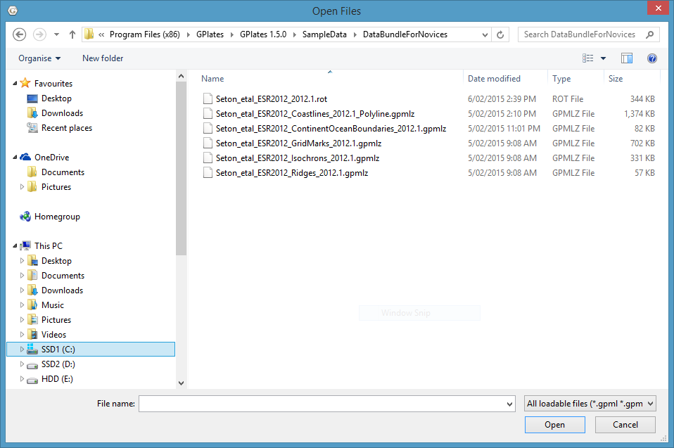
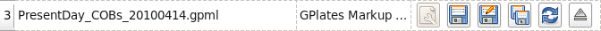

Before you load any data into GPlates the globe will appear as a blank sphere; in order to start with GPlates you will need to know how to load, save and unload data.

> **Tip**
>
> You can still manipulate the view of the globe even though it’s blank. See Chapter 5, Controlling the View for more details.

Introducing Feature Collections
===============================

When a data file is loaded in GPlates, it is loaded in the **Feature Collection**. All data in GPlates are represented as features (e.g. MOR, volcano, etc) — whether geological data or reconstruction data. Regardless of the file format, all features will be contained internally as GPlates features. However GPlates *will* remember the name and format of the file for saving.

All data loaded in GPlates are represented as *features*; all data-manipulation functions are operations upon features. GPlates offers a rich variety of feature types, enabling GPlates to handle geographic, paleo-geographic, geological and tectonic data. Basin, Coastline, Craton, Fault, Hotspot, Isochron, Mid-Ocean Ridge, Seamount, Subduction Zone, Suture and Volcano are just some of the many feature types handled by GPlates. The meta-data attributes of data are contained within named *properties* of the features.

GPlates is able to load and save a number of data-file formats (e.g. PLATES4). When a data file is loaded in GPlates, the data will be converted to the appropriate types of features and placed into a **Feature Collection**. One **Feature Collection** in GPlates corresponds to one data file on the disk. Even though the data have been converted to GPlates features, GPlates will remember the name and original format of the file for saving.

When the features are saved, they will be converted back to their original data format. It is also possible to save features into different data formats using the "Save As" or "Save a Copy" buttons in the Manage Feature Collections dialog. To specify a different file format, change the file-name extension (e.g ".gpml", ".dat", etc) to the extension for the desired format.

How to Load a File
==================

There are several ways to load a data file or collection of files into GPlates.

The Open Feature Collection menu item
-------------------------------------

1.  Go to the **File Menu** in the menu bar.

2.  Scroll down to **Open Feature Collection** (shortcut: `Ctrl+O`).

3.  A classic File Open dialog window will appear; select the file to be loaded.

> **Tip**
>
> You can open multiple files at once via this dialog. Hold down `Ctrl` to select additional files, then click **Open**.

Drag and Drop
-------------

1.  Open your file browser to the directory containing the files you want to load.

2.  Select the files you are interested in; Multiple selection is usually possible by dragging a rectangle around files or holding `Ctrl` while clicking.

3.  Drag these files into the GPlates **Main Window**.

> **Tip**
>
> It is also possible to add `CPT` files to the **Manage Colouring** dialog in this way.

The Open Recent Session menu
----------------------------

Whenever you close GPlates, it automatically remembers which set of files you were working on last time. You can resume your previous session by using the menu.

1.  Go to the **File Menu** in the menu bar.

2.  Scroll down to the **Open Recent Session** submenu.

3.  Select the menu entry corresponding to the set of files you want GPlates to load.

An entry for each prior session of GPlates can be identified by the number of files that were loaded, the name of the directory that all the files have in common, and the date they were last in use. Connections between different **Layers** that are loaded will also be saved, however please note that colouring settings and other Layer-specific settings (e.g. VGP Visibility) are not currently remembered and must be restored manually.

How do I load a raster image in GPlates?
----------------------------------------

To load a raster image into GPlates it must first have a GPML file associated with it. This is done by *importing* the raster into GPlates. This only needs to be done once for each raster. After that you can simply load the GPML file (created during the import process) into GPlates like you would a regular feature collection.

For information on how to *import* a raster please see the **Data File Types** chapter.

The Manage Feature Collections Dialog
=====================================

This dialog window enables you to load new files, and save, reconfigure and unload currently-loaded files. This is where you will find any file-specific operations. To control how GPlates uses the data from those files, please see the **Layers** chapter and related functionality.

1.  Go to the **File Menu** in the menu bar.

2.  Click on **Manage Feature Collections** menu item (shortcut: `Ctrl+M`).

> **Important**
>
> A single row in the table corresponds to one file.

<table><colgroup><col style="width: 20%" /><col style="width: 80%" /></colgroup><thead><tr class="header"><th style="text-align: left;">Column Name</th><th style="text-align: left;">Function</th></tr></thead><tbody><tr class="odd"><td style="text-align: left;">File Name</td><td style="text-align: left;">The name of the file on disk</td></tr><tr class="even"><td style="text-align: left;">File Format</td><td style="text-align: left;">The file format type</td></tr><tr class="odd"><td style="text-align: left;">Actions</td><td style="text-align: left;">A collection of operations relevant to this file</td></tr></tbody></table>

> **Tip**
>
> If you place your mouse over the file name a tool tip appears indicating the directory the file is located in.

Saving a file
-------------

There are three different ways to save a file in GPlates.

The **Manage Feature Collections** dialog contains a table of controls and status information about the feature collections that are loaded in GPlates; each row corresponds to a single feature collection, and lists file name, format and available actions.

<table><colgroup><col style="width: 12%" /><col style="width: 25%" /><col style="width: 62%" /></colgroup><tbody><tr class="odd"><td>
Item
</td><td>
Name
</td><td>
Function
</td></tr><tr class="even"><td>

</td><td>
File Properties
</td><td>
Edit the file’s configuration
</td></tr><tr class="odd"><td>

</td><td>
Save
</td><td>
Save the file using the current name
</td></tr><tr class="even"><td>

</td><td>
Save As
</td><td>
Save the file using a new name and/or format
</td></tr><tr class="odd"><td>

</td><td>
Save a Copy
</td><td>
Save a copy of the file with a different name
</td></tr><tr class="even"><td>

</td><td>
Refresh
</td><td>
Reload the file from disk
</td></tr><tr class="odd"><td>

</td><td>
Eject
</td><td>
Unload the file from GPlates
</td></tr></tbody></table>

###  Save…

-   Saves the current file with its **current** name.

-   Will overwrite previous contents of the file.

> **Tip**
>
> This is useful when you have modified your file and are happy to save these changes.

> **Important**
>
> Do not edit the file in two separate programs simultaneously (e.g. GPlates and a text-editor)

###  Save As…

-   Saves the current file with a **new** name.

-   Will leave the previous file intact.

-   Will load the new file in place of the old file.

-   Gives you the opportunity to change the file format.

> **Tip**
>
> This is useful when you want to edit a copy of a file without changing the original.

###  Save a Copy…

-   Saves a copy of the current file with a **new** name.

-   Will leave the previous file intact.

-   Will not replace or unload the current file.

-   Gives you the opportunity to change the file format.

> **Tip**
>
> This is useful for making backups of your work as you go.

Saving all modified files
-------------------------

If a file has been modified in GPlates, it will appear with a red background colour to highlight it. As a convenient shortcut for saving all your changes in one go, the **Manage Feature Collections** dialog has a **Save All** button.

1.  Have been modified in GPlates since they were last loaded/saved.

2.  Have a file name.

> **Note**
>
> The "Save All" button does not save newly created feature collections (highlighted in orange) which have not been saved with a file name yet. This is to avoid ambiguity in case you have created many new feature collections, some possibly for temporary work, which have not yet been named.

File Errors
===========

Introduction
------------

File read errors may occur when attempting to load data from file (or some other data source, such as a database). GPlates developers have done their best to notify the user of the specifics of the error so corrections can be made.

Error Categories
----------------

It is anticipated that file input errors may fall into four categories:

1.  Warning

2.  Recoverable error

3.  Terminating error

4.  Failure to begin

When you load a file which causes warnings, GPlates will display a warning icon  in the status bar. You can click it to open the File Errors dialog for more information, or click the **View Read Errors** entry on the **File** menu. For more serious errors, GPlates will open the dialog immediately on loading.

### Warning

-   A warning is a notification of a problem (generally a problem in the data) which required GPlates to modify the data in order to rectify the situation.

-   Examples of problems which might result in warnings include:

    -   Data which are being imported into GPlates, which do not possess quite enough information for the needs of GPlates *(such as total reconstruction poles in PLATES4 rotation-format files which have been commented-out by changing their moving plate ID to 999)*.

    -   An attribute field whose value is obviously incorrect, but which is easy for GPlates to repair *(for instance, when the *Number Of Points* field in a PLATES4 line-format polyline header does not match the actual number of points in the polyline)*.

-   A warning will not have resulted in any data loss, but you may wish to investigate the problem, in order to verify that GPlates has *corrected* the errors in the data in the way you would expect; and to be aware of incorrect data which other programs may handle differently.

### Recoverable error

-   A recoverable error is an error *(generally an error in the data)* from which GPlates is able to recover, although some amount of data had to be discarded because it was invalid or malformed in such a way that GPlates was unable to repair it.

-   Examples of recoverable errors might include:

    -   When the wrong type of data encountered in a fixed-width attribute field *(for instance, text encountered where an integer was expected)*.

-   **When a recoverable error occurs, GPlates will do the following:**

    -   Retain the data it has already successfully read.

    -   Discard the invalid or malformed data *(which will result in some data loss)*.

    -   Continue reading from the data source. GPlates will discard the smallest possible amount of data, and will inform you exactly what was discarded.

### Terminating error

-   A terminating error halts the reading of data in such a way that GPlates is unable to read any more data from the data source.

-   Examples of terminating errors might include:

    -   A file-system error.

    -   A broken network connection.

-   When a terminating error occurs, GPlates will retain the data it has already read, but will not be able to read any more data from the data source.

### Failure to begin

-   A failure to begin has occurred when GPlates is not even able to start reading data from the data source.

-   Examples of failures to begin might include:

    -   The file cannot be located on disk or opened for reading.

    -   The database cannot be accessed; no network connection could be established.

-   In the event of a failure to begin, GPlates will not be able to load any data from the data source.

Unsaved Changes
===============

Introduction
------------

GPlates keeps track of any changes you make to files while they are loaded. To remind you that some feature collections have unsaved changes, GPlates will display the  icon in the status area. Hover over the icon to see a list of modified files, or click it to open the **Manage Feature Collections** dialog.

Closing GPlates with unsaved changes
------------------------------------

If you close GPlates while there are still unsaved changes, GPlates will ask you to confirm this action, indicating which files have been modified and allowing you to select one of three actions to resolve the situation.

1.  No files will be saved. Any changes made since you last saved the file will not be kept.

2.  GPlates will close.

<!-- -->

1.  GPlates will not close.

2.  This gives you an opportunity to go back and manually save the files you wish to keep, and discard the rest.

<!-- -->

1.  GPlates will save every file that has been modified but not yet saved.

2.  In the event of a new feature collection which has not yet been given a file name, you will be prompted to give each one a name using the standard save dialog. However, this may lead to ambiguity about which feature collection is being saved, and it is advised to use the "Don’t Close" option to carefully examine the situation.

3.  If all files were saved successfully, GPlates will close.

The **Unsaved Changes** dialog may also be triggered when using the **Open Recent Session** functionality. If the files you currently have open have changes made to them, the act of opening a new session will replace them, and GPlates will warn you about this in the same way.

  
