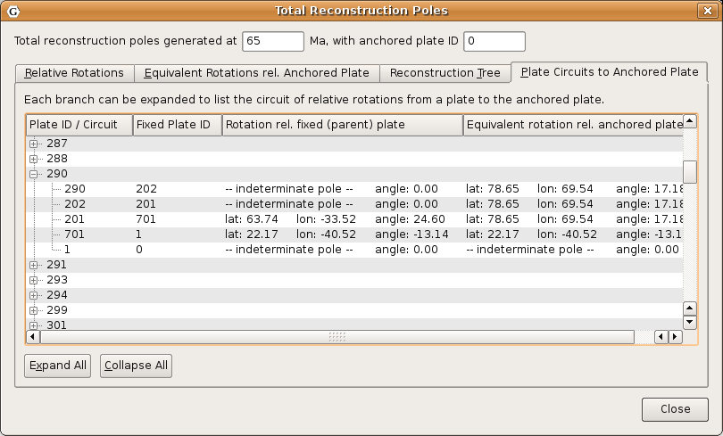

Theory
======

Plate IDs
---------

As discussed earlier in this documentation, GPlates uses the concept of a **Plate ID** to ascribe tectonic motion to a feature. All features using the same plate ID move in unison when reconstructed back through time. A plate ID is a non-negative whole number. Assigning specific meanings to specific plate IDs, such as making plate ID 714 correspond to northwest Africa, is up to the creator of the rotation file.

Plate IDs do not correspond to a physical tectonic plate, although they may represent the motion of features which are on that physical plate. Plate IDs can also be assigned to represent the motion of things on the same physical plate relative to one another - for example, the motion of an island arc caused by back-arc spreading. A subduction zone can be assigned one plate ID, and its associated island arc can be assigned another plate ID. The motion of both of these plate IDs can be anchored to a third plate ID, representing the global motion of the physical plate underneath the subduction zone and island arc.

Finite Rotations
----------------

Euler’s Displacement Theorem tells us that any displacement on the surface of the globe can be modelled as a rotation about some axis. This combination of axis and angle is called a **finite rotation**. Finite rotations are used by GPlates as the elementary building blocks of plate motion.

Total Reconstruction Poles
--------------------------

Total Reconstruction Poles tie finite rotations to plate motion. A total reconstruction pole is a finite rotation which "reconstructs" a plate from its present day position to its position at some point in time in the past. It is expressed as the combination of a "fixed" plate id, a "moving" plate id, a point in time and a finite rotation.

Reconstructions are defined in a relative fashion; A single total reconstruction pole defines the motion of one plate id (the "moving" plate id) relative to another (the "fixed" plate id) at a specific moment in geological time. A sequence of total reconstruction poles is needed in order to fully model the motion of one particular plate across the surface of the globe throughout time.

Anchored Plate ID
-----------------

A sequence of total reconstruction poles is used to model the motion of a single plate across the surface of the globe. The total reconstruction poles describe the relative motion between each plate, but ultimately this motion has to be traced back to a single plate ID which is considered "anchored". GPlates calls this the **Anchored Plate ID**. Generally, this plate ID corresponds to an absolute reference frame, such as a hotspot, paleomagnetic, or mantle reference frame. The convention is to assign the anchored plate ID to 000, but GPlates allows any plate ID to be used as the anchored plate ID.

The Rotation Hierarchy
----------------------

To create the model of global plate rotations that is used in GPlates, total reconstruction poles are arranged to form a hierarchy, or tree-like structure. At the top of the hierarchy is the anchored plate ID. Successive plate IDs are further down the chain, linked by total reconstruction poles. To calculate the absolute rotation of a plate ID of a plate with a given plate ID. (relative to the fixed reference defined by the anchored plate ID, at a given time), GPlates starts at that point in the hierarchy and works its way up to the top - to the root of the tree.

Specify Anchored Plate ID
=========================

The **Specify Anchored Plate ID** command on the Reconstruction menu can be used to change which plate ID GPlates considers to be the globally fixed reference when performing reconstructions. Enter a new plate ID to be the anchor in the dialog that pops up, and GPlates will automatically rearrange the rotation hierarchy so that the specified plate ID is at the top.

Reconstruction Pole Dialog
==========================

The Total Reconstruction Pole Dialog is accessed from the Reconstruction menu. It contains four tables of information, relevant to the current reconstruction time and the current anchored plate ID.

Relative Rotations
------------------

This table lists all the total reconstruction poles in terms of the relative motions between plates, for the current reconstruction time.

Equivalent Rotations Relative To Anchored Plate
-----------------------------------------------

Similar to the **Relative Rotations** table, this lists rotations for each plate. However, the data presented here has been converted from individual relative rotations into the equivalent absolute rotation, relative to the anchored plate ID. Again, these apply to the current reconstruction time.

Reconstruction Tree
-------------------

Here the reconstruction hierarchy is presented in a more natural, tree-like form. Relative rotations are listed, but individual nodes of the tree (plate IDs) can be expanded or collapsed, to explore the branches of the plate rotation model.

Plate Circuits To Stationary Plate
----------------------------------

This tab of the Total Reconstruction Poles dialog can be used to trace a series of total reconstruction poles from any given plate ID back to the top of the hierarchy, the anchored plate ID. It is useful to quickly identify the other plate IDs that a chosen plate ID depends on.

  
