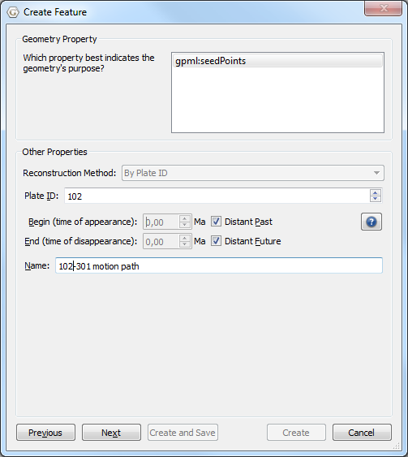
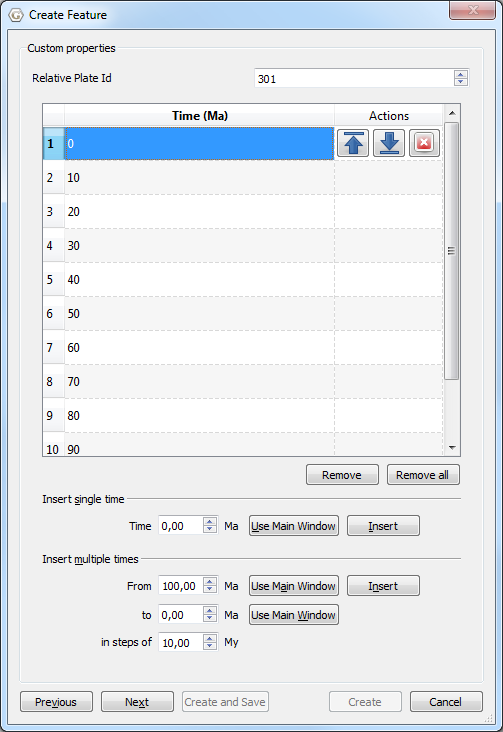
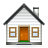

Introduction
============

Motion Paths illustrate the movement of plates over time, either with respect to the anchor plate, or with respect to some other specified plate.

Creating Motion Paths
=====================

To use motion paths in GPlates, you need to create or load a motion path feature. Motion path features can be created, like other features, with the digitisation tool. See **Creating New Features** for more information on using the digitisation tool. To create a motion path, begin by selecting the **Point Geometries** icon from the **Tool Palette**:

 Point Geometries

After choosing the Point Geometries tool, select points on the globe which you wish to track. Once you are satisfied with the locations, click the **Create Feature** button and select **gpml:MotionPath** as the desired feature type.

> **Note**
>
> Motion Paths can be created at any reconstruction time.

Next allocate a plate id and the times of appearance and disappearance.

> **Note**
>
> Motion paths will only be generated between the feature’s time of appearance and time of disappearance.

Next select the reference plate id. The motion path is calculated with respect to this reference plate id.

> **Note**
>
> To display the absolute motion (with respect to the mantle), set the reference plate id to zero.

Then specify the times between which the path segments are calculated.

Finally assign your new motion path feature to a feature collection.

After creating your motion path feature you should see the reconstructed motion path(s) on the globe or map. Motion paths will automatically update appropriately for the current reconstruction time.

Saving motion paths
===================

Motion path feature collections can be saved in **gpml** format and loaded like other feature collections.

Editing motion paths
====================

Motion path features can be edited like other features by selecting **Choose Feature** from the **Tool Palette** and clicking on the end point of the motion path.

Exporting motion paths
======================

Reconstructed motion path geometries can be exported to GMT and ESRI Shapefile format. To export motion paths, select **Export…** from the **Reconstruction** menu. After selecting **Add**, you can select Motion Paths as the export data type.

When exporting to GMT format, each reconstructed motion path point is output in the form (lon, lat, time).

**Example of an exported motion path GMT file:.**

&gt;anchorPlateId 0 &gt;reconstructionTime 0 &gt; &gt;MotionPath &lt;identity&gt;GPlates-a3c24577-4137-4226-aba4-bde5427cba32&lt;/identity&gt; &lt;revision&gt;GPlates-f11fa5f9-bf1d-4000-b6af-eaa465ceea0d&lt;/revision&gt; &gt; Recostruction plate id: 102 &gt; Relative plate id: 301 &gt; 0,10,20,30,40,50,60,70,80,90,100 &gt; Seed point: Lat: 62.9712, Lon: -40.1395 &gt; Motion path -16.213502 58.361165 100.000000 -16.625527 58.450034 90.000000 -16.934371 58.691767 80.000000 -17.076489 58.742035 70.000000 -17.763448 59.146028 60.000000 -21.656092 60.522007 50.000000 -25.174028 61.902590 40.000000 -28.717604 62.347711 30.000000 -31.941397 62.609357 20.000000 -36.158642 62.825853 10.000000 -40.139488 62.971198 0.000000

  
