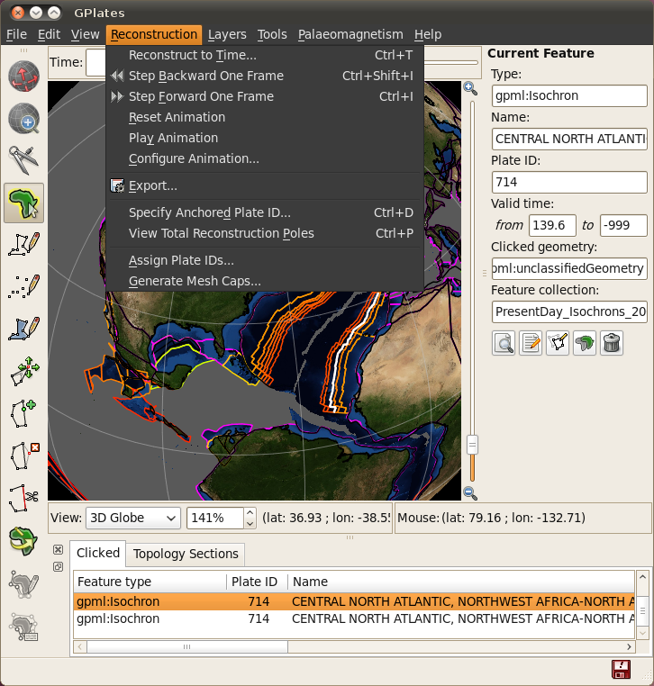
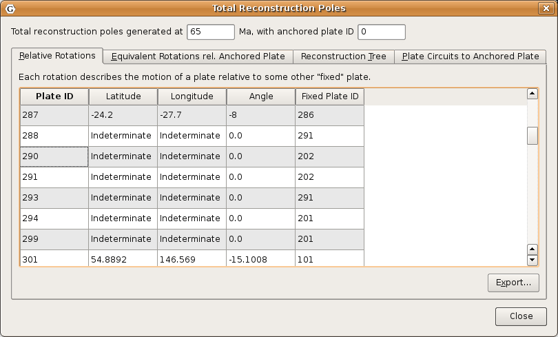
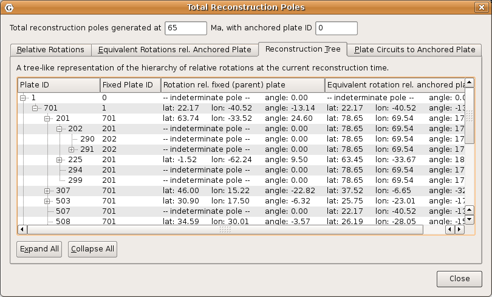

Introduction
============

The motions of tectonic plates through geological time may be described and simulated using plate-tectonic reconstructions. Plate-tectonic reconstructions are the calculations of the probable positions, orientations and motions of tectonic plates through time, based upon the relative (plate-to-plate) positions of plates at various times in the past which may be inferred from other data. Geological, geophysical and paleo-geographic data may be attached to the simulated plates, enabling a researcher to trace the motions and interactions of these data through time.

Geological time instants in GPlates are measured in units of Mega-annum (Ma), in which 1 Ma is equal to one million years in the past. For example, the allowable range for reconstructions is from 0 to 10 000 Ma (i.e. present day to 1010 years ago).

> **Tip**
>
> The current age of the Earth is approximately 4.5 x 109 years!

Main Window Interface Components
================================

Slider
------

Interface to interact with reconstruction animations in GPlates, discussed in further detail below.

###  Play

Starts animation, when pressed it changes to the pause button

###  Pause

Halts animation, when pressed it changes to play button

###  Reset

Returns animation to the start time

###  Fast Forward

Step forwards one frame in the animation

###  Rewind

Step backwards one frame in the animation

Step Forwards One Frame / Step Backwards One Frame (Fast Forward and Rewind):
-----------------------------------------------------------------------------

These buttons are used to change the current reconstruction time that you are viewing in small steps. Pressing the buttons once, or using their shortcut keys (`Ctrl+I` for forwards; `Ctrl+Shift+I` for backwards) will adjust the reconstruction time by one frame. The time interval between frames can be adjusted via the **Configure Animation Dialog**, accessed via the **Reconstruction menu**.

> **Note**
>
> The Step Forwards one Frame / Step Backwards one Frame buttons can be held down to move through time rapidly.

The forwards and backwards buttons apply relative to the current animation time. Normally, the present day (0 Ma) is at the right-hand side of the animation slider, and the distant past is on the left-hand side.

GPlates makes it possible for you to set a reverse animation, where the start time is the present day (or near past), and the end time is in the distant future. When an animation is set up this way, the slider and buttons behave as consistently as possible; your start time (the present) is on the left, and your end time (the distant past) is on the right. Using the **Step Forwards one Frame** button moves the slider to the right (into the past), and the **Step Backwards one Frame** button does the opposite, as you would expect.

> **Note**
>
> The default settings for the **Slider** are: a time range of 140Ma to present and a time increment per frame of 1 million years

Reconstruction Menu
===================

The **Reconstruction Menu** provides access to the following tools:

<table><colgroup><col style="width: 28%" /><col style="width: 14%" /><col style="width: 57%" /></colgroup><tbody><tr class="odd"><td>
Menu Item
</td><td>
Shortcut
</td><td>
Operation
</td></tr><tr class="even"><td>
Reconstruct to Time…
</td><td>
<code>Ctrl+T</code>
</td><td>
Show a reconstruction for the user-specified time
</td></tr><tr class="odd"><td>
Step Backward One Frame
</td><td>
<code>Ctrl+Shift+I</code>
</td><td>
Step backward one frame in the animation
</td></tr><tr class="even"><td>
Step Forward One Frame
</td><td>
<code>Ctrl+I</code>
</td><td>
Step forward one frame in the animation
</td></tr><tr class="odd"><td>
Reset Animation
</td><td></td><td>
Return to the first frame of the animation
</td></tr><tr class="even"><td>
Play Animation
</td><td></td><td>
Start reconstructing each frame through the animation
</td></tr><tr class="odd"><td>
Configure Animation…
</td><td></td><td>
Pop up the <strong>Configure Animation</strong> dialog to control the animation parameters
</td></tr><tr class="even"><td>
Specify Anchored Plate ID…
</td><td>
<code>Ctrl+D</code>
</td><td>
Specify the anchored plate in the plate hierarchy
</td></tr><tr class="odd"><td>
View Total Reconstruction Poles
</td><td>
<code>Ctrl+P</code>
</td><td>
Pop up the Total Reconstruction Poles dialog
</td></tr><tr class="even"><td>
Export…
</td><td></td><td>
Opens the <strong>Export Dialog</strong> for exporing aspects of the reconstruction to files
</td></tr></tbody></table>

Reconstruct to Time
-------------------

When this menu item is invoked, it will activate the Time field in the Main Window, which is used to specify the current reconstruction time. The user can type a new reconstruction time, or increase or decrease the value using the Up and Down arrow keys or the mouse scroll-wheel, before pressing the Enter key to execute the reconstruction.

The current frame of the animation always corresponds to the reconstruction time. Changing the reconstruction time will simultaneously change the current frame of the animation. If the specified time is outside the current range of the animation, the range will be extended.

Step Forward One Frame
----------------------

This button is used to change the current reconstruction time forward that you are viewing in small steps.

Step Backward One Frame
-----------------------

This button is used to change the current reconstruction time backward that you are viewing in small steps.

Specify Anchored Plate ID
-------------------------

This item is used to choose the anchored plate ID of the plate hierarchy. It will be described in the chapter, **More On Reconstructions**.

View Total Reconstruction Poles
-------------------------------

When this item is activated, the **Total Reconstruction Poles** dialog will appear, enabling the user to view a variety of information about the reconstruction poles and the plate hierarchy at the current reconstruction time. This dialog will be described in the chapter, **More On Reconstructions**.

   

Animations
==========

The animation dialog, found in the Reconstruction menu, allows you to automate a reconstruction backwards or forwards through time. The user can set the start and end times by either entering the age or using the current time displayed in the main window. The options, frames per second can be set and there is also the option to loop the animation.

Animation Dialog
----------------

### Range

This group of controls specifies the time range that the animation should cover. The **Use Main Window** buttons are a convenient way of quickly entering the time that the main window is currently viewing.

### Options

Additional options to fine-tune the behaviour of the animation are presented here. The **Frames per second** number controls the rate at which GPlates will limit the display of animation frames when presenting an animation interactively. Larger numbers produce a slower animation.

> **Note**
>
> If calculating the next step of the animation takes too long, perhaps due to a large amount of data, GPlates may skip some frames to try and keep the animation running at the correct rate.

### Playback

These controls allow simple playback and seeking within the animation from this dialog. They behave identically to the equivalent controls found in the **Reconstruction View**.

  
