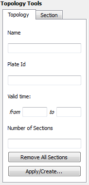
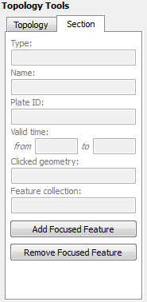

Introduction
============

In GPlates, everything is a feature. Many features on the globe are reconstructable, and have an unchanging geometric presence that is moved around the globe according to the reconstruction tree. This chapter introduces **Topological** features, which do not have a geometry of their own defined.

Instead of a single fixed geometry, topological features automatically construct their geometry based on the parts of other features. The most useful application of this is constructing topological **closed plate polygons** based on the intersections of various plate tectonic boundary features.

Topology Controls and Displays
==============================

In addition to the Globe, the various Topology Tools make use of a few other displays and controls on the Main Window. The Topology Tools Task Panel and The Topology Sections Table work together to manipulate the list of features that form a topology’s boundary. As you edit the list of boundary features, you will work back and forth between the globe, the Task Panel, and the Sections Table.

Topology Canvas Tools
---------------------

Found on the **Tool Palette**, the **Build New Topology** tool and the **Edit Topology Sections** tool are used to create new topologies and modify existing ones.

<table><colgroup><col style="width: 11%" /><col style="width: 22%" /><col style="width: 11%" /><col style="width: 55%" /></colgroup><tbody><tr class="odd"><td>
Icon
</td><td>
Tool
</td><td>
Shortcut
</td><td>
Operation
</td></tr><tr class="even"><td>

</td><td>
Build New Topology
</td><td>
B
</td><td>
Create a new dynamically closing plate polygon by adding sections of other features that define a boundary
</td></tr><tr class="odd"><td>

</td><td>
Edit Topology Sections
</td><td>
E
</td><td>
Edit the selected topological feature’s sections
</td></tr></tbody></table>

Topology Task Panel
-------------------

The Topology Tools' Task Panel has two sub-tabs, one for the topology itself, and the other for a feature intended to become a section of the topology.

Topology Tab
------------

The Topology Tab shows a summary of the topology under edit.

When building a new topology, the Name, Plate Id, and Valid Time displays will be blank (these values will be set when finalizing the new topology). When editing an existing topology these will display that the various property values of that topology feature.

The **Remove All Sections** button will delete all entries in Topology Sections Table, and effectively *clear* the topology. Use with caution this operation has no undo.

The **Apply/Create…** button is used to apply all edits to the current topology (under the Edit Topology Tool), or to finalise the creation process (under the Build New Topology Tool).

Section Tab
-----------

The Section Tab shows the basic properties of the focused feature.

The **Add Focused Feature** button will insert the feature into the Topology Sections Table at the current Insertion Point. See below for an explaination of the table and the insertion point.

Topology Sections Table
=======================

The Topology Sections Table holds an ordered list of boundary features. Upon each reconstruction, it is these features, and their relationships, that will be processed into the resultant polygon geometry for the topology.

Features are added to the Sections Table via the controls in the Task Panel, and via the table itself. The insert location of the table (and corresponding spot on the ordered list of boundary features) will be highlighted by a special row with a large blue arrow and a message. This is the Insertion Point. The insertion point usually stays at the end of the list, so that each new section gets appended to the topology one after the other. If you wish to insert a feature elsewhere in the list of boundary sections, adjust the insertion point’s location using the buttons in the table.

All the controls for directly editing the Sections Table appear under the **Actions** column of the table. Buttons related to a row will appear on mouse-over. Simply move the mouse pointer over a section in the table, and the following action buttons will appear:

 Move the Insertion Point to the row above this one; new sections will be added to the topology before this one.

 Move the Insertion Point to the row below this one; new sections will be added to the topology after this one.

 Remove this section from the list. It will no longer contribute to the topology.

 Reset the Insertion Point to the last entry. This causes insert operations to simply append features to the Sections Table.

> **Tip**
>
> If you need to distinguish between similar features used in the topology, click on a row of the table. This will highlight that row, and also highlight the corresponding geometry on screen.

The Feature Type, Plate ID, and Name columns provide a quick summary of the Section.

The background colour of a row will change to red if there are some problems resolving that part of the topology. This may occur, for example, when you have loaded a file containing the topology definitions but have yet to load a file containing the features that were used to build that topology.

Topology Drawing Conventions
============================

While a topology feature is under edit GPlates will draw the topology, and its referenced features, with certain highlights and colors.

The focused feature will always be drawn in white.

The topology’s resultant boundary polygon will be drawn in light gray. All the topology’s resultant vertices, both those from the source features, and those computed as intersection points, will be highlighted with gray dots.

The current Insertion Point of the Topology Section Table will be highlighted visually on the globe with slightly different coloring of the features on either side of it: The feature before the insertion point will be drawn in Black, and the feature after the insertion point will be drawn in White. The mnemonic *before black; after white* is a quick way to recall where a new feature will be inserted into the topology sections Table.

These visual cues may be helpful when *fine tuning* how various features, particularly features with complicated polylines, intersect to form a topology’s boundary.

> **Note**
>
> The vertices of each feature in the topological sections table will be used in a the reverse order, if necessary, from which they appear in the source feature’s data. This decision is performed automatically by GPlates for each feature in the sections table and requires no user involvement. It ensures the final closed polygon will be created as a continuous closed polygon regardless of the orientation of each topological section.

Until all topological sections for a closed polygon are added, the topological closed polygon displayed can look wrong. The following shows what the topological polygon looks like when only two out of four topological sections have been added.

However once all topological sections are added and the topological polygon is closed, the final closed polygon will be correct. Note that the topological polygon is closed when all added topological sections intersect both adjacent neighbours forming a completely closed circuit.

> **Tip**
>
> Checkable items in the Layers menu can be used to reduce visual clutter, by switching off the display of certain types of geometry. Remember that you can also use the Clicked Feature Table to help you pick out features when they overlap.

 Build New Topology tool
===================================================================

The **Build New Topology** tool is the tool used to create new topology features from existing regular non-topological features. You will select a series of features, in an ordered fashion, moving around the intended boundary of the topology.

Activate the Tool
-----------------

First, click on the **Build New Topology** tool button. You may need to deselect a feature you are currently working on for this tool to become available.

Initially the new topology will have an empty list of sections. As you add sections to the topology, the Topology Sections Table will become populated with the features.

Select Features to become Topology Sections
-------------------------------------------

Next, select a feature by clicking on it on the Globe.

> **Note**
>
> You do not have to switch to the **Choose Feature** Tool. The Build Topology Tool is a specialised version of choosing features.

If more than one feature is under the click point, you can use the Clicked Table to further refine your selection to the proper feature.

Once you have identified the desired feature, click the **Add Focused Feature** button. The referenced feature is transferred to the Topology Sections Table, where it will be used to construct part of the topology’s boundary.

Continue creating the intended boundary of the new topology by selecting a feature to focus it, and then clicking Add Focused Feature to insert it into the Topology Section Table.

It is recommended to create a new topology by cycling around the boundary systematically (either a clockwise or counter-clockwise) and appending features to the end of the Topology Sections Table.

Editing the Sections Table
--------------------------

If you have discovered that you forgot a feature in the middle of the boundary list list, or realise you want to modify the ordering of the Sections in the Table, then you may change the insert point via the Actions column of the table, and continue with the same steps as above: Focus a feature on the Globe, then click the Add Focused Feature button.

Adding a feature does not change the insertion point, so be aware if you perform an Insert operation out of sequence.

Creating the new feature
------------------------

Once you are satisfied with the entries in the Topology Sections Table, and the resultant polygon geometry of the Topology itself, then you may create the new Topology via the **Apply/Create** button on the Topology Tab of the Topology Task Panel. This action will lead you through a series of dialogs to finalise the creation process.

In the first step you will choose the Feature Type of the new Topology. Currently GPlates supports only one type of topology: **TopologicalClosedPlateBoundary**.

The next step is to assign other basic property values to the Topology.

The geometry type is usually *Boundary*, and this value is automatically selected for you.

The other basic feature properties must be set as well: Plate ID, Begin Time, End Time, Name.

In the final step of feature creation, the feature is assigned to a feature collection. All data files that are currently loaded in GPlates will be listed here, as well as the **&lt; New Feature Collection &gt;** option. Choosing any one of the existing feature collections and clicking Create will add the newly created topology feature to that collection and return the user to the GPlates main window.

If the **&lt; New Feature Collection &gt;** option is selected, a new feature collection will be created to hold the new feature. This feature collection will not yet have a name, and is not associated with a file on disk. Like all other feature collections, the new one will be found in the Manage Feature Collections dialog.

The convenience button **Create and Save** adds the feature to the selected feature collection, and opens the Manage Feature Collections dialog, so that you may immediately save or rename the collection.

 Edit Topology Sections tool
======================================================================

The **Edit Topology Sections** tool is the tool used to edit existing topology features. Under this tool you will load an exiting topology into the Topology Sections Table, and make edits to that ordered list of features.

Activate the Tool
-----------------

First, use the **Choose Feature** Tool to select an existing topology. You may have to click on the panel below to select the topology rather than the selected line.

Next, click on the **Edit Topology** tool button.

Editing the Topology
--------------------

Notice that the topology will be drawn with the highlighting described above. The feature’s basic data is placed into the Topology tab of the Task Panel, and the Topology Sections Table will be filled with the list of boundary features.

From this point on the same basic editing steps described above, such as inserting or deleting a line, may be used to change the Topology Sections Table (the boundary list).

Once you are satisfied with the changes, click on the **Apply/Create** button and the Topology’s boundary list will be changed to the current contents of the Topology Section Table.

More advanced editing may be required with **time-dependent** topologies. Due to the semi-automated nature of closing topologies a likely source of any problems that may arise is the constituting lines; namely the length and/or time of appearance and order of inclusion in the topology. If not closed properly the polygon will fail and exhibit anomalous vertices and skewed lines.

> **Note**
>
> A handy way of checking what a final polygon looks like is by turning off the lines. This is achieved by clicking the **Layers** toolbar and unticking the **Show line features** option.

It may be necessary to break the time period of an existing topology, for instance if a line needs to be inserted or deleted at a particular timestep but the opposite case is true for the adjacent time period. For example, a particular topology is valid from 20-10Ma and a constituting line included in the topology is relevant for 20-16 Ma but not 16-10Ma. With the line inserted the topology will therefore close correctly between 20-16Ma but fail from 16-10Ma in the given scenario (the opposite case would be true if the line was deleted from the polygon). In this case you need to duplicate the topology entry and effectively make two new polygons with different times of appearance or disappearance i.e. one topology valid from 20-16Ma and the other from 16-10Ma.

Firstly select and highlight the topology, as previously described, and then click on the **clone feature** icon on the right panel. Reclicking on the topology, you will see two copies of the topology entry in the Clicked Feature Table at the bottom of the window. To change the validity of the feature click on the original or duplicate entry and click on the Edit feature properties icon on the right panel, and change the Begin and/or End time. Remember to press Enter to adjust the new time period.

> **Note**
>
> For convenience of reconstruction and preventing the overlap of polygons at 1Myr timesteps, the time of appearance may be best selected at \#\#.10Ma, i.e. 20.10-15.10Ma (20-16Ma) and 15.10-9.10Ma (15-10Ma)

You may also need to extend a line so that a topology closes. This problem often arises when using rotation files that are significantly different, and therefore the new location of a particular plate ID-assigned line may mean that a topology is no longer closed. This method is best restricted to instances where the line only needs to be extended a relatively short distance and in a largely straight line. This is achieved by using the Insert Vertex icon, as previously described. Because the topology already exists as an entry, the new line will be automatically incorporated and the topology should be successfully closed. It is wise to check the polygons through time that utilize this line, to ensure that no other existing polygons have been changed.

