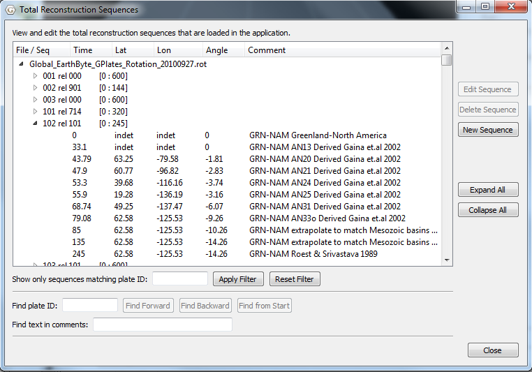
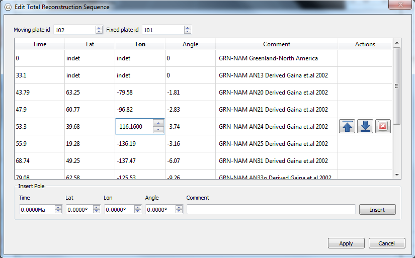
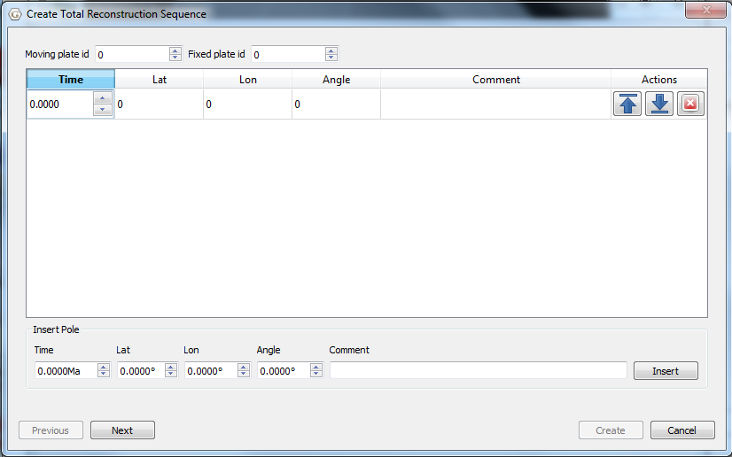

Introduction
============

A Total Reconstruction Sequence (TRS) is a sequence of Total Reconstruction Poles (see **More on Reconsructions**) defining the motion of one plate with respect to another over time. GPlates regards a TRS as a feature; TRSs can be stored in feature collections, and imported and exported to file. A feature collection containing TRSs is known as a **reconstruction feature collection**. TRSs are imported to GPlates from a reconstruction file, which will typically contain TRSs relating to many different plates, and which will define the user’s reconstruction model. At any given reconstruction time, GPlates analyses its collection of TRSs and generates Total Reconstruction Poles for the selected reconstruction time. These poles are then arranged into a Rotation Hierarchy (see **More on Reconstructions**) and used to position the plates.

The Total Reconstruction Sequences dialog
=========================================

The TRSs which have been loaded into GPlates can be viewed through the **Total Reconstruction Sequences** dialog which is accessed from the **Features** menu.

This tree display shows the reconstruction feature collections which are loaded, and the TRSs which they contain. Each TRS is summarised in the form **p1 rel p2 \[t1:t2\]** where **p1** and **p2** are plate ids, and **t1** and **t2** are times. For example **102 rel 101 \[0:245\]** indicates that the sequence describes the motion of plate 102 relative to plate 101 over the times 0 to 245 My.

Each sequence can be expanded to see the Total Reconstruction Poles which make up that sequence.

Editing a Total Reconstruction Sequence
=======================================

A TRS can be edited by selecting the sequence in the tree and clicking the **Edit Sequence** button. This opens the **Edit Total Reconstruction Sequence** dialog. After editing the TRS, select **Apply**, and the TRS dialog will be updated.

> **Note**
>
> After editing a TRS, the TRS feature collection will have been updated, but not saved to disk. The updated feature collection can be saved to disk from the **Manage Feature Collections** dialog (Ctrl+M).

Creating a Total Reconstruction Sequence
========================================

A new TRS can be created by selecting **New Sequence**. After filling in the fields of the new sequence, including the moving and fixed plates, select **Next** and add the sequence to an existing feature collection, or create a new feature collection.

> **Note**
>
> After creating a TRS, the TRS feature collection will have been updated, but not saved to disk. The updated feature collection can be saved to disk from the **Manage Feature Collections** dialog (Ctrl+M).

  
